# A Classification problem solution attempt with Decision Tree Classifiers, Random Forest Classifiers, Artificial Neural Networks, Gradient Boosting Classifier, K-Neighbors Classifier & Logistic Regression
🕸🕸🕸🕸🕸🕸🕸🕸🕸🕸🕸🕸🌲🌳🌲🌲🌳🌲🌲🌳🌲🌲🌳🌲🌲🌳🌲🌲🌲🌳🌲🌲🌳🌲🌲🌳🌲🌲🌳🌲🌲🌳🌲🌲🌳🕸🕸🕸🕸🕸🕸🕸🕸🕸🕸🕸🕸

---


Sources:
(a) Original owner of the database:

   R. K. Bock
   Major Atmospheric Gamma Imaging Cherenkov Telescope project (MAGIC)
   http://wwwmagic.mppmu.mpg.de
   rkb@mail.cern.ch
  
(b) Donor:

   P. Savicky
   Institute of Computer Science, AS of CR
   Czech Republic
   savicky@cs.cas.cz

# Importing libraries


```python
#This cell was used to install mpld3. It allows to manipulate plots: zoom and moving
#!pip install mpld3
```


```python
#%matplotlib inline
#import mpld3
#mpld3.enable_notebook()
```


```python
#plots and style
import matplotlib.pyplot as plt
import seaborn as sns; sns.set_theme()
import matplotlib.style as sty
#sty.use('ggplot')
sty.use('seaborn-whitegrid')
from matplotlib.pyplot import figure
```


```python
#To avoid the warnings
import warnings
warnings.simplefilter(action='ignore', category=FutureWarning)
```


```python
import numpy as np
import pandas as pd
import sys, os

#to not print
class HiddenPrints:
    def __enter__(self):
        self._original_stdout = sys.stdout
        sys.stdout = open(os.devnull, 'w')

    def __exit__(self, exc_type, exc_val, exc_tb):
        sys.stdout.close()
        sys.stdout = self._original_stdout

#to print tables in LaTex
#!pip install tabulate
from tabulate import tabulate
```


```python
#ROC curve and AUC
from sklearn.metrics import roc_curve, auc
```


```python
#importing all possible distributions
from scipy.stats import genextreme
from scipy.stats import gamma
from scipy.stats import t
from scipy.stats import dweibull
from scipy.stats import beta
from scipy.stats import norm
from scipy.stats import expon
from scipy.stats import pareto
from scipy.stats import genextreme
from scipy.stats import uniform
from scipy.stats import logistic
from scipy.stats import kstest
from scipy.stats import ks_2samp
from scipy.stats import lognorm
#this distribution is for annother purpose
from scipy.stats import loguniform
```


```python
# Importing train_test_split to split our data
from sklearn.model_selection import train_test_split
```


```python
# From the distfit library import the class distfit
from distfit import distfit
```


```python
# Importing Decision Tree Model
from sklearn.tree import DecisionTreeClassifier
# Importing Random Forest Model
from sklearn.ensemble import RandomForestClassifier
# Importing GBC
from sklearn.ensemble import GradientBoostingClassifier
#Importing KNeighborsClassifier
from sklearn.neighbors import KNeighborsClassifier
#Importing Logistic Regression
from sklearn.linear_model import LogisticRegression

# Importing mean_absolute_error to find Mean absolute error of each model
from sklearn.metrics import mean_absolute_error

from sklearn.metrics import confusion_matrix
from sklearn.metrics import accuracy_score, confusion_matrix, precision_score, recall_score, f1_score
```


```python
#To normalize data
from sklearn.preprocessing import StandardScaler
```


```python
#import keras ANN
from keras.models import Sequential
from keras.layers import Dense, Dropout
```


```python
#cross vaidation
from sklearn.model_selection import cross_val_score
#Hyperparameter tunning
from sklearn.model_selection import GridSearchCV,cross_validate, RandomizedSearchCV
from tensorflow.keras.wrappers.scikit_learn import KerasClassifier
```


```python
#optimizer for the cuts
from scipy.optimize import minimize
```


```python
font = {
        'size'   : 19}
#to set a biggers size of text in plots
from matplotlib import rc
rc('font', **font)
```

# Displaying Data


```python
df = pd.read_csv('telescope_data.csv')#importing data
del df['Unnamed: 0']#this column was empty
df.head()
```


<div>
<style scoped>
    .dataframe tbody tr th:only-of-type {
        vertical-align: middle;
    }

    .dataframe tbody tr th {
        vertical-align: top;
    }

    .dataframe thead th {
        text-align: right;
    }
</style>
<table border="1" class="dataframe">
  <thead>
    <tr style="text-align: right;">
      <th></th>
      <th>fLength</th>
      <th>fWidth</th>
      <th>fSize</th>
      <th>fConc</th>
      <th>fConc1</th>
      <th>fAsym</th>
      <th>fM3Long</th>
      <th>fM3Trans</th>
      <th>fAlpha</th>
      <th>fDist</th>
      <th>class</th>
    </tr>
  </thead>
  <tbody>
    <tr>
      <th>0</th>
      <td>28.7967</td>
      <td>16.0021</td>
      <td>2.6449</td>
      <td>0.3918</td>
      <td>0.1982</td>
      <td>27.7004</td>
      <td>22.0110</td>
      <td>-8.2027</td>
      <td>40.0920</td>
      <td>81.8828</td>
      <td>g</td>
    </tr>
    <tr>
      <th>1</th>
      <td>31.6036</td>
      <td>11.7235</td>
      <td>2.5185</td>
      <td>0.5303</td>
      <td>0.3773</td>
      <td>26.2722</td>
      <td>23.8238</td>
      <td>-9.9574</td>
      <td>6.3609</td>
      <td>205.2610</td>
      <td>g</td>
    </tr>
    <tr>
      <th>2</th>
      <td>162.0520</td>
      <td>136.0310</td>
      <td>4.0612</td>
      <td>0.0374</td>
      <td>0.0187</td>
      <td>116.7410</td>
      <td>-64.8580</td>
      <td>-45.2160</td>
      <td>76.9600</td>
      <td>256.7880</td>
      <td>g</td>
    </tr>
    <tr>
      <th>3</th>
      <td>23.8172</td>
      <td>9.5728</td>
      <td>2.3385</td>
      <td>0.6147</td>
      <td>0.3922</td>
      <td>27.2107</td>
      <td>-6.4633</td>
      <td>-7.1513</td>
      <td>10.4490</td>
      <td>116.7370</td>
      <td>g</td>
    </tr>
    <tr>
      <th>4</th>
      <td>75.1362</td>
      <td>30.9205</td>
      <td>3.1611</td>
      <td>0.3168</td>
      <td>0.1832</td>
      <td>-5.5277</td>
      <td>28.5525</td>
      <td>21.8393</td>
      <td>4.6480</td>
      <td>356.4620</td>
      <td>g</td>
    </tr>
  </tbody>
</table>
</div>


Summary the raw data


```python
df.info()
```

    <class 'pandas.core.frame.DataFrame'>
    RangeIndex: 19020 entries, 0 to 19019
    Data columns (total 11 columns):
     #   Column    Non-Null Count  Dtype  
    ---  ------    --------------  -----  
     0   fLength   19020 non-null  float64
     1   fWidth    19020 non-null  float64
     2   fSize     19020 non-null  float64
     3   fConc     19020 non-null  float64
     4   fConc1    19020 non-null  float64
     5   fAsym     19020 non-null  float64
     6   fM3Long   19020 non-null  float64
     7   fM3Trans  19020 non-null  float64
     8   fAlpha    19020 non-null  float64
     9   fDist     19020 non-null  float64
     10  class     19020 non-null  object 
    dtypes: float64(10), object(1)
    memory usage: 1.6+ MB
    

There are not missing values so we don't need to use pipelines to structure the data


```python
df.describe()
```


<div>
<style scoped>
    .dataframe tbody tr th:only-of-type {
        vertical-align: middle;
    }

    .dataframe tbody tr th {
        vertical-align: top;
    }

    .dataframe thead th {
        text-align: right;
    }
</style>
<table border="1" class="dataframe">
  <thead>
    <tr style="text-align: right;">
      <th></th>
      <th>fLength</th>
      <th>fWidth</th>
      <th>fSize</th>
      <th>fConc</th>
      <th>fConc1</th>
      <th>fAsym</th>
      <th>fM3Long</th>
      <th>fM3Trans</th>
      <th>fAlpha</th>
      <th>fDist</th>
    </tr>
  </thead>
  <tbody>
    <tr>
      <th>count</th>
      <td>19020.000000</td>
      <td>19020.000000</td>
      <td>19020.000000</td>
      <td>19020.000000</td>
      <td>19020.000000</td>
      <td>19020.000000</td>
      <td>19020.000000</td>
      <td>19020.000000</td>
      <td>19020.000000</td>
      <td>19020.000000</td>
    </tr>
    <tr>
      <th>mean</th>
      <td>53.250154</td>
      <td>22.180966</td>
      <td>2.825017</td>
      <td>0.380327</td>
      <td>0.214657</td>
      <td>-4.331745</td>
      <td>10.545545</td>
      <td>0.249726</td>
      <td>27.645707</td>
      <td>193.818026</td>
    </tr>
    <tr>
      <th>std</th>
      <td>42.364855</td>
      <td>18.346056</td>
      <td>0.472599</td>
      <td>0.182813</td>
      <td>0.110511</td>
      <td>59.206062</td>
      <td>51.000118</td>
      <td>20.827439</td>
      <td>26.103621</td>
      <td>74.731787</td>
    </tr>
    <tr>
      <th>min</th>
      <td>4.283500</td>
      <td>0.000000</td>
      <td>1.941300</td>
      <td>0.013100</td>
      <td>0.000300</td>
      <td>-457.916100</td>
      <td>-331.780000</td>
      <td>-205.894700</td>
      <td>0.000000</td>
      <td>1.282600</td>
    </tr>
    <tr>
      <th>25%</th>
      <td>24.336000</td>
      <td>11.863800</td>
      <td>2.477100</td>
      <td>0.235800</td>
      <td>0.128475</td>
      <td>-20.586550</td>
      <td>-12.842775</td>
      <td>-10.849375</td>
      <td>5.547925</td>
      <td>142.492250</td>
    </tr>
    <tr>
      <th>50%</th>
      <td>37.147700</td>
      <td>17.139900</td>
      <td>2.739600</td>
      <td>0.354150</td>
      <td>0.196500</td>
      <td>4.013050</td>
      <td>15.314100</td>
      <td>0.666200</td>
      <td>17.679500</td>
      <td>191.851450</td>
    </tr>
    <tr>
      <th>75%</th>
      <td>70.122175</td>
      <td>24.739475</td>
      <td>3.101600</td>
      <td>0.503700</td>
      <td>0.285225</td>
      <td>24.063700</td>
      <td>35.837800</td>
      <td>10.946425</td>
      <td>45.883550</td>
      <td>240.563825</td>
    </tr>
    <tr>
      <th>max</th>
      <td>334.177000</td>
      <td>256.382000</td>
      <td>5.323300</td>
      <td>0.893000</td>
      <td>0.675200</td>
      <td>575.240700</td>
      <td>238.321000</td>
      <td>179.851000</td>
      <td>90.000000</td>
      <td>495.561000</td>
    </tr>
  </tbody>
</table>
</div>


```python
df.shape
```


    (19020, 11)


The data has 11 variables with 19020 events:
1.  fLength:  continuous  -  major axis of ellipse [mm]
2.  fWidth:   continuous  - minor axis of ellipse [mm] 
3.  fSize:    continuous  - 10-log of sum of content of all pixels [in #phot]
4.  fConc:    continuous  - ratio of sum of two highest pixels over fSize  [ratio]
5.  fConc1:   continuous  - ratio of highest pixel over fSize  [ratio]
6.  fAsym:    continuous  - distance from highest pixel to center, projected onto major axis [mm]
7.  fM3Long:  continuous  - 3rd root of third moment along major axis  [mm] 
8.  fM3Trans: continuous  - 3rd root of third moment along minor axis  [mm]
9.  fAlpha:   continuous  - angle of major axis with vector to origin [deg]
10.  fDist:    continuous  - distance from origin to center of ellipse [mm]
11.  class:    g,h  - gamma (signal), hadron (background)

## Check distribution and correlations


```python
plt.figure(figsize=(20, 20))
#Compute pairwise correlation of columns, excluding NA/null values. It displays pearson standard correlation coefficient
sns.heatmap(df.corr(), annot=True, cmap="YlGnBu", annot_kws={"size":15})
```


    <AxesSubplot:>


    
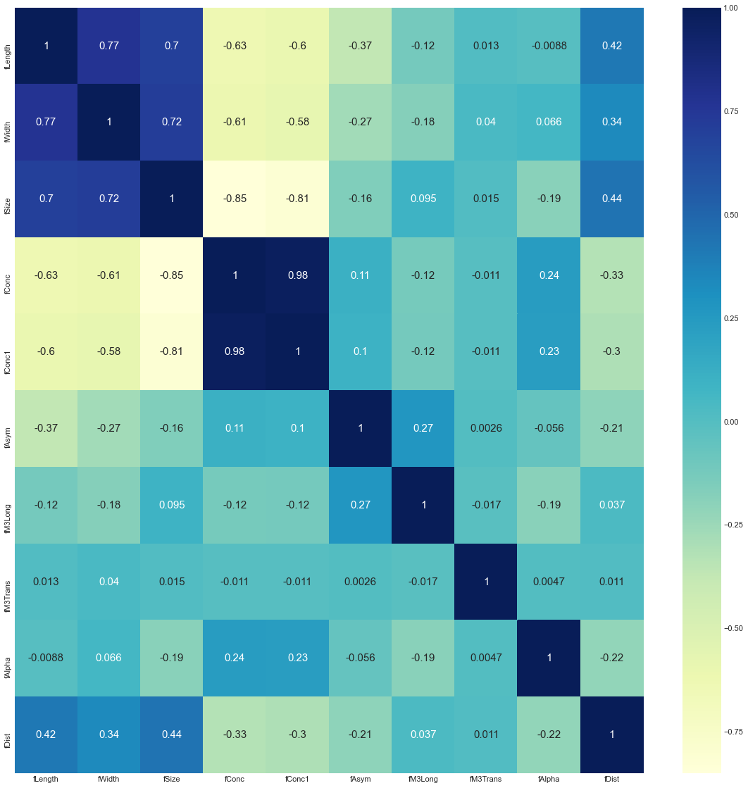
    


It is notorious that there is a high correlation between *fConc* and *fConc1*, but that is rather obvious from their definitions:
4.  fConc:    continuous  - ratio of sum of the two highest pixels over fSize  [ratio]
5.  fConc1:   continuous  - ratio of the highest pixel over fSize  [ratio]

Before looking for the distributions it is needed to separate the data in training and test categories:


```python
# Create target object and call it y
y = df['class'].replace('g',1).replace('h',0)

# Create X
features = list(df)[:-1]#without the last column
X = df[features]
```


```python
# Split into validation and training data
train_X, val_X, train_y, val_y = train_test_split(X, y, test_size = 0.25, random_state = 0)
```

Pearson  pairwise correlation  of the train data categories with the binary target category : Signal


```python
train_X.corrwith(train_y).plot(kind='bar', figsize=(12, 6), title='Features correlation with the target variable')
plt.ylabel("PCC")
plt.show()
```


    
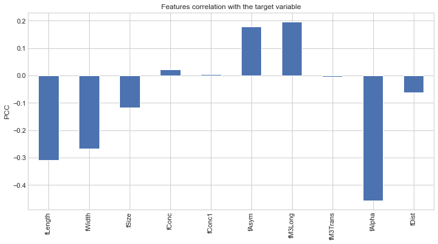
    


The most strong correlation is a negative correlation between *fAlpha ("continuous  - angle of major axis with vector to origin [deg]")* and the target binary variable *class*.

## Testing distributions on the parameters of the train data

A kernel density estimation (KDE) is a non-parametric way to estimate the probability density function (PDF) of a random variable. These are KDE plots on top of the distribution histograms:


```python
fig, ax = plt.subplots(2,5, figsize=(16, 6))
ax = ax.flatten()
for i in range(10):
    sns.distplot(train_X.iloc[:,i].values,ax=ax[i],color='r')#it plots both the histogram and the KDE
    ax[i].set_title(train_X.columns[i])#title of the histogram
fig.tight_layout(pad=2.0)   
```


    
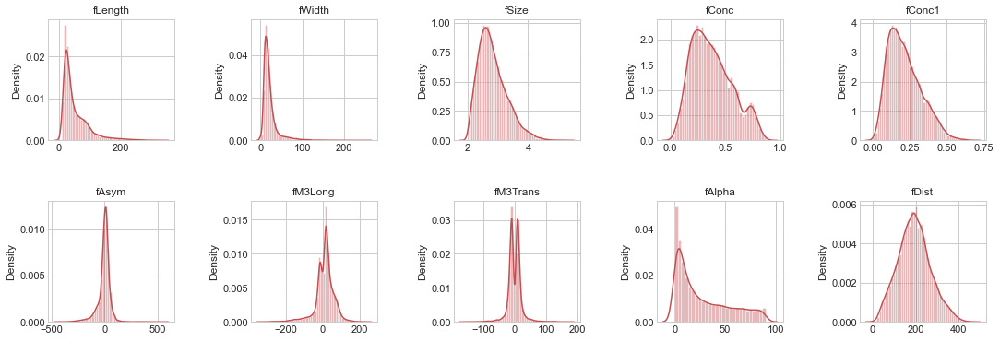
    


Disfit is a package that proves some possible distributions (89) and looks for the best theoretical distribution using the Residual Sum of Squares (RSS) estimates. It starts with interpolation to smooth a histogram of the distribution. Then it uses the RSS to look for the best distributions. 
This is a good way to obtain the best distribution and the RSS of the most popular models.


```python
aempty=[]
for i in range(10):
    # Initialize
    dist = distfit()
    # Search for best theoretical fit on your emperical data
    aempty.append(dist.fit_transform(train_X.iloc[:,i].values))#save the RSS results
    # plot
    dist.plot(train_X.columns[i])
```

    [distfit] >fit..
    [distfit] >transform..
    [distfit] >[norm      ] [RSS: 0.0008238] [loc=53.457 scale=43.056] 
    [distfit] >[expon     ] [RSS: 0.0007048] [loc=4.284 scale=49.174] 
    [distfit] >[pareto    ] [RSS: 0.0029099] [loc=-0.008 scale=4.291] 
    [distfit] >[dweibull  ] [RSS: 0.0004258] [loc=32.517 scale=26.580] 
    [distfit] >[t         ] [RSS: 0.0004800] [loc=37.070 scale=20.196] 
    [distfit] >[genextreme] [RSS: 0.0000708] [loc=30.620 scale=17.712] 
    [distfit] >[gamma     ] [RSS: 0.0003334] [loc=4.277 scale=27.514] 
    [distfit] >[lognorm   ] [RSS: 0.0024580] [loc=4.283 scale=3.028] 
    [distfit] >[beta      ] [RSS: 0.0003345] [loc=4.277 scale=6629220575.237] 
    [distfit] >[uniform   ] [RSS: 0.0015846] [loc=4.284 scale=329.894] 
    [distfit] >Compute confidence interval [parametric]
    [distfit] >plot..
    


    
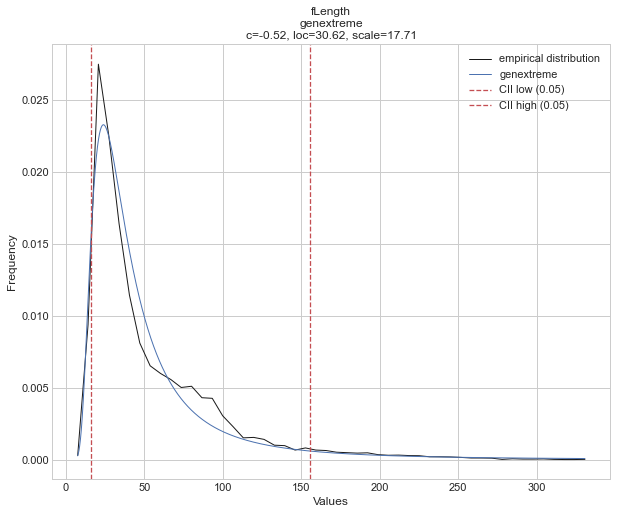
    


    [distfit] >fit..
    [distfit] >transform..
    [distfit] >[norm      ] [RSS: 0.0022657] [loc=22.241 scale=18.645] 
    [distfit] >[expon     ] [RSS: 0.0029952] [loc=0.000 scale=22.241] 
    [distfit] >[pareto    ] [RSS: 0.0073812] [loc=-3.115 scale=3.115] 
    [distfit] >[dweibull  ] [RSS: 0.0005543] [loc=16.308 scale=9.375] 
    [distfit] >[t         ] [RSS: 0.0002920] [loc=16.485 scale=6.342] 
    [distfit] >[genextreme] [RSS: 0.0001671] [loc=14.619 scale=8.279] 
    [distfit] >[gamma     ] [RSS: 0.0007863] [loc=-0.634 scale=9.070] 
    [distfit] >[lognorm   ] [RSS: 0.0003792] [loc=-2.667 scale=20.991] 
    [distfit] >[beta      ] [RSS: 0.0008131] [loc=-0.596 scale=166546178985.119] 
    [distfit] >[uniform   ] [RSS: 0.0056181] [loc=0.000 scale=256.382] 
    [distfit] >Compute confidence interval [parametric]
    [distfit] >plot..
    


    
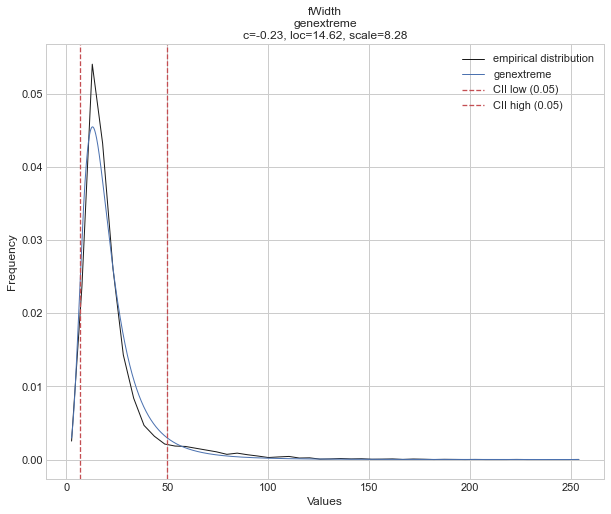
    


    [distfit] >fit..
    [distfit] >transform..
    [distfit] >[norm      ] [RSS: 0.6279483] [loc=2.824 scale=0.472] 
    [distfit] >[expon     ] [RSS: 4.0566499] [loc=1.947 scale=0.877] 
    [distfit] >[pareto    ] [RSS: 5.7587757] [loc=-0.042 scale=1.989] 
    [distfit] >[dweibull  ] [RSS: 0.8185592] [loc=2.792 scale=0.396] 
    [distfit] >[t         ] [RSS: 0.5201262] [loc=2.794 scale=0.426] 
    [distfit] >[genextreme] [RSS: 0.0495485] [loc=2.606 scale=0.370] 
    [distfit] >[gamma     ] [RSS: 0.0282840] [loc=1.921 scale=0.255] 
    [distfit] >[lognorm   ] [RSS: 0.0360586] [loc=1.593 scale=1.146] 
    [distfit] >[beta      ] [RSS: 0.0318266] [loc=1.942 scale=7.808] 
    [distfit] >[uniform   ] [RSS: 5.3198046] [loc=1.947 scale=3.376] 
    [distfit] >Compute confidence interval [parametric]
    [distfit] >plot..
    


    
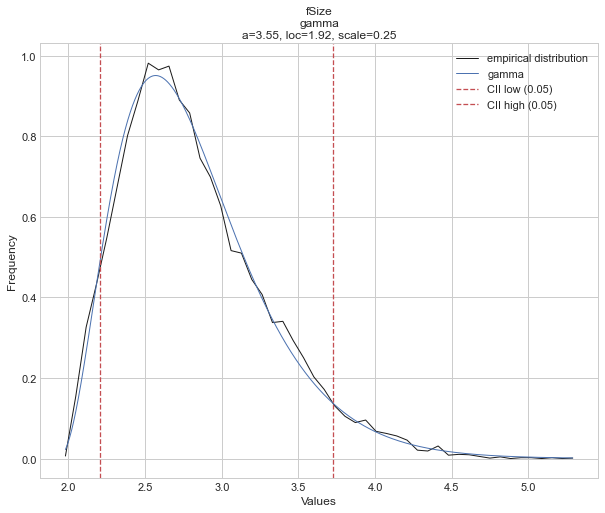
    


    [distfit] >fit..
    [distfit] >transform..
    [distfit] >[norm      ] [RSS: 6.1926246] [loc=0.381 scale=0.183] 
    [distfit] >[expon     ] [RSS: 39.1630033] [loc=0.013 scale=0.368] 
    [distfit] >[pareto    ] [RSS: 36.2632547] [loc=-29317.168 scale=29317.181] 
    [distfit] >[dweibull  ] [RSS: 8.0966123] [loc=0.374 scale=0.164] 
    [distfit] >[t         ] [RSS: 6.1937253] [loc=0.381 scale=0.183] 
    [distfit] >[genextreme] [RSS: 2.4931807] [loc=0.301 scale=0.157] 
    [distfit] >[gamma     ] [RSS: 1.6033370] [loc=-0.042 scale=0.084] 
    [distfit] >[lognorm   ] [RSS: 2.0545347] [loc=-0.238 scale=0.593] 
    [distfit] >[beta      ] [RSS: 1.8778444] [loc=0.011 scale=1.046] 
    [distfit] >[uniform   ] [RSS: 25.3005185] [loc=0.013 scale=0.880] 
    [distfit] >Compute confidence interval [parametric]
    [distfit] >plot..
    


    
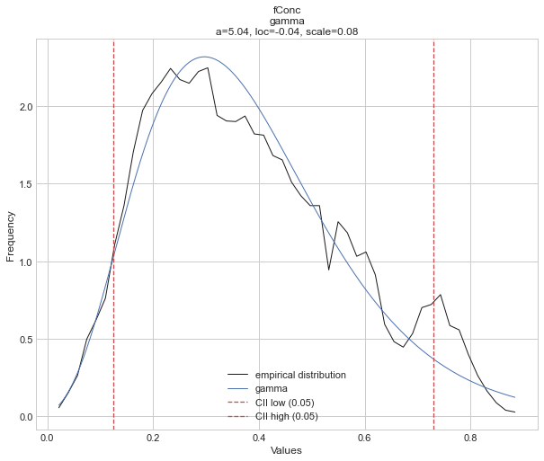
    


    [distfit] >fit..
    [distfit] >transform..
    [distfit] >[norm      ] [RSS: 14.5504566] [loc=0.215 scale=0.111] 
    [distfit] >[expon     ] [RSS: 86.4852924] [loc=0.000 scale=0.215] 
    [distfit] >[pareto    ] [RSS: 86.9637038] [loc=-1397449.525 scale=1397449.526] 
    [distfit] >[dweibull  ] [RSS: 20.4854740] [loc=0.209 scale=0.097] 
    [distfit] >[t         ] [RSS: 14.5022300] [loc=0.215 scale=0.111] 
    [distfit] >[genextreme] [RSS: 3.3369324] [loc=0.164 scale=0.090] 
    [distfit] >[gamma     ] [RSS: 1.6243850] [loc=-0.014 scale=0.056] 
    [distfit] >[lognorm   ] [RSS: 2.4153420] [loc=-0.095 scale=0.291] 
    [distfit] >[beta      ] [RSS: 1.7704505] [loc=-0.002 scale=1.091] 
    [distfit] >[uniform   ] [RSS: 90.3234778] [loc=0.000 scale=0.675] 
    [distfit] >Compute confidence interval [parametric]
    [distfit] >plot..
    


    
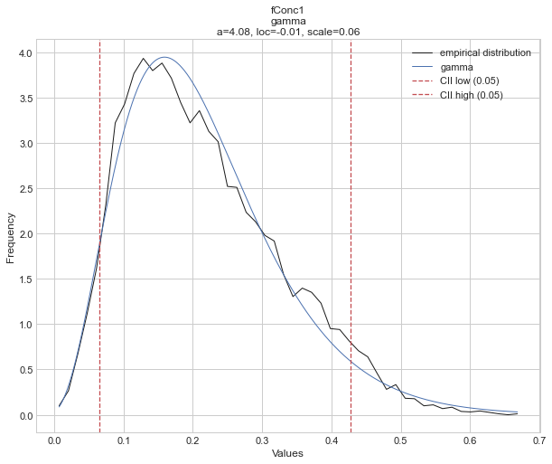
    


    [distfit] >fit..
    [distfit] >transform..
    [distfit] >[norm      ] [RSS: 0.0000739] [loc=-4.561 scale=59.668] 
    [distfit] >[expon     ] [RSS: 0.0003350] [loc=-449.953 scale=445.392] 
    [distfit] >[pareto    ] [RSS: 0.0003222] [loc=-3560720.763 scale=3560270.793] 
    [distfit] >[dweibull  ] [RSS: 0.0000072] [loc=4.067 scale=35.483] 
    [distfit] >[t         ] [RSS: 0.0000026] [loc=5.061 scale=27.058] 
    [distfit] >[genextreme] [RSS: 0.0003736] [loc=574.857 scale=3.477] 
    [distfit] >[gamma     ] [RSS: 0.0000882] [loc=-744.222 scale=5.404] 
    [distfit] >[lognorm   ] [RSS: 0.0004332] [loc=-449.953 scale=8.025] 
    [distfit] >[beta      ] [RSS: 0.0000721] [loc=-13641.414 scale=15514.513] 
    [distfit] >[uniform   ] [RSS: 0.0003146] [loc=-449.953 scale=1025.193] 
    [distfit] >Compute confidence interval [parametric]
    [distfit] >plot..
    


    
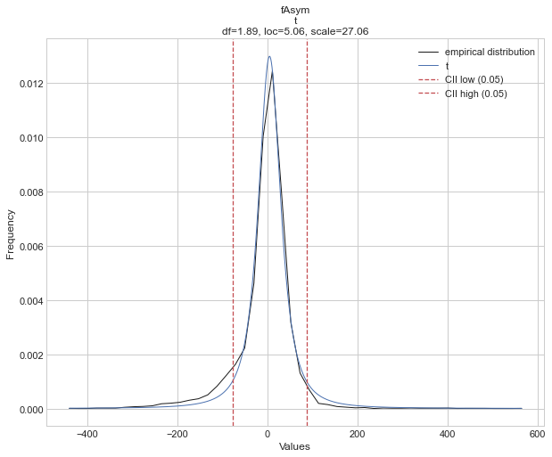
    


    [distfit] >fit..
    [distfit] >transform..
    [distfit] >[norm      ] [RSS: 0.0001345] [loc=10.301 scale=51.722] 
    [distfit] >[expon     ] [RSS: 0.0006436] [loc=-331.780 scale=342.081] 
    [distfit] >[pareto    ] [RSS: 0.0006260] [loc=-46449814487.046 scale=46449814155.266] 
    [distfit] >[dweibull  ] [RSS: 0.0000509] [loc=16.190 scale=32.972] 
    [distfit] >[t         ] [RSS: 0.0000609] [loc=14.167 scale=29.975] 
    [distfit] >[genextreme] [RSS: 0.0007580] [loc=237.907 scale=3.192] 
    [distfit] >[gamma     ] [RSS: 0.0001791] [loc=-335.645 scale=10.096] 
    [distfit] >[lognorm   ] [RSS: 0.0001336] [loc=-16211.650 scale=16222.055] 
    [distfit] >[beta      ] [RSS: 0.0001290] [loc=-656596.974 scale=656882.520] 
    [distfit] >[uniform   ] [RSS: 0.0005571] [loc=-331.780 scale=570.101] 
    [distfit] >Compute confidence interval [parametric]
    [distfit] >plot..
    


    
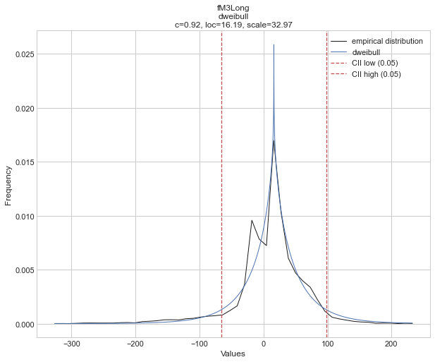
    


    [distfit] >fit..
    [distfit] >transform..
    [distfit] >[norm      ] [RSS: 0.0006329] [loc=0.231 scale=20.982] 
    [distfit] >[expon     ] [RSS: 0.0027997] [loc=-164.140 scale=164.371] 
    [distfit] >[pareto    ] [RSS: 0.0027414] [loc=-5847212965.351 scale=5847212801.211] 
    [distfit] >[dweibull  ] [RSS: 0.0004889] [loc=0.183 scale=16.000] 
    [distfit] >[t         ] [RSS: 0.0005865] [loc=0.093 scale=13.670] 
    [distfit] >[genextreme] [RSS: 0.0009438] [loc=-8.486 scale=25.394] 
    [distfit] >[gamma     ] [RSS: 0.0006380] [loc=-502.329 scale=0.887] 
    [distfit] >[lognorm   ] [RSS: 0.0036828] [loc=-164.140 scale=1.965] 
    [distfit] >[beta      ] [RSS: 0.0006325] [loc=-1622.590 scale=8338.412] 
    [distfit] >[uniform   ] [RSS: 0.0025978] [loc=-164.140 scale=343.991] 
    [distfit] >Compute confidence interval [parametric]
    [distfit] >plot..
    


    
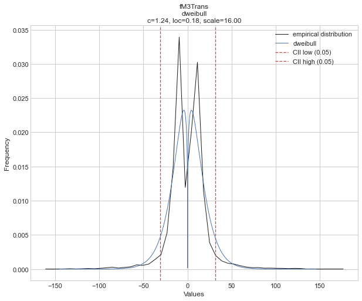
    


    [distfit] >fit..
    [distfit] >transform..
    [distfit] >[norm      ] [RSS: 0.0054292] [loc=27.709 scale=26.155] 
    [distfit] >[expon     ] [RSS: 0.0010020] [loc=0.000 scale=27.709] 
    [distfit] >[pareto    ] [RSS: 0.0011171] [loc=-350630.409 scale=350630.409] 
    [distfit] >[dweibull  ] [RSS: 0.0051886] [loc=32.269 scale=26.029] 
    [distfit] >[t         ] [RSS: 0.0054292] [loc=27.708 scale=26.154] 
    [distfit] >[genextreme] [RSS: 0.0015523] [loc=10.200 scale=12.000] 
    [distfit] >[gamma     ] [RSS: 0.0006142] [loc=-0.000 scale=28.173] 
    [distfit] >[lognorm   ] [RSS: 0.0126030] [loc=-0.000 scale=1.682] 
    [distfit] >[beta      ] [RSS: 0.0006344] [loc=-0.000 scale=91.020] 
    [distfit] >[uniform   ] [RSS: 0.0053099] [loc=0.000 scale=90.000] 
    [distfit] >Compute confidence interval [parametric]
    [distfit] >plot..
    


    
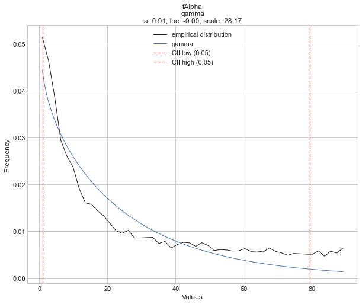
    


    [distfit] >fit..
    [distfit] >transform..
    [distfit] >[norm      ] [RSS: 0.0000030] [loc=193.614 scale=74.718] 
    [distfit] >[expon     ] [RSS: 0.0002424] [loc=1.283 scale=192.332] 
    [distfit] >[pareto    ] [RSS: 0.0010388] [loc=0.001 scale=1.282] 
    [distfit] >[dweibull  ] [RSS: 0.0000079] [loc=190.675 scale=63.433] 
    [distfit] >[t         ] [RSS: 0.0000030] [loc=193.624 scale=74.714] 
    [distfit] >[genextreme] [RSS: 0.0000032] [loc=164.788 scale=71.444] 
    [distfit] >[gamma     ] [RSS: 0.0000026] [loc=-350.235 scale=10.288] 
    [distfit] >[lognorm   ] [RSS: 0.0000026] [loc=-651.058 scale=841.382] 
    [distfit] >[beta      ] [RSS: 0.0000038] [loc=-44.890 scale=630.875] 
    [distfit] >[uniform   ] [RSS: 0.0001765] [loc=1.283 scale=465.125] 
    [distfit] >Compute confidence interval [parametric]
    [distfit] >plot..
    


    
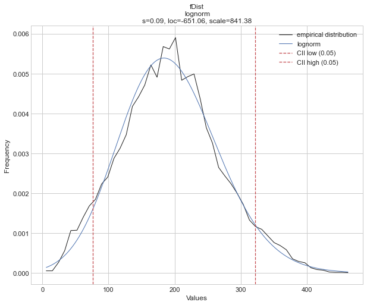
    


Now, it is known which is the best distribution for each parameter. The Residual Sum of Squares (RSS)  was used to compare.

To have a better idea, the same test of which-distribution-is-the-best-fit is made using Maximum Likelihood Estimation (MLE).
Calculating the *negative loglikelihood function* for all the parameter data with the principal distributions that Disfit try before:


```python
dist =[norm, expon, pareto, dweibull, t, genextreme, gamma, lognorm, beta, uniform,logistic,lognorm]#distribution names
mles = []#to save the MLE of each parameter for each distribution
besto=[]
for i in range(10):#for each parameter
  mle_i=[train_X.columns[i],]
  mini=[float('inf'),'none']
  for distribution in dist:#for each distribution
        #obtaining parameters of the distribution from data using MLE estimation 
      pars = distribution.fit(train_X.iloc[:,i].values)
        # negative loglikelihood function for the data and the distribution w the parameter's values obtained in the previous line
      mle = distribution.nnlf(pars,train_X.iloc[:,i].values)
      mle_i.append(mle)#saving
      if mle<mini[0]:#looking for the minimum  negative loglikelihood function for each parameter data
        mini=[mle,distribution.name,pars]
  mles.append(mle_i)#saving the MLE for all distributions
  besto.append([train_X.columns[i]]+mini)#save the best

distnames= [distribution.name for distribution in dist]
print(tabulate(mles, headers=["parameter"]+distnames,numalign="right",floatfmt="1.3e",tablefmt="github"))
```

    | parameter   |       norm |      expon |     pareto |   dweibull |          t |   genextreme |      gamma |    lognorm |       beta |    uniform |   logistic |    lognorm |
    |-------------|------------|------------|------------|------------|------------|--------------|------------|------------|------------|------------|------------|------------|
    | fLength     |  7.391e+04 |  6.983e+04 |  7.919e+04 |  7.188e+04 |  7.161e+04 |    6.766e+04 |  6.862e+04 |  8.594e+04 |  6.862e+04 |  8.272e+04 |  7.256e+04 |  8.594e+04 |
    | fWidth      |  6.197e+04 |  5.851e+04 |  6.743e+04 |  5.702e+04 |  5.607e+04 |    5.460e+04 |  5.621e+04 |  5.516e+04 |  5.622e+04 |  7.912e+04 |  5.876e+04 |  5.516e+04 |
    | fSize       |  9.544e+03 |  1.239e+04 |  1.422e+04 |  9.494e+03 |  9.441e+03 |    8.429e+03 |  8.318e+03 |  8.387e+03 |  8.302e+03 |  1.736e+04 |  9.463e+03 |  8.387e+03 |
    | fConc       | -3.946e+03 |  2.152e+00 |  2.775e+01 | -3.766e+03 | -3.946e+03 |   -4.479e+03 | -4.565e+03 | -4.484e+03 | -4.748e+03 | -1.825e+03 | -3.634e+03 | -4.484e+03 |
    | fConc1      | -1.110e+04 | -7.670e+03 | -7.669e+03 | -1.100e+04 | -1.110e+04 |   -1.195e+04 | -1.206e+04 | -1.199e+04 | -1.211e+04 | -5.609e+03 | -1.095e+04 | -1.199e+04 |
    | fAsym       |  7.857e+04 |  1.013e+05 |  1.021e+05 |  7.570e+04 |  7.547e+04 |    1.426e+05 |  7.918e+04 |  1.271e+05 |  7.847e+04 |  9.889e+04 |  7.672e+04 |  1.271e+05 |
    | fM3Long     |  7.653e+04 |  9.750e+04 |  9.767e+04 |  7.458e+04 |  7.470e+04 |    1.268e+05 |  7.834e+04 |  7.656e+04 |  7.606e+04 |  9.052e+04 |  7.527e+04 |  7.656e+04 |
    | fM3Trans    |  6.366e+04 |  8.705e+04 |  8.721e+04 |  6.195e+04 |  6.164e+04 |    6.560e+04 |  6.368e+04 |  1.141e+05 |  6.365e+04 |  8.332e+04 |  6.208e+04 |  1.141e+05 |
    | fAlpha      |  6.680e+04 |  6.165e+04 |  6.169e+04 |  6.624e+04 |  6.680e+04 |    6.346e+04 |  6.156e+04 |  7.113e+04 |  6.050e+04 |  6.419e+04 |  6.708e+04 |  7.113e+04 |
    | fDist       |  8.178e+04 |  8.929e+04 |  1.108e+05 |  8.196e+04 |  8.178e+04 |    8.169e+04 |  8.170e+04 |  8.170e+04 |  8.167e+04 |  8.762e+04 |  8.193e+04 |  8.170e+04 |
    

The distribution with the lowest negative loglikelihood function is the best option for fitting.

| parameter   |       norm |      expon |     pareto |   dweibull |          t |   genextreme |      gamma |    lognorm |       beta |    uniform |   logistic |    lognorm |
|-------------|------------|------------|------------|------------|------------|--------------|------------|------------|------------|------------|------------|------------|
| fLength     |  7.391e+04 |  6.983e+04 |  7.919e+04 |  7.188e+04 |  7.161e+04 |    6.766e+04 |  6.862e+04 |  8.594e+04 |  6.862e+04 |  8.272e+04 |  7.256e+04 |  8.594e+04 |
| fWidth      |  6.197e+04 |  5.851e+04 |  6.743e+04 |  5.702e+04 |  5.607e+04 |    5.460e+04 |  5.621e+04 |  5.516e+04 |  5.622e+04 |  7.912e+04 |  5.876e+04 |  5.516e+04 |
| fSize       |  9.544e+03 |  1.239e+04 |  1.422e+04 |  9.494e+03 |  9.441e+03 |    8.429e+03 |  8.318e+03 |  8.387e+03 |  8.302e+03 |  1.736e+04 |  9.463e+03 |  8.387e+03 |
| fConc       | -3.946e+03 |  2.152e+00 |  2.775e+01 | -3.766e+03 | -3.946e+03 |   -4.479e+03 | -4.565e+03 | -4.484e+03 | -4.748e+03 | -1.825e+03 | -3.634e+03 | -4.484e+03 |
| fConc1      | -1.110e+04 | -7.670e+03 | -7.669e+03 | -1.100e+04 | -1.110e+04 |   -1.195e+04 | -1.206e+04 | -1.199e+04 | -1.211e+04 | -5.609e+03 | -1.095e+04 | -1.199e+04 |
| fAsym       |  7.857e+04 |  1.013e+05 |  1.021e+05 |  7.570e+04 |  7.547e+04 |    1.426e+05 |  7.918e+04 |  1.271e+05 |  7.847e+04 |  9.889e+04 |  7.672e+04 |  1.271e+05 |
| fM3Long     |  7.653e+04 |  9.750e+04 |  9.767e+04 |  7.458e+04 |  7.470e+04 |    1.268e+05 |  7.834e+04 |  7.656e+04 |  7.606e+04 |  9.052e+04 |  7.527e+04 |  7.656e+04 |
| fM3Trans    |  6.366e+04 |  8.705e+04 |  8.721e+04 |  6.195e+04 |  6.164e+04 |    6.560e+04 |  6.368e+04 |  1.141e+05 |  6.365e+04 |  8.332e+04 |  6.208e+04 |  1.141e+05 |
| fAlpha      |  6.680e+04 |  6.165e+04 |  6.169e+04 |  6.624e+04 |  6.680e+04 |    6.346e+04 |  6.156e+04 |  7.113e+04 |  6.050e+04 |  6.419e+04 |  6.708e+04 |  7.113e+04 |
| fDist       |  8.178e+04 |  8.929e+04 |  1.108e+05 |  8.196e+04 |  8.178e+04 |    8.169e+04 |  8.170e+04 |  8.170e+04 |  8.167e+04 |  8.762e+04 |  8.193e+04 |  8.170e+04 |

The best distribution for each parameter are (using MLE):


```python
print(tabulate(besto, headers=["Parameter","Min MLE","Best Distribution","pars"],floatfmt="1.3e",tablefmt="github"))
```

    | Parameter   |    Min MLE | Best Distribution   | pars                                                                                |
    |-------------|------------|---------------------|-------------------------------------------------------------------------------------|
    | fLength     |  6.766e+04 | genextreme          | (-0.5168311011076752, 30.620170091516144, 17.712035391223132)                       |
    | fWidth      |  5.460e+04 | genextreme          | (-0.2302990459331291, 14.619278332812193, 8.279171747642685)                        |
    | fSize       |  8.302e+03 | beta                | (2.9865075466901647, 23.466690106826164, 1.9421685492730938, 7.807898188679667)     |
    | fConc       | -4.748e+03 | beta                | (2.3747563441321544, 4.319102239567787, 0.011010372014689334, 1.0462523165345419)   |
    | fConc1      | -1.211e+04 | beta                | (2.9205386446315, 11.717734743239793, -0.0023693459483200225, 1.090849660322091)    |
    | fAsym       |  7.547e+04 | t                   | (1.8911380046029715, 5.06126445621727, 27.05805512093712)                           |
    | fM3Long     |  7.458e+04 | dweibull            | (0.919733391237972, 16.190099999999994, 32.9720695688185)                           |
    | fM3Trans    |  6.164e+04 | t                   | (3.6797649833440547, 0.09323594876200089, 13.67041677212795)                        |
    | fAlpha      |  6.050e+04 | beta                | (0.6183227106691553, 1.3324627013144175, -4.213909411700232e-28, 91.01981546505654) |
    | fDist       |  8.167e+04 | beta                | (5.938498285136098, 9.77054573870754, -44.89030744651807, 630.8748075748614)        |
    

| Parameter   |    Min MLE | Best Distribution   | pars                                                                                |
|-------------|------------|---------------------|-------------------------------------------------------------------------------------|
| fLength     |  6.766e+04 | genextreme          | (-0.5168311011076752, 30.620170091516144, 17.712035391223132)                       |
| fWidth      |  5.460e+04 | genextreme          | (-0.2302990459331291, 14.619278332812193, 8.279171747642685)                        |
| fSize       |  8.302e+03 | beta                | (2.9865075466901647, 23.466690106826164, 1.9421685492730938, 7.807898188679667)     |
| fConc       | -4.748e+03 | beta                | (2.3747563441321544, 4.319102239567787, 0.011010372014689334, 1.0462523165345419)   |
| fConc1      | -1.211e+04 | beta                | (2.9205386446315, 11.717734743239793, -0.0023693459483200225, 1.090849660322091)    |
| fAsym       |  7.547e+04 | t                   | (1.8911380046029715, 5.06126445621727, 27.05805512093712)                           |
| fM3Long     |  7.458e+04 | dweibull            | (0.919733391237972, 16.190099999999994, 32.9720695688185)                           |
| fM3Trans    |  6.164e+04 | t                   | (3.6797649833440547, 0.09323594876200089, 13.67041677212795)                        |
| fAlpha      |  6.050e+04 | beta                | (0.6183227106691553, 1.3324627013144175, -4.213909411700232e-28, 91.01981546505654) |
| fDist       |  8.167e+04 | beta                | (5.938498285136098, 9.77054573870754, -44.89030744651807, 630.8748075748614)        |

I produce other types of plots with the results above by including  results with the MLE and the first results with the *disfit* package.  Also, the KS test was made, but the results were not satisfctory.


```python
def plotdist(namee,xval,par,typel,data) :
    #function to plot all distributions
    a=par[0]#a and b are shape parameters of the distribution
    b=par[1]
    c=par[2]#c can be a shape parameter but most of the time is the scale parameter
    if ( namee== "genextreme" ):
        y1 = genextreme.pdf(xval, a,b,c) #the density plot which is essentially a smooth version of the histogram
        label= typel+": Genextreme pdf"
        ksdata=list(kstest(rvs=data, cdf='genextreme',args=par))#KS test result and p value
        
    elif (namee == "gamma" ):
        xval = np.linspace( max(0.25,min(xval)),max(xval), 200)# I have to add this because when x-> 0, the distribution->inf too fast
        y1= gamma.pdf(xval,a,b,c)#the density plot which is essentially a smooth version of the histogram
        label= typel+": Gamma pdf"
        ksdata=list(kstest(rvs=data, cdf='gamma',args=par))#KS test result and p value
         
    elif ( namee == "t" ):
        y1= t.pdf(xval,a,b,c)#the density plot which is essentially a smooth version of the histogram
        label= typel+": t pdf"
        ksdata=list(kstest(rvs =data, cdf= 't',args=par))#KS test result and p value
         
    elif ( namee == "dweibull" ):
        y1= dweibull.pdf(xval,a,b,c)#the density plot which is essentially a smooth version of the histogram
        label= typel+": Dweibull pdf"
        ksdata=list(kstest(rvs =data, cdf='dweibull',args=par))#KS test result and p value
        
    elif (namee == "beta" ):
        xval = np.linspace( max(0.25,min(xval)),max(xval), 200)#the same reason of the gamma case
        d= par[3]# scale factor
        y1= beta.pdf(xval,a,b,c,d)#the density plot which is essentially a smooth version of the histogram
        label= typel+": Beta pdf"    
        ksdata=list(kstest(rvs =data, cdf='beta',args=par))#KS test result and p value
        
    elif (namee == "lognorm" ):
        y1= lognorm.pdf(xval,a,b,c)#the density plot which is essentially a smooth version of the histogram
        label= typel+": Lognorm pdf"
        ksdata=list(kstest(rvs =data, cdf='lognorm',args=par))#KS test result and p value
        
    return (y1,label,ksdata)#returns the points for the distribution, label, ks value
```


```python
figsize=(30,20)
ksdata1=[]
ksdata2=[]
for i in range(10):
    data=train_X.iloc[:,i].values#each column data
    xval = np.linspace(min(data), max(data), 200)#x points to plot
    
    #Disfit package
    namee=((aempty[i])['model'])['name'] #best distribution given by disfit package
    par=((aempty[i])['model'])['params'] #parameters for the best distribution statated in the previous line by disfit
    (y_1,label1,ks1)=plotdist(namee,xval,par,"RSS",data)
    ksdata1.append([train_X.columns[i]]+[namee]+ks1)#KS and p value of RSS-disfit result
    
    #MLE with scipy
    temp=besto[i]#best distribution chosen by minimun negative loglikelihood function
    namee=temp[2]#name
    par=temp[3]#parameters
    (y_2,label2,ks2)=plotdist(namee,xval,par,"MLE",data)
    ksdata2.append([train_X.columns[i]]+[namee]+ks2)#KS and p value of MLE result

    plt.hist(data, bins=aempty[i]['bins'], density=True,color='lightgrey',alpha = 0.9,)#histogram plot

    plt.plot(xval, y_1,linestyle='-.',label=label1,color='darkmagenta')#smooth distribution of the histogram plot for disfit results
    plt.plot(xval, y_2,label=label2,color='b')#smooth distribution of the histogram plot for MLE results
    plt.legend(loc="upper left")
    plt.title(train_X.columns[i])
    plt.xlabel('Values')
    plt.ylabel('Frequency')
    plt.show()
    print('\n')
```


    
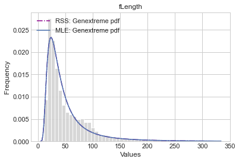
    


    
    
    


    
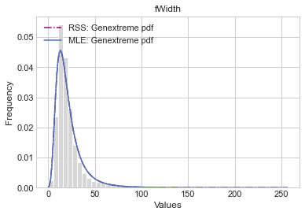
    


    
    
    


    
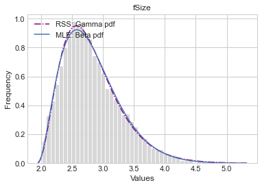
    


    
    
    


    
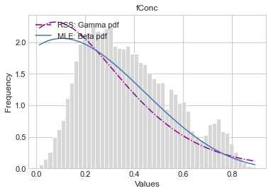
    


    
    
    


    
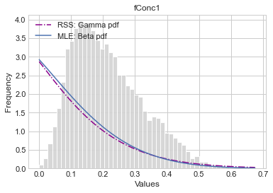
    


    
    
    


    
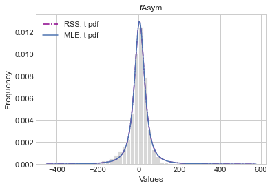
    


    
    
    


    
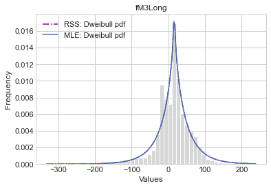
    


    
    
    


    
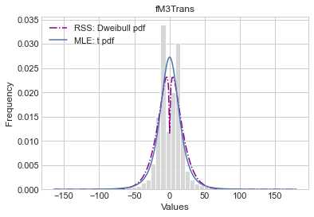
    


    
    
    


    
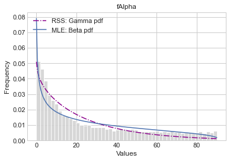
    


    
    
    


    
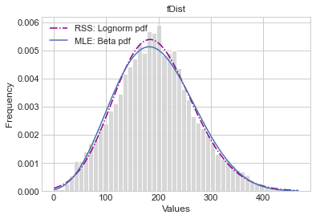
    


    
    
    

Results of the goodness of the fit ( parameters obtained with Residual Sum of Squares (RSS) - *disfit* package) using the KS-test :


```python
print(tabulate(ksdata1, headers=["parameter","Best distribution fit","KS test statistic","p-value"],numalign="right",tablefmt="github"))#tablefmt="latex"
```

    | parameter   | Best distribution fit   |   KS test statistic |     p-value |
    |-------------|-------------------------|---------------------|-------------|
    | fLength     | genextreme              |           0.0505276 | 4.32225e-32 |
    | fWidth      | genextreme              |           0.0475182 | 1.97834e-28 |
    | fSize       | gamma                   |          0.00933521 |    0.165311 |
    | fConc       | gamma                   |           0.0262115 | 6.01853e-09 |
    | fConc1      | gamma                   |           0.0190699 | 6.15626e-05 |
    | fAsym       | t                       |           0.0477719 | 9.91746e-29 |
    | fM3Long     | dweibull                |           0.0701475 | 1.76044e-61 |
    | fM3Trans    | dweibull                |           0.0590488 | 1.11829e-43 |
    | fAlpha      | gamma                   |           0.0841271 | 2.80465e-88 |
    | fDist       | lognorm                 |           0.0114856 |   0.0460398 |
    

| parameter   | Best distribution fit   |   KS test statistic |     p-value |
|-------------|-------------------------|---------------------|-------------|
| fLength     | genextreme              |           0.0505276 | 4.32225e-32 |
| fWidth      | genextreme              |           0.0475182 | 1.97834e-28 |
| fSize       | gamma                   |          0.00933521 |    0.165311 |
| fConc       | gamma                   |           0.0262115 | 6.01853e-09 |
| fConc1      | gamma                   |           0.0190699 | 6.15626e-05 |
| fAsym       | t                       |           0.0477719 | 9.91746e-29 |
| fM3Long     | dweibull                |           0.0701475 | 1.76044e-61 |
| fM3Trans    | dweibull                |           0.0590488 | 1.11829e-43 |
| fAlpha      | gamma                   |           0.0841271 | 2.80465e-88 |
| fDist       | lognorm                 |           0.0114856 |   0.0460398 |

Results of the goodnessof the fit (obtained with Negative Loglikelihood Function -> (MLE) - *scipy* package)  using the KS-test :


```python
print(tabulate(ksdata2, headers=["parameter","Best distribution fit","KS test statistic","p-value"],numalign="right",tablefmt="github"))#tablefmt="latex"
```

    | parameter   | Best distribution fit   |   KS test statistic |     p-value |
    |-------------|-------------------------|---------------------|-------------|
    | fLength     | genextreme              |           0.0505276 | 4.32225e-32 |
    | fWidth      | genextreme              |           0.0475182 | 1.97834e-28 |
    | fSize       | beta                    |           0.0109658 |   0.0642539 |
    | fConc       | beta                    |           0.0289843 | 7.61679e-11 |
    | fConc1      | beta                    |           0.0198265 | 2.65685e-05 |
    | fAsym       | t                       |           0.0477719 | 9.91746e-29 |
    | fM3Long     | dweibull                |           0.0701475 | 1.76044e-61 |
    | fM3Trans    | t                       |           0.0808537 | 1.44717e-81 |
    | fAlpha      | beta                    |           0.0683299 | 2.35181e-58 |
    | fDist       | beta                    |            0.016181 |  0.00112744 |
    

| parameter   | Best distribution fit   |   KS test statistic |     p-value |
|-------------|-------------------------|---------------------|-------------|
| fLength     | genextreme              |           0.0505276 | 4.32225e-32 |
| fWidth      | genextreme              |           0.0475182 | 1.97834e-28 |
| fSize       | beta                    |           0.0109658 |   0.0642539 |
| fConc       | beta                    |           0.0289843 | 7.61679e-11 |
| fConc1      | beta                    |           0.0198265 | 2.65685e-05 |
| fAsym       | t                       |           0.0477719 | 9.91746e-29 |
| fM3Long     | dweibull                |           0.0701475 | 1.76044e-61 |
| fM3Trans    | t                       |           0.0808537 | 1.44717e-81 |
| fAlpha      | beta                    |           0.0683299 | 2.35181e-58 |
| fDist       | beta                    |            0.016181 |  0.00112744 |

Using the Kolomogorov-Smirov this results are obtained (but the parameters for  location, scale, and shape are estimated from the data, and https://www.statisticshowto.com/kolmogorov-smirnov-test/ says that this invalidates the test.)

However, in both cases only the p-value of all the fits are less than 0.05 so we can not accept the null hypothesis. Exept on the fSize  with the Gamma Fit obtained with the *disfit* package, the sample result would be likely if the null hypothesis were true and leads to the retention of the null hypothesis.

# Building models
Our aim is to find the best model to predict if the Cherenkov photons collected, are caused by primary gammas (signal) from the images of hadronic showers or initiated by cosmic rays in the upper atmosphere (background).

After reading and testing, Normalizing the data do not affect the classifiers that do not need normalized data. So normalizing data for all classifiers do not affect negatively


```python
#Scaling
sc = StandardScaler()
train_X = sc.fit_transform(train_X)
val_X = sc.transform(val_X)
sct=StandardScaler()
X=sct.fit_transform(X)
```


```python
def print_score(clf, X_train, y_train, X_test, y_test, train=True):
    
    #To debug, dont actually used
    if train:
        pred = clf.predict(X_train)
        print("Train Result:\n===========================================")
        print(f"accuracy score: {accuracy_score(y_train, pred):.4f}\n")
        print(f"Classification Report: \n \tPrecision: {precision_score(y_train, pred)}\n\tRecall Score: {recall_score(y_train, pred)}\n\tF1 score: {f1_score(y_train, pred)}\n")
        print(f"Confusion Matrix: \n {confusion_matrix(y_train, clf.predict(X_train))}\n")
    
    #this is the used part:
    elif train==False:
        pred = clf.predict(X_test)#we predict new results
        print("Test Result:\n===========================================")        
        print(f"accuracy score: {accuracy_score(y_test, pred)}\n")#accuracy of the results comparing with the real values
        print(f"Classification Report: \n \tPrecision: {precision_score(y_test, pred)}\n\tRecall Score: {recall_score(y_test, pred)}\n\tF1 score: {f1_score(y_test, pred)}\n")
        print(f"Confusion Matrix: \n")# {confusion_matrix(y_test, pred)}\n")
        con_matrix=confusion_matrix(y_test, pred)
        t_cm=[["True F"]+list(con_matrix[0]),["True T"]+list(con_matrix[1])]
        print(tabulate(t_cm,headers=["      ","Predicted F","Predicted T"],tablefmt="psql"))
        t_cm_r=[np.array(con_matrix)[0]/np.sum(np.array(con_matrix)[0]),np.array(con_matrix)[1]/np.sum(np.array(con_matrix)[1])]
        t_cm_r=[["True F"]+list(t_cm_r[0]),["True T"]+list(t_cm_r[1])]
        print("\nRelative Confusion Matrix: \n")# {confusion_matrix(y_test, pred)}\n")
        print(tabulate(t_cm_r,headers=["      ","Predicted F","Predicted T"],tablefmt="psql",floatfmt="1.3"))
```


```python
def ROC_plot(model,title):
    #Almost every model available makes a continuous approximation before 
    #mapping it to a hard prediction. Usually, in the scikit-learn models, these 
    #continuous outputs can be accessed through the predict_proba method
    probs = model.predict_proba(val_X)
    #the second column are the probability of signal
    preds = probs[:,1]
    #the roc_curve function return the values for the plot of ROC. false positive rate,true positive rate
    fprd, tprd, thresholdd = roc_curve(val_y, preds)
    roc_aucd = auc(fprd, tprd)#area under the curve

    plt.plot(fprd, tprd, 'b', label = 'AUC = %0.2f' % roc_aucd)
    plt.plot([0, 1], [0, 1],'r--')
    plt.title('Receiver Operating Characteristic '+title,fontsize=12)
    plt.ylabel('True Positive Rate',fontsize=12)
    plt.xlabel('False Positive Rate',fontsize=12)
    plt.legend(loc = 'lower right', prop={'size': 12})
    plt.show()
    return (roc_aucd,fprd, tprd)
```


```python
#@title
#for using this first it's needed to train a logistic classificator
#first fit pls
#The trees and forest classifiers do not make a continuous approximation before mapping it to a hard prediction.
#so they cannot produce a ROC curve with the same method as the previous function
# we use the metod given in http://mlwiki.org/index.php/ROC_Analysis
#for this, we need a ranker, we can use the Logistic Regression outputs probabilities
def ROC_trees(val_X,model,logmodel,class_name):
    probs = model.predict_proba(val_X)
    #the step up must sum 1 and is given by the signals
    #the step to the right must sum 1 and is given by the background
    step_up=1/sum(probs[:,1])
    step_rigth=1/sum(probs[:,0])

    #obtaining the continous values of the Logistic Regression to rank the values of the data
    valor_bin=model.predict_proba(val_X)#2 columns of data (probability of background, probabilty of signal) 
    #in the case of the tree (or a forest) the probabilities can only be 1 or 0
    #we asign steps values for each value
    valor_bin[:,0]=valor_bin[:,0]*step_rigth 
    valor_bin[:,1]=valor_bin[:,1]*step_up
    stept=valor_bin[:,0]# this line is used latter to calculate the area under the curve
    valor_bin=valor_bin.tolist()#to list

    # use the probability of signal predicted by the logmodel to make the score order for each event
    score=list(logmodel.predict_proba(val_X)[:,1])

    Z = [x for _,x in sorted(zip(score,valor_bin),reverse=True)]#order each event in function of its score from the highest score to the lowest
    Z=np.array(Z)

    pandaZx=pd.Series(Z[:,0])#to panda format
    pandaZY=pd.Series(Z[:,1])#to panda format
    cumu_x=(pandaZx.cumsum()).tolist()#cumulative sum of right steps
    cumu_y=(pandaZY.cumsum()).tolist()#cumulative sum of up steps

    finalll=np.zeros((len(cumu_x)+1,2))#creating a zero array to add all the steps and an initial step 0,0
    finalll[1:,0]=cumu_x#adding the cumulative sum
    finalll[1:,1]=cumu_y#adding the cumulative sum

    #area under the curve
    ordersteps = [x for _,x in sorted(zip(score,stept),reverse=True)]#we order the steps to the right
    AUC=sum(ordersteps*np.array(cumu_y))

    plt.plot(finalll[:,0],finalll[:,1], 'b', label = 'AUC = %0.2f' % AUC)
    plt.plot([0, 1], [0, 1],'r--')
    plt.title('Receiver Operating Characteristic '+class_name,fontsize=12)
    plt.ylabel('True Positive Rate',fontsize=12)
    plt.xlabel('False Positive Rate',fontsize=12)
    plt.legend(loc = 'lower right', prop={'size': 12})
    plt.show()
    #to save the results for latter 
    return (AUC,finalll[:,0], finalll[:,1])
```

## Logistic Regression 📉📈📉

### No boosted parameters


```python
#the classifier
logmodel = LogisticRegression() 
#training
logmodel.fit(train_X, train_y)

# Make validation predictions and calculate precition
print_score(logmodel, train_X, train_y, val_X, val_y, train=False)
```

    Test Result:
    ===========================================
    accuracy score: 0.7911671924290221
    
    Classification Report: 
     	Precision: 0.8007497116493656
    	Recall Score: 0.9019162065605716
    	F1 score: 0.8483274782343058
    
    Confusion Matrix: 
    
    +----------+---------------+---------------+
    |          |   Predicted F |   Predicted T |
    |----------+---------------+---------------|
    | True F   |           985 |           691 |
    | True T   |           302 |          2777 |
    +----------+---------------+---------------+
    
    Relative Confusion Matrix: 
    
    +----------+---------------+---------------+
    |          |   Predicted F |   Predicted T |
    |----------+---------------+---------------|
    | True F   |        0.588  |         0.412 |
    | True T   |        0.0981 |         0.902 |
    +----------+---------------+---------------+
    


```python
#saving the result for later
ac0 =accuracy_score(val_y, logmodel.predict(val_X)) 
```

#### ROC curve


```python
(r0,rx0,ry0)=ROC_plot(logmodel,"Logistic Regression")
```


    

    


#### Cross validation


```python
score0  =cross_val_score(logmodel, X, y, cv=5, scoring='accuracy')# in 5 groups
print('Mean Accuracy Score LR w no parameters: %2f' %(score0.mean()))
```

    Mean Accuracy Score LR w no parameters: 0.790799
    

### Best hyperparameters given by GridSearchCV package

Grid search is the process of performing  an exhaustive search over specified values in order to determine the optimal hyperparameter values for a given model. 


```python
#classifier
LR = LogisticRegression()
```

Proving values for max_iter:Maximum number of iterations taken for the solvers to converge (default=100). Values were tested from 100 to 1000 in steps of 5.
We will optimize the solver, the penalty, and the C hyperparameters


```python
params_LR={'max_iter':range(100,1000,100)}
params_LR['solver'] = ['newton-cg', 'lbfgs', 'liblinear']
params_LR['penalty'] = ['none', 'l1', 'l2', 'elasticnet']
params_LR['C'] = [1e-5, 1e-2,1e2]
```

The package realize cross-validation in 5 groups with "accuracy" as the parameter of scoring


```python
LR_GS = GridSearchCV(
        estimator=LR,
        param_grid=params_LR,
        cv=5, scoring='accuracy', verbose=0, n_jobs=-1)
```

when fit is applied to the GridSearchCV the best params to give the best accuracy for the test data is searched


```python
LR_result = LR_GS.fit(train_X,train_y)
LR_params = LR_result.best_params_#the resultant best parameters
LR_params
```


    {'C': 100.0, 'max_iter': 200, 'penalty': 'l1', 'solver': 'liblinear'}


This hiperparameter is used to build a Best Logistic Regression Classifier


```python
best_LR=LogisticRegression(max_iter=LR_params["max_iter"],
                                solver=LR_params["solver"],
                                penalty=LR_params["penalty"],
                                C=LR_params["C"],
                                );
best_LR.fit(train_X,train_y);
print_score(best_LR, train_X, train_y, val_X, val_y, train=False)
```

    Test Result:
    ===========================================
    accuracy score: 0.7911671924290221
    
    Classification Report: 
     	Precision: 0.8007497116493656
    	Recall Score: 0.9019162065605716
    	F1 score: 0.8483274782343058
    
    Confusion Matrix: 
    
    +----------+---------------+---------------+
    |          |   Predicted F |   Predicted T |
    |----------+---------------+---------------|
    | True F   |           985 |           691 |
    | True T   |           302 |          2777 |
    +----------+---------------+---------------+
    
    Relative Confusion Matrix: 
    
    +----------+---------------+---------------+
    |          |   Predicted F |   Predicted T |
    |----------+---------------+---------------|
    | True F   |        0.588  |         0.412 |
    | True T   |        0.0981 |         0.902 |
    +----------+---------------+---------------+
    


```python
#saving the result for later
ac1 =accuracy_score(val_y, best_LR.predict(val_X)) 
```

#### ROC curve


```python
(r1,rx1,ry1)=ROC_plot(best_LR,"Logistic Regression")
```


    
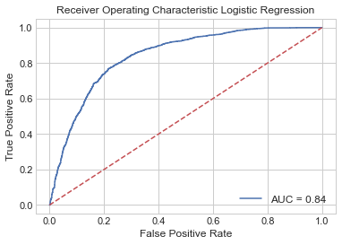
    


#### Cross validation

Let's prove how these values of the hyperparameters work on all the data (not only in the test data). Also, the Cross-validation is performed to validate the slice of data results.


```python
score1  =cross_val_score(best_LR, X, y, cv=5, scoring='accuracy')
print('Mean Accuracy Score LR w best parameters: %2f' %(score1.mean()))
```

    Mean Accuracy Score LR w best parameters: 0.790641
    

### Best parameter by RandomSearchCV package

GridSearchCV is computationally-time expensive, especially when searching over a large hyperparameter space and dealing with multiple hyperparameters. A solution to this is to use RandomizedSearchCV, in which not all hyperparameter values are tried out. Instead, a fixed number of hyperparameter settings is sampled from specified probability distributions.


```python
lr = LogisticRegression()
```

Proving values for max_iter:Maximum number of iterations taken for the solvers to converge (default=100). Values were tested from 100 to 1000 in steps of 5

This is a dictionary where names are arguments to the model and values are distributions from which to draw samples. We will optimize the solver, the penalty, and the C hyperparameters of the model with discrete distributions for the solver and penalty type and a log-uniform distribution from 1e-5 to 100 for the C value.

Log-uniform is useful for searching values as we often explore values at different orders of magnitude.


```python
params_lr={'max_iter':range(100,1000,5)}
params_lr['solver'] = ['newton-cg', 'lbfgs', 'liblinear']
params_lr['penalty'] = ['none', 'l1', 'l2', 'elasticnet']
params_lr['C'] = loguniform(1e-5, 100)
```


```python
lr_RS = RandomizedSearchCV(estimator=lr, param_distributions=params_lr,
                           n_iter = 20, scoring='accuracy', cv =5, verbose=2, random_state=0, n_jobs=-1)
```

when fit is applied to the GridSearchCV the best params to give the best accuracy for the test data is searched


```python
lr_result = lr_RS.fit(train_X,train_y)
lr_params = lr_result.best_params_
lr_params
```

    Fitting 5 folds for each of 20 candidates, totalling 100 fits
    

    [Parallel(n_jobs=-1)]: Using backend LokyBackend with 4 concurrent workers.
    [Parallel(n_jobs=-1)]: Done  86 tasks      | elapsed:    1.7s
    [Parallel(n_jobs=-1)]: Done 100 out of 100 | elapsed:    2.0s finished
    


    {'C': 0.06945356257424773,
     'max_iter': 685,
     'penalty': 'none',
     'solver': 'lbfgs'}


The hyperparameters are used to built a better Logistic Regression Classifier


```python
best_lr=LogisticRegression(max_iter=lr_params["max_iter"],
                                solver=lr_params["solver"],
                                penalty=lr_params["penalty"],
                                C=lr_params["C"],
                                );
best_lr.fit(train_X,train_y);
print_score(best_lr, train_X, train_y, val_X, val_y, train=False)
```

    Test Result:
    ===========================================
    accuracy score: 0.7911671924290221
    
    Classification Report: 
     	Precision: 0.8007497116493656
    	Recall Score: 0.9019162065605716
    	F1 score: 0.8483274782343058
    
    Confusion Matrix: 
    
    +----------+---------------+---------------+
    |          |   Predicted F |   Predicted T |
    |----------+---------------+---------------|
    | True F   |           985 |           691 |
    | True T   |           302 |          2777 |
    +----------+---------------+---------------+
    
    Relative Confusion Matrix: 
    
    +----------+---------------+---------------+
    |          |   Predicted F |   Predicted T |
    |----------+---------------+---------------|
    | True F   |        0.588  |         0.412 |
    | True T   |        0.0981 |         0.902 |
    +----------+---------------+---------------+
    


```python
#saving the result for later
ac1b =accuracy_score(val_y, best_lr.predict(val_X)) 
```

#### ROC curve


```python
(r1b,rx1b,ry1b)=ROC_plot(best_lr,"Random Forest Model")
```


    
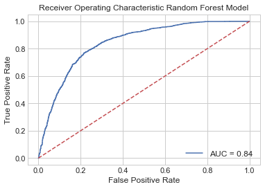
    


#### Cross validation

Let's prove how these values of the hyperparameters work on all the data (not only in the test data). Also, the Cross-validation is performed to validate the slice of data results.


```python
score1b  =cross_val_score(best_lr, X, y, cv=5, scoring='accuracy')
print('Mean Accuracy Score RFC w best parameters: %2f' %(score1b.mean()))
```

    Mean Accuracy Score RFC w best parameters: 0.790641
    

## Decision Tree Model 🌳

### No boosted parameters


```python
# Specify Model
decision_tree_model = DecisionTreeClassifier(criterion='entropy',random_state = 0)

# Fit Model
decision_tree_model.fit(train_X, train_y)

# Make validation predictions and calculate precition
print_score(decision_tree_model, train_X, train_y, val_X, val_y, train=False)
print(f'leaves:{decision_tree_model.get_n_leaves()}')
```

    Test Result:
    ===========================================
    accuracy score: 0.8143007360672976
    
    Classification Report: 
     	Precision: 0.8621372031662269
    	Recall Score: 0.8489769405651185
    	F1 score: 0.8555064637538864
    
    Confusion Matrix: 
    
    +----------+---------------+---------------+
    |          |   Predicted F |   Predicted T |
    |----------+---------------+---------------|
    | True F   |          1258 |           418 |
    | True T   |           465 |          2614 |
    +----------+---------------+---------------+
    
    Relative Confusion Matrix: 
    
    +----------+---------------+---------------+
    |          |   Predicted F |   Predicted T |
    |----------+---------------+---------------|
    | True F   |         0.751 |         0.249 |
    | True T   |         0.151 |         0.849 |
    +----------+---------------+---------------+
    leaves:1347
    


```python
#saving the result for later
#pudo ir antes en la función de display de resultados pero me iba a costar tiempo reevaluar
ac2 =accuracy_score(val_y, decision_tree_model.predict(val_X)) 
```

#### ROC curve


```python
# Make validation predictions and calculate precition
(r2,rx2,ry2)=ROC_trees(val_X,decision_tree_model,best_lr,"Decision Tree")
```


    
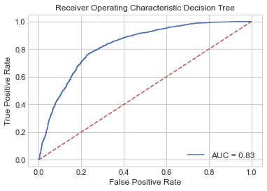
    


#### Cross validation


```python
score2  =cross_val_score(decision_tree_model, X, y, cv=5, scoring='accuracy')# in 5 groups
print('Mean Accuracy Score DTC w no parameters: %2f' %(score2.mean()))
```

    Mean Accuracy Score DTC w no parameters: 0.818139
    

### Best parameters given by GridSearchCV package

Grid search is the process of performing hyper parameter tuning in order to determine the optimal values for a given model. Also the function preforms cross-validation


```python
DTC = DecisionTreeClassifier(criterion='entropy',random_state = 0)
```

Proving values for

*max_depth*: The maximum depth of the tree. If None, then nodes are expanded until all leaves are pure or until all leaves contain less than min_samples_split samples. Values were tested from 10 to 50 in steps of 5.

*max_leaf_nodes*: max_leaf_nodes in best-first fashion. Best nodes are defined as relative reduction in impurity. If None then unlimited number of leaf nodes. Values were tested from 10 to 200 in steps of 10.


```python
params_DTC={'max_depth':range(10,50,5), 'max_leaf_nodes':range(10,200,10)}
```

The package realize cross-validation in 5 groups with "accuracy" as the parameter of scoring


```python
DTC_GS = GridSearchCV(
        estimator=DTC,
        param_grid=params_DTC,
        cv=5, scoring='accuracy', verbose=0, n_jobs=-1)
```


```python
DTC_result = DTC_GS.fit(train_X,train_y)
DTC_params = DTC_result.best_params_
DTC_params
```


    {'max_depth': 15, 'max_leaf_nodes': 100}


```python
best_DTC=DecisionTreeClassifier(criterion='entropy',random_state = 0,max_depth=DTC_params["max_depth"],max_leaf_nodes=DTC_params["max_leaf_nodes"]);
best_DTC.fit(train_X,train_y);
print_score(best_DTC, train_X, train_y, val_X, val_y, train=False)
```

    Test Result:
    ===========================================
    accuracy score: 0.8515247108307045
    
    Classification Report: 
     	Precision: 0.8538622129436325
    	Recall Score: 0.9298473530367002
    	F1 score: 0.89023631840796
    
    Confusion Matrix: 
    
    +----------+---------------+---------------+
    |          |   Predicted F |   Predicted T |
    |----------+---------------+---------------|
    | True F   |          1186 |           490 |
    | True T   |           216 |          2863 |
    +----------+---------------+---------------+
    
    Relative Confusion Matrix: 
    
    +----------+---------------+---------------+
    |          |   Predicted F |   Predicted T |
    |----------+---------------+---------------|
    | True F   |        0.708  |         0.292 |
    | True T   |        0.0702 |         0.93  |
    +----------+---------------+---------------+
    


```python
#saving the result for later
#pudo ir antes en la función de display de resultados pero me iba a costar tiempo reevaluar
ac3 =accuracy_score(val_y, best_DTC.predict(val_X)) 
```

#### ROC curve


```python
(r3,rx3,ry3)=ROC_plot(best_DTC,"Decision Tree Model")
```


    
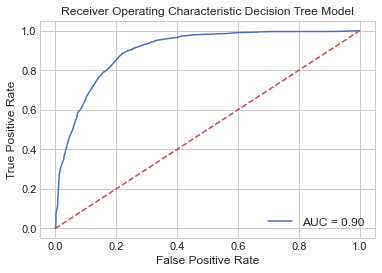
    


#### Cross validation


```python
score3  =cross_val_score(best_DTC, X, y, cv=5, scoring='accuracy')
print('Mean Accuracy Score DTC w best parameters: %2f' %(score3.mean()))
```

    Mean Accuracy Score DTC w best parameters: 0.850053
    

### Best parameter by RandomSearchCV package

GridSearchCV is computationally-time expensive, especially when searching over a large hyperparameter space and dealing with multiple hyperparameters. A solution to this is to use RandomizedSearchCV, in which not all hyperparameter values are tried out. Instead, a fixed number of hyperparameter settings is sampled from specified probability distributions.


```python
dtc = DecisionTreeClassifier(criterion='entropy',random_state = 0)
```


```python
params_dtc={'max_depth':range(10,50), 'max_leaf_nodes':range(10,200)}
```

Proving values for

*max_depth*: The maximum depth of the tree. If None, then nodes are expanded until all leaves are pure or until all leaves contain less than min_samples_split samples. Values were tested from 10 to 50.

*max_leaf_nodes*: max_leaf_nodes in best-first fashion. Best nodes are defined as relative reduction in impurity. If None then unlimited number of leaf nodes. Values were tested from 10 to 200.


```python
dtc_RS = RandomizedSearchCV(estimator=dtc, param_distributions=params_dtc, n_iter = 20, scoring='accuracy', cv =5, verbose=2, random_state=0, n_jobs=-1)
```


```python
dtc_result = dtc_RS.fit(train_X,train_y)
dtc_params = dtc_result.best_params_
dtc_params
```

    Fitting 5 folds for each of 20 candidates, totalling 100 fits
    

    [Parallel(n_jobs=-1)]: Using backend LokyBackend with 4 concurrent workers.
    [Parallel(n_jobs=-1)]: Done  33 tasks      | elapsed:    5.5s
    [Parallel(n_jobs=-1)]: Done 100 out of 100 | elapsed:   15.7s finished
    


    {'max_leaf_nodes': 104, 'max_depth': 45}


```python
best_dtc=DecisionTreeClassifier(criterion='entropy',random_state = 0,
                       max_depth=dtc_params["max_depth"],
                       max_leaf_nodes=dtc_params["max_leaf_nodes"]);

best_dtc.fit(train_X,train_y);
print_score(best_dtc, train_X, train_y, val_X, val_y, train=False)
```

    Test Result:
    ===========================================
    accuracy score: 0.8511041009463722
    
    Classification Report: 
     	Precision: 0.8533532041728763
    	Recall Score: 0.9298473530367002
    	F1 score: 0.8899595896798259
    
    Confusion Matrix: 
    
    +----------+---------------+---------------+
    |          |   Predicted F |   Predicted T |
    |----------+---------------+---------------|
    | True F   |          1184 |           492 |
    | True T   |           216 |          2863 |
    +----------+---------------+---------------+
    
    Relative Confusion Matrix: 
    
    +----------+---------------+---------------+
    |          |   Predicted F |   Predicted T |
    |----------+---------------+---------------|
    | True F   |        0.706  |         0.294 |
    | True T   |        0.0702 |         0.93  |
    +----------+---------------+---------------+
    


```python
#saving the result for later
#pudo ir antes en la función de display de resultados pero me iba a costar tiempo reevaluar
ac3b =accuracy_score(val_y, best_dtc.predict(val_X)) 
```

#### ROC curve


```python
(r3b,rx3b,ry3b)=ROC_plot(best_dtc,"Random Forest Model")
```


    
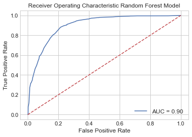
    


#### Cross validation


```python
score3b  =cross_val_score(best_dtc, X, y, cv=5, scoring='accuracy')
print('Mean Accuracy Score RFC w best parameters: %2f' %(score3b.mean()))
```

    Mean Accuracy Score RFC w best parameters: 0.849790
    

## Random Forest Model 🌲🌳🌲

### No boosted parameters


```python
# Define the model. Set random_state to 1
rf_model  = RandomForestClassifier(criterion = 'entropy', random_state = 0)

# fit your model
rf_model.fit(train_X, train_y)

# Calculate the mean absolute error of your Random Forest model on the validation data
print_score(rf_model, train_X, train_y, val_X, val_y, train=False)
print(f'parameters:{rf_model.get_params()}')
```

    Test Result:
    ===========================================
    accuracy score: 0.8858044164037855
    
    Classification Report: 
     	Precision: 0.8816977724262492
    	Recall Score: 0.951282884053264
    	F1 score: 0.9151695047648805
    
    Confusion Matrix: 
    
    +----------+---------------+---------------+
    |          |   Predicted F |   Predicted T |
    |----------+---------------+---------------|
    | True F   |          1283 |           393 |
    | True T   |           150 |          2929 |
    +----------+---------------+---------------+
    
    Relative Confusion Matrix: 
    
    +----------+---------------+---------------+
    |          |   Predicted F |   Predicted T |
    |----------+---------------+---------------|
    | True F   |        0.766  |         0.234 |
    | True T   |        0.0487 |         0.951 |
    +----------+---------------+---------------+
    parameters:{'bootstrap': True, 'ccp_alpha': 0.0, 'class_weight': None, 'criterion': 'entropy', 'max_depth': None, 'max_features': 'auto', 'max_leaf_nodes': None, 'max_samples': None, 'min_impurity_decrease': 0.0, 'min_impurity_split': None, 'min_samples_leaf': 1, 'min_samples_split': 2, 'min_weight_fraction_leaf': 0.0, 'n_estimators': 100, 'n_jobs': None, 'oob_score': False, 'random_state': 0, 'verbose': 0, 'warm_start': False}
    


```python
#saving the result for later
#pudo ir antes en la función de display de resultados pero me iba a costar tiempo reevaluar
ac4 =accuracy_score(val_y, rf_model.predict(val_X)) 
```

#### ROC curve


```python
(r4,rx4,ry4)=ROC_trees(val_X,rf_model,best_lr,"Random Forest Model")
```


    
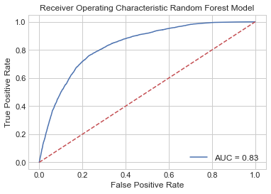
    


#### Cross validation


```python
score4  =cross_val_score(rf_model, X, y, cv=5, scoring='accuracy')# in 5 groups
print('Mean Accuracy Score RFC w no parameters: %2f' %(score4.mean()))
```

    Mean Accuracy Score RFC w no parameters: 0.880967
    

### Best parameters given by GridSearchCV package

Grid search is the process of performing hyper parameter tuning in order to determine the optimal values for a given model. Also the function preforms cross-validation


```python
RFC = RandomForestClassifier(criterion='entropy',random_state = 0)
```


```python
params_RFC= {  'bootstrap': [True], 'max_depth': [5,10,50,100,None],
             'max_features': ['auto', 'log2'], 'n_estimators':[50,100,150,200,250,500,1000]}
```

Proving values for

*n_estimators*: (default=100)
The number of trees in the forest. Values were tested from 50 to 1000

*bootstrapbool*: (default=True)
Whether bootstrap samples are used when building trees. If False, the whole dataset is used to build each tree.

*max_features*{“auto”, “sqrt”, “log2”}:( default=”auto”)
The number of features to consider when looking for the best split

*max_depth*: The maximum depth of the tree. If None, then nodes are expanded until all leaves are pure or until all leaves contain less than min_samples_split samples. Values were tested from 5 to 100 

The package realize cross-validation in 5 groups with "accuracy" as the parameter of scoring


```python
RFC_GS = GridSearchCV(
        estimator=RFC,
        param_grid=params_RFC,
        cv=5, scoring='accuracy', verbose=0, n_jobs=-1)
```


```python
RFC_result = RFC_GS.fit(train_X,train_y)
RFC_params = RFC_result.best_params_
RFC_params
```


    {'bootstrap': True,
     'max_depth': 50,
     'max_features': 'auto',
     'n_estimators': 250}


```python
best_RFC=RandomForestClassifier(criterion='entropy',random_state = 0,
                                bootstrap=RFC_params["bootstrap"],
                                max_depth=RFC_params["max_depth"],
                                max_features=RFC_params["max_features"],
                                n_estimators=RFC_params["n_estimators"],
                                );
best_RFC.fit(train_X,train_y);
print_score(best_RFC, train_X, train_y, val_X, val_y, train=False)
```

    Test Result:
    ===========================================
    accuracy score: 0.8858044164037855
    
    Classification Report: 
     	Precision: 0.882157926461724
    	Recall Score: 0.9506333225073076
    	F1 score: 0.9151164608410194
    
    Confusion Matrix: 
    
    +----------+---------------+---------------+
    |          |   Predicted F |   Predicted T |
    |----------+---------------+---------------|
    | True F   |          1285 |           391 |
    | True T   |           152 |          2927 |
    +----------+---------------+---------------+
    
    Relative Confusion Matrix: 
    
    +----------+---------------+---------------+
    |          |   Predicted F |   Predicted T |
    |----------+---------------+---------------|
    | True F   |        0.767  |         0.233 |
    | True T   |        0.0494 |         0.951 |
    +----------+---------------+---------------+
    


```python
#saving the result for later
#pudo ir antes en la función de display de resultados pero me iba a costar tiempo reevaluar
ac5 =accuracy_score(val_y, best_RFC.predict(val_X)) 
```

#### ROC curve


```python
(r5,rx5,ry5)=ROC_plot(best_RFC,"Random Forest Model")
```


    
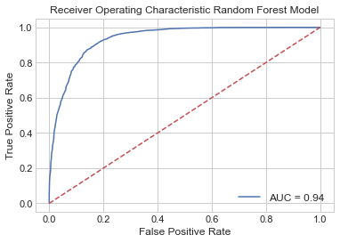
    


#### Cross validation


```python
score5  =cross_val_score(best_RFC, X, y, cv=5, scoring='accuracy')
print('Mean Accuracy Score RFC w best parameters: %2f' %(score5.mean()))
```

    Mean Accuracy Score RFC w best parameters: 0.881073
    

### Best parameter by RandomSearchCV package

GridSearchCV is computationally-time expensive, especially when searching over a large hyperparameter space and dealing with multiple hyperparameters. A solution to this is to use RandomizedSearchCV, in which not all hyperparameter values are tried out. Instead, a fixed number of hyperparameter settings is sampled from specified probability distributions.


```python
rfc = RandomForestClassifier(criterion='entropy',random_state = 0)
```


```python
params_rfc= { 'bootstrap': [True], 'max_depth': list(range(5,100))+[ None],
             'max_features': ['auto', 'log2'], 'n_estimators':range(50,1000)}
```

Proving values for

*n_estimators*: (default=100)
The number of trees in the forest. Values were tested from 50 to 1000 

*bootstrapbool*: (default=True)
Whether bootstrap samples are used when building trees. If False, the whole dataset is used to build each tree.

*max_features*{“auto”, “sqrt”, “log2”}:( default=”auto”)
The number of features to consider when looking for the best split

*max_depth*: The maximum depth of the tree. If None, then nodes are expanded until all leaves are pure or until all leaves contain less than min_samples_split samples. Values were tested from 10 to 100 


```python
rfc_RS = RandomizedSearchCV(estimator=rfc, param_distributions=params_rfc, n_iter = 20, scoring='accuracy',
                            cv =5, verbose=2, random_state=0, n_jobs=-1)
```


```python
rfc_result = rfc_RS.fit(train_X,train_y)
rfc_params = rfc_result.best_params_
rfc_params
```

    Fitting 5 folds for each of 20 candidates, totalling 100 fits
    

    [Parallel(n_jobs=-1)]: Using backend LokyBackend with 4 concurrent workers.
    [Parallel(n_jobs=-1)]: Done  33 tasks      | elapsed:  9.8min
    [Parallel(n_jobs=-1)]: Done 100 out of 100 | elapsed: 26.5min finished
    


    {'n_estimators': 200,
     'max_features': 'log2',
     'max_depth': 30,
     'bootstrap': True}


```python
best_rfc=RandomForestClassifier(criterion='entropy',random_state = 0,
                                bootstrap=rfc_params["bootstrap"],
                                max_depth=rfc_params["max_depth"],
                                max_features=rfc_params["max_features"],
                                n_estimators=rfc_params["n_estimators"],
                                );
best_rfc.fit(train_X,train_y);
print_score(best_rfc, train_X, train_y, val_X, val_y, train=False)
```

    Test Result:
    ===========================================
    accuracy score: 0.8843322818086226
    
    Classification Report: 
     	Precision: 0.8826021180030257
    	Recall Score: 0.9473855147775252
    	F1 score: 0.9138471177944862
    
    Confusion Matrix: 
    
    +----------+---------------+---------------+
    |          |   Predicted F |   Predicted T |
    |----------+---------------+---------------|
    | True F   |          1288 |           388 |
    | True T   |           162 |          2917 |
    +----------+---------------+---------------+
    
    Relative Confusion Matrix: 
    
    +----------+---------------+---------------+
    |          |   Predicted F |   Predicted T |
    |----------+---------------+---------------|
    | True F   |        0.768  |         0.232 |
    | True T   |        0.0526 |         0.947 |
    +----------+---------------+---------------+
    


```python
#saving the result for later
#pudo ir antes en la función de display de resultados pero me iba a costar tiempo reevaluar
ac5b =accuracy_score(val_y, best_rfc.predict(val_X)) 
```

#### ROC curve


```python
(r5b,rx5b,ry5b)=ROC_plot(best_rfc,"Random Forest Model")
```


    

    


#### Cross validation


```python
score5b  =cross_val_score(best_rfc, X, y, cv=5, scoring='accuracy')
print('Mean Accuracy Score RFC w best parameters: %2f' %(score5b.mean()))
```

    Mean Accuracy Score RFC w best parameters: 0.880652
    

## Artificial Neural Network  🕸 🧠🧠

### No boosted parameters

This classifier needs standardized data. The data was standardized at the beginning


```python
def build_model():
  model = Sequential()
  #First Hidden Layer
  model.add(Dense(units=16,  kernel_initializer= 'uniform', activation='relu', input_dim=10))
  model.add(Dropout(0.1))
  #Second  Hidden Layer
  model.add(Dense(units=16,  kernel_initializer='uniform', activation='relu'))
  model.add(Dropout(0.1))
  #Output Layer
  model.add(Dense(units=1,  kernel_initializer='uniform', activation='sigmoid'))

  #Compiling the neural network
  model.compile(optimizer='adam', loss='binary_crossentropy', metrics=['accuracy'])
  return model

keras_clf = KerasClassifier(build_model,epochs=200, batch_size=100)
```


```python
classifier=build_model()
```


```python
history=classifier.fit(train_X, train_y, validation_data=(val_X, val_y),epochs=200, batch_size=100)
```

    Epoch 1/200
    143/143 [==============================] - 1s 5ms/step - loss: 0.6293 - accuracy: 0.7385 - val_loss: 0.5028 - val_accuracy: 0.7937
    Epoch 2/200
    143/143 [==============================] - 0s 2ms/step - loss: 0.4533 - accuracy: 0.7989 - val_loss: 0.4232 - val_accuracy: 0.8040
    Epoch 3/200
    143/143 [==============================] - 0s 2ms/step - loss: 0.4281 - accuracy: 0.8073 - val_loss: 0.4128 - val_accuracy: 0.8111
    Epoch 4/200
    143/143 [==============================] - 0s 2ms/step - loss: 0.4173 - accuracy: 0.8125 - val_loss: 0.4012 - val_accuracy: 0.8244
    Epoch 5/200
    143/143 [==============================] - 0s 2ms/step - loss: 0.4085 - accuracy: 0.8210 - val_loss: 0.3913 - val_accuracy: 0.8290
    Epoch 6/200
    143/143 [==============================] - 0s 2ms/step - loss: 0.4015 - accuracy: 0.8235 - val_loss: 0.3828 - val_accuracy: 0.8355
    Epoch 7/200
    143/143 [==============================] - 0s 2ms/step - loss: 0.3922 - accuracy: 0.8292 - val_loss: 0.3779 - val_accuracy: 0.8376
    Epoch 8/200
    143/143 [==============================] - 0s 2ms/step - loss: 0.3859 - accuracy: 0.8352 - val_loss: 0.3704 - val_accuracy: 0.8423
    Epoch 9/200
    143/143 [==============================] - 0s 2ms/step - loss: 0.3820 - accuracy: 0.8401 - val_loss: 0.3668 - val_accuracy: 0.8427
    Epoch 10/200
    143/143 [==============================] - 0s 2ms/step - loss: 0.3775 - accuracy: 0.8390 - val_loss: 0.3615 - val_accuracy: 0.8448
    Epoch 11/200
    143/143 [==============================] - 0s 2ms/step - loss: 0.3733 - accuracy: 0.8424 - val_loss: 0.3590 - val_accuracy: 0.8456
    Epoch 12/200
    143/143 [==============================] - 0s 2ms/step - loss: 0.3692 - accuracy: 0.8424 - val_loss: 0.3559 - val_accuracy: 0.8465
    Epoch 13/200
    143/143 [==============================] - 0s 2ms/step - loss: 0.3678 - accuracy: 0.8471 - val_loss: 0.3514 - val_accuracy: 0.8482
    Epoch 14/200
    143/143 [==============================] - 0s 2ms/step - loss: 0.3636 - accuracy: 0.8475 - val_loss: 0.3476 - val_accuracy: 0.8507
    Epoch 15/200
    143/143 [==============================] - 0s 3ms/step - loss: 0.3566 - accuracy: 0.8515 - val_loss: 0.3433 - val_accuracy: 0.8538
    Epoch 16/200
    143/143 [==============================] - 0s 2ms/step - loss: 0.3572 - accuracy: 0.8509 - val_loss: 0.3423 - val_accuracy: 0.8583
    Epoch 17/200
    143/143 [==============================] - 0s 2ms/step - loss: 0.3535 - accuracy: 0.8532 - val_loss: 0.3376 - val_accuracy: 0.8595
    Epoch 18/200
    143/143 [==============================] - 0s 2ms/step - loss: 0.3503 - accuracy: 0.8540 - val_loss: 0.3342 - val_accuracy: 0.8612
    Epoch 19/200
    143/143 [==============================] - 0s 2ms/step - loss: 0.3514 - accuracy: 0.8531 - val_loss: 0.3327 - val_accuracy: 0.8593
    Epoch 20/200
    143/143 [==============================] - 0s 2ms/step - loss: 0.3459 - accuracy: 0.8553 - val_loss: 0.3309 - val_accuracy: 0.8620
    Epoch 21/200
    143/143 [==============================] - 0s 2ms/step - loss: 0.3456 - accuracy: 0.8564 - val_loss: 0.3309 - val_accuracy: 0.8633
    Epoch 22/200
    143/143 [==============================] - 0s 2ms/step - loss: 0.3462 - accuracy: 0.8546 - val_loss: 0.3270 - val_accuracy: 0.8650
    Epoch 23/200
    143/143 [==============================] - 0s 2ms/step - loss: 0.3457 - accuracy: 0.8590 - val_loss: 0.3256 - val_accuracy: 0.8656
    Epoch 24/200
    143/143 [==============================] - 0s 2ms/step - loss: 0.3399 - accuracy: 0.8599 - val_loss: 0.3241 - val_accuracy: 0.8646
    Epoch 25/200
    143/143 [==============================] - 0s 2ms/step - loss: 0.3438 - accuracy: 0.8575 - val_loss: 0.3231 - val_accuracy: 0.8654
    Epoch 26/200
    143/143 [==============================] - 0s 2ms/step - loss: 0.3384 - accuracy: 0.8567 - val_loss: 0.3224 - val_accuracy: 0.8679
    Epoch 27/200
    143/143 [==============================] - 0s 2ms/step - loss: 0.3390 - accuracy: 0.8601 - val_loss: 0.3209 - val_accuracy: 0.8660
    Epoch 28/200
    143/143 [==============================] - 0s 2ms/step - loss: 0.3433 - accuracy: 0.8562 - val_loss: 0.3226 - val_accuracy: 0.8692
    Epoch 29/200
    143/143 [==============================] - 0s 2ms/step - loss: 0.3380 - accuracy: 0.8600 - val_loss: 0.3212 - val_accuracy: 0.8686
    Epoch 30/200
    143/143 [==============================] - 0s 2ms/step - loss: 0.3384 - accuracy: 0.8606 - val_loss: 0.3186 - val_accuracy: 0.8692
    Epoch 31/200
    143/143 [==============================] - 0s 1ms/step - loss: 0.3387 - accuracy: 0.8606 - val_loss: 0.3175 - val_accuracy: 0.8675
    Epoch 32/200
    143/143 [==============================] - 0s 2ms/step - loss: 0.3369 - accuracy: 0.8610 - val_loss: 0.3175 - val_accuracy: 0.8665
    Epoch 33/200
    143/143 [==============================] - 0s 2ms/step - loss: 0.3330 - accuracy: 0.8618 - val_loss: 0.3168 - val_accuracy: 0.8686
    Epoch 34/200
    143/143 [==============================] - 0s 2ms/step - loss: 0.3369 - accuracy: 0.8607 - val_loss: 0.3182 - val_accuracy: 0.8673
    Epoch 35/200
    143/143 [==============================] - 0s 2ms/step - loss: 0.3366 - accuracy: 0.8599 - val_loss: 0.3168 - val_accuracy: 0.8681
    Epoch 36/200
    143/143 [==============================] - 0s 2ms/step - loss: 0.3365 - accuracy: 0.8620 - val_loss: 0.3189 - val_accuracy: 0.8679
    Epoch 37/200
    143/143 [==============================] - 0s 2ms/step - loss: 0.3313 - accuracy: 0.8633 - val_loss: 0.3160 - val_accuracy: 0.8686
    Epoch 38/200
    143/143 [==============================] - 0s 2ms/step - loss: 0.3335 - accuracy: 0.8613 - val_loss: 0.3147 - val_accuracy: 0.8683
    Epoch 39/200
    143/143 [==============================] - 0s 2ms/step - loss: 0.3343 - accuracy: 0.8627 - val_loss: 0.3144 - val_accuracy: 0.8688
    Epoch 40/200
    143/143 [==============================] - 0s 2ms/step - loss: 0.3327 - accuracy: 0.8601 - val_loss: 0.3142 - val_accuracy: 0.8696
    Epoch 41/200
    143/143 [==============================] - 0s 2ms/step - loss: 0.3323 - accuracy: 0.8606 - val_loss: 0.3147 - val_accuracy: 0.8698
    Epoch 42/200
    143/143 [==============================] - 0s 2ms/step - loss: 0.3338 - accuracy: 0.8608 - val_loss: 0.3144 - val_accuracy: 0.8690
    Epoch 43/200
    143/143 [==============================] - 0s 2ms/step - loss: 0.3310 - accuracy: 0.8620 - val_loss: 0.3135 - val_accuracy: 0.8677
    Epoch 44/200
    143/143 [==============================] - 0s 2ms/step - loss: 0.3315 - accuracy: 0.8630 - val_loss: 0.3150 - val_accuracy: 0.8686
    Epoch 45/200
    143/143 [==============================] - 0s 2ms/step - loss: 0.3291 - accuracy: 0.8620 - val_loss: 0.3135 - val_accuracy: 0.8683
    Epoch 46/200
    143/143 [==============================] - 0s 2ms/step - loss: 0.3295 - accuracy: 0.8634 - val_loss: 0.3127 - val_accuracy: 0.8696
    Epoch 47/200
    143/143 [==============================] - 0s 2ms/step - loss: 0.3308 - accuracy: 0.8646 - val_loss: 0.3138 - val_accuracy: 0.8677
    Epoch 48/200
    143/143 [==============================] - 0s 2ms/step - loss: 0.3299 - accuracy: 0.8655 - val_loss: 0.3120 - val_accuracy: 0.8690
    Epoch 49/200
    143/143 [==============================] - 0s 2ms/step - loss: 0.3291 - accuracy: 0.8630 - val_loss: 0.3125 - val_accuracy: 0.8679
    Epoch 50/200
    143/143 [==============================] - 0s 2ms/step - loss: 0.3277 - accuracy: 0.8635 - val_loss: 0.3127 - val_accuracy: 0.8688
    Epoch 51/200
    143/143 [==============================] - 0s 2ms/step - loss: 0.3291 - accuracy: 0.8622 - val_loss: 0.3112 - val_accuracy: 0.8711
    Epoch 52/200
    143/143 [==============================] - 0s 2ms/step - loss: 0.3294 - accuracy: 0.8629 - val_loss: 0.3137 - val_accuracy: 0.8675
    Epoch 53/200
    143/143 [==============================] - 0s 2ms/step - loss: 0.3254 - accuracy: 0.8639 - val_loss: 0.3111 - val_accuracy: 0.8705
    Epoch 54/200
    143/143 [==============================] - 0s 2ms/step - loss: 0.3286 - accuracy: 0.8620 - val_loss: 0.3108 - val_accuracy: 0.8694
    Epoch 55/200
    143/143 [==============================] - 0s 2ms/step - loss: 0.3258 - accuracy: 0.8652 - val_loss: 0.3099 - val_accuracy: 0.8686
    Epoch 56/200
    143/143 [==============================] - 0s 2ms/step - loss: 0.3267 - accuracy: 0.8642 - val_loss: 0.3106 - val_accuracy: 0.8713
    Epoch 57/200
    143/143 [==============================] - 0s 3ms/step - loss: 0.3282 - accuracy: 0.8619 - val_loss: 0.3111 - val_accuracy: 0.8677
    Epoch 58/200
    143/143 [==============================] - 0s 2ms/step - loss: 0.3285 - accuracy: 0.8660 - val_loss: 0.3106 - val_accuracy: 0.8694
    Epoch 59/200
    143/143 [==============================] - 0s 2ms/step - loss: 0.3296 - accuracy: 0.8629 - val_loss: 0.3110 - val_accuracy: 0.8681
    Epoch 60/200
    143/143 [==============================] - 0s 2ms/step - loss: 0.3286 - accuracy: 0.8637 - val_loss: 0.3101 - val_accuracy: 0.8679
    Epoch 61/200
    143/143 [==============================] - 0s 2ms/step - loss: 0.3254 - accuracy: 0.8646 - val_loss: 0.3098 - val_accuracy: 0.8711
    Epoch 62/200
    143/143 [==============================] - 0s 2ms/step - loss: 0.3252 - accuracy: 0.8644 - val_loss: 0.3084 - val_accuracy: 0.8709
    Epoch 63/200
    143/143 [==============================] - 0s 2ms/step - loss: 0.3253 - accuracy: 0.8637 - val_loss: 0.3095 - val_accuracy: 0.8719
    Epoch 64/200
    143/143 [==============================] - 0s 2ms/step - loss: 0.3261 - accuracy: 0.8634 - val_loss: 0.3089 - val_accuracy: 0.8688
    Epoch 65/200
    143/143 [==============================] - 0s 2ms/step - loss: 0.3229 - accuracy: 0.8664 - val_loss: 0.3086 - val_accuracy: 0.8705
    Epoch 66/200
    143/143 [==============================] - 0s 2ms/step - loss: 0.3264 - accuracy: 0.8644 - val_loss: 0.3090 - val_accuracy: 0.8711
    Epoch 67/200
    143/143 [==============================] - 0s 2ms/step - loss: 0.3245 - accuracy: 0.8663 - val_loss: 0.3086 - val_accuracy: 0.8723
    Epoch 68/200
    143/143 [==============================] - 0s 2ms/step - loss: 0.3254 - accuracy: 0.8653 - val_loss: 0.3091 - val_accuracy: 0.8719
    Epoch 69/200
    143/143 [==============================] - 0s 2ms/step - loss: 0.3239 - accuracy: 0.8657 - val_loss: 0.3079 - val_accuracy: 0.8696
    Epoch 70/200
    143/143 [==============================] - 0s 2ms/step - loss: 0.3276 - accuracy: 0.8630 - val_loss: 0.3086 - val_accuracy: 0.8713
    Epoch 71/200
    143/143 [==============================] - 0s 2ms/step - loss: 0.3221 - accuracy: 0.8676 - val_loss: 0.3103 - val_accuracy: 0.8711
    Epoch 72/200
    143/143 [==============================] - 0s 2ms/step - loss: 0.3249 - accuracy: 0.8657 - val_loss: 0.3100 - val_accuracy: 0.8707
    Epoch 73/200
    143/143 [==============================] - 0s 2ms/step - loss: 0.3225 - accuracy: 0.8634 - val_loss: 0.3085 - val_accuracy: 0.8723
    Epoch 74/200
    143/143 [==============================] - 0s 1ms/step - loss: 0.3236 - accuracy: 0.8655 - val_loss: 0.3074 - val_accuracy: 0.8721
    Epoch 75/200
    143/143 [==============================] - 0s 2ms/step - loss: 0.3211 - accuracy: 0.8663 - val_loss: 0.3083 - val_accuracy: 0.8705
    Epoch 76/200
    143/143 [==============================] - 0s 2ms/step - loss: 0.3209 - accuracy: 0.8641 - val_loss: 0.3078 - val_accuracy: 0.8686
    Epoch 77/200
    143/143 [==============================] - 0s 2ms/step - loss: 0.3218 - accuracy: 0.8670 - val_loss: 0.3086 - val_accuracy: 0.8726
    Epoch 78/200
    143/143 [==============================] - 0s 2ms/step - loss: 0.3214 - accuracy: 0.8661 - val_loss: 0.3080 - val_accuracy: 0.8700
    Epoch 79/200
    143/143 [==============================] - 0s 2ms/step - loss: 0.3210 - accuracy: 0.8649 - val_loss: 0.3089 - val_accuracy: 0.8696
    Epoch 80/200
    143/143 [==============================] - 0s 2ms/step - loss: 0.3229 - accuracy: 0.8658 - val_loss: 0.3075 - val_accuracy: 0.8721
    Epoch 81/200
    143/143 [==============================] - 0s 1ms/step - loss: 0.3238 - accuracy: 0.8649 - val_loss: 0.3072 - val_accuracy: 0.8713
    Epoch 82/200
    143/143 [==============================] - 0s 1ms/step - loss: 0.3205 - accuracy: 0.8662 - val_loss: 0.3095 - val_accuracy: 0.8709
    Epoch 83/200
    143/143 [==============================] - 0s 1ms/step - loss: 0.3212 - accuracy: 0.8683 - val_loss: 0.3068 - val_accuracy: 0.8723
    Epoch 84/200
    143/143 [==============================] - 0s 2ms/step - loss: 0.3207 - accuracy: 0.8673 - val_loss: 0.3079 - val_accuracy: 0.8713
    Epoch 85/200
    143/143 [==============================] - 0s 2ms/step - loss: 0.3205 - accuracy: 0.8671 - val_loss: 0.3071 - val_accuracy: 0.8715
    Epoch 86/200
    143/143 [==============================] - 0s 1ms/step - loss: 0.3189 - accuracy: 0.8679 - val_loss: 0.3069 - val_accuracy: 0.8723
    Epoch 87/200
    143/143 [==============================] - 0s 1ms/step - loss: 0.3210 - accuracy: 0.8658 - val_loss: 0.3061 - val_accuracy: 0.8707
    Epoch 88/200
    143/143 [==============================] - 0s 2ms/step - loss: 0.3189 - accuracy: 0.8686 - val_loss: 0.3076 - val_accuracy: 0.8719
    Epoch 89/200
    143/143 [==============================] - 0s 1ms/step - loss: 0.3240 - accuracy: 0.8655 - val_loss: 0.3084 - val_accuracy: 0.8707
    Epoch 90/200
    143/143 [==============================] - 0s 1ms/step - loss: 0.3188 - accuracy: 0.8660 - val_loss: 0.3057 - val_accuracy: 0.8723
    Epoch 91/200
    143/143 [==============================] - 0s 2ms/step - loss: 0.3187 - accuracy: 0.8657 - val_loss: 0.3075 - val_accuracy: 0.8717
    Epoch 92/200
    143/143 [==============================] - ETA: 0s - loss: 0.3158 - accuracy: 0.86 - 0s 2ms/step - loss: 0.3193 - accuracy: 0.8674 - val_loss: 0.3074 - val_accuracy: 0.8723
    Epoch 93/200
    143/143 [==============================] - 0s 2ms/step - loss: 0.3200 - accuracy: 0.8658 - val_loss: 0.3063 - val_accuracy: 0.8721
    Epoch 94/200
    143/143 [==============================] - 0s 2ms/step - loss: 0.3170 - accuracy: 0.8661 - val_loss: 0.3059 - val_accuracy: 0.8709
    Epoch 95/200
    143/143 [==============================] - 0s 2ms/step - loss: 0.3205 - accuracy: 0.8674 - val_loss: 0.3063 - val_accuracy: 0.8717
    Epoch 96/200
    143/143 [==============================] - 0s 1ms/step - loss: 0.3197 - accuracy: 0.8662 - val_loss: 0.3060 - val_accuracy: 0.8721
    Epoch 97/200
    143/143 [==============================] - 0s 2ms/step - loss: 0.3186 - accuracy: 0.8676 - val_loss: 0.3069 - val_accuracy: 0.8719
    Epoch 98/200
    143/143 [==============================] - 0s 1ms/step - loss: 0.3187 - accuracy: 0.8676 - val_loss: 0.3066 - val_accuracy: 0.8705
    Epoch 99/200
    143/143 [==============================] - 0s 1ms/step - loss: 0.3183 - accuracy: 0.8688 - val_loss: 0.3070 - val_accuracy: 0.8709
    Epoch 100/200
    143/143 [==============================] - 0s 2ms/step - loss: 0.3208 - accuracy: 0.8656 - val_loss: 0.3071 - val_accuracy: 0.8728
    Epoch 101/200
    143/143 [==============================] - 0s 1ms/step - loss: 0.3198 - accuracy: 0.8665 - val_loss: 0.3067 - val_accuracy: 0.8713
    Epoch 102/200
    143/143 [==============================] - 0s 2ms/step - loss: 0.3183 - accuracy: 0.8660 - val_loss: 0.3059 - val_accuracy: 0.8719
    Epoch 103/200
    143/143 [==============================] - 0s 1ms/step - loss: 0.3189 - accuracy: 0.8693 - val_loss: 0.3055 - val_accuracy: 0.8732
    Epoch 104/200
    143/143 [==============================] - 0s 1ms/step - loss: 0.3188 - accuracy: 0.8664 - val_loss: 0.3061 - val_accuracy: 0.8730
    Epoch 105/200
    143/143 [==============================] - 0s 2ms/step - loss: 0.3172 - accuracy: 0.8681 - val_loss: 0.3078 - val_accuracy: 0.8717
    Epoch 106/200
    143/143 [==============================] - 0s 1ms/step - loss: 0.3197 - accuracy: 0.8677 - val_loss: 0.3057 - val_accuracy: 0.8702
    Epoch 107/200
    143/143 [==============================] - 0s 2ms/step - loss: 0.3191 - accuracy: 0.8672 - val_loss: 0.3065 - val_accuracy: 0.8715
    Epoch 108/200
    143/143 [==============================] - 0s 2ms/step - loss: 0.3185 - accuracy: 0.8686 - val_loss: 0.3075 - val_accuracy: 0.8702
    Epoch 109/200
    143/143 [==============================] - 0s 2ms/step - loss: 0.3169 - accuracy: 0.8672 - val_loss: 0.3053 - val_accuracy: 0.8713
    Epoch 110/200
    143/143 [==============================] - 0s 2ms/step - loss: 0.3172 - accuracy: 0.8689 - val_loss: 0.3064 - val_accuracy: 0.8719
    Epoch 111/200
    143/143 [==============================] - 0s 2ms/step - loss: 0.3176 - accuracy: 0.8675 - val_loss: 0.3061 - val_accuracy: 0.8705
    Epoch 112/200
    143/143 [==============================] - 0s 1ms/step - loss: 0.3164 - accuracy: 0.8689 - val_loss: 0.3055 - val_accuracy: 0.8715
    Epoch 113/200
    143/143 [==============================] - 0s 1ms/step - loss: 0.3181 - accuracy: 0.8676 - val_loss: 0.3056 - val_accuracy: 0.8709
    Epoch 114/200
    143/143 [==============================] - 0s 2ms/step - loss: 0.3188 - accuracy: 0.8665 - val_loss: 0.3065 - val_accuracy: 0.8705
    Epoch 115/200
    143/143 [==============================] - 0s 1ms/step - loss: 0.3158 - accuracy: 0.8660 - val_loss: 0.3045 - val_accuracy: 0.8744
    Epoch 116/200
    143/143 [==============================] - 0s 2ms/step - loss: 0.3170 - accuracy: 0.8680 - val_loss: 0.3059 - val_accuracy: 0.8719
    Epoch 117/200
    143/143 [==============================] - 0s 2ms/step - loss: 0.3199 - accuracy: 0.8683 - val_loss: 0.3064 - val_accuracy: 0.8702
    Epoch 118/200
    143/143 [==============================] - 0s 2ms/step - loss: 0.3181 - accuracy: 0.8667 - val_loss: 0.3054 - val_accuracy: 0.8713
    Epoch 119/200
    143/143 [==============================] - 0s 1ms/step - loss: 0.3170 - accuracy: 0.8689 - val_loss: 0.3059 - val_accuracy: 0.8711
    Epoch 120/200
    143/143 [==============================] - 0s 2ms/step - loss: 0.3172 - accuracy: 0.8676 - val_loss: 0.3084 - val_accuracy: 0.8715
    Epoch 121/200
    143/143 [==============================] - 0s 2ms/step - loss: 0.3157 - accuracy: 0.8673 - val_loss: 0.3058 - val_accuracy: 0.8726
    Epoch 122/200
    143/143 [==============================] - 0s 2ms/step - loss: 0.3162 - accuracy: 0.8686 - val_loss: 0.3056 - val_accuracy: 0.8723
    Epoch 123/200
    143/143 [==============================] - 0s 2ms/step - loss: 0.3160 - accuracy: 0.8674 - val_loss: 0.3052 - val_accuracy: 0.8730
    Epoch 124/200
    143/143 [==============================] - 0s 2ms/step - loss: 0.3182 - accuracy: 0.8673 - val_loss: 0.3070 - val_accuracy: 0.8713
    Epoch 125/200
    143/143 [==============================] - 0s 2ms/step - loss: 0.3151 - accuracy: 0.8683 - val_loss: 0.3065 - val_accuracy: 0.8719
    Epoch 126/200
    143/143 [==============================] - 0s 1ms/step - loss: 0.3169 - accuracy: 0.8685 - val_loss: 0.3045 - val_accuracy: 0.8736
    Epoch 127/200
    143/143 [==============================] - 0s 1ms/step - loss: 0.3142 - accuracy: 0.8691 - val_loss: 0.3068 - val_accuracy: 0.8700
    Epoch 128/200
    143/143 [==============================] - 0s 2ms/step - loss: 0.3158 - accuracy: 0.8697 - val_loss: 0.3081 - val_accuracy: 0.8717
    Epoch 129/200
    143/143 [==============================] - 0s 2ms/step - loss: 0.3144 - accuracy: 0.8692 - val_loss: 0.3067 - val_accuracy: 0.8702
    Epoch 130/200
    143/143 [==============================] - 0s 1ms/step - loss: 0.3179 - accuracy: 0.8676 - val_loss: 0.3056 - val_accuracy: 0.8721
    Epoch 131/200
    143/143 [==============================] - 0s 1ms/step - loss: 0.3131 - accuracy: 0.8706 - val_loss: 0.3046 - val_accuracy: 0.8742
    Epoch 132/200
    143/143 [==============================] - 0s 2ms/step - loss: 0.3155 - accuracy: 0.8683 - val_loss: 0.3043 - val_accuracy: 0.8717
    Epoch 133/200
    143/143 [==============================] - 0s 1ms/step - loss: 0.3190 - accuracy: 0.8656 - val_loss: 0.3056 - val_accuracy: 0.8740
    Epoch 134/200
    143/143 [==============================] - 0s 1ms/step - loss: 0.3141 - accuracy: 0.8695 - val_loss: 0.3050 - val_accuracy: 0.8723
    Epoch 135/200
    143/143 [==============================] - 0s 2ms/step - loss: 0.3162 - accuracy: 0.8662 - val_loss: 0.3063 - val_accuracy: 0.8713
    Epoch 136/200
    143/143 [==============================] - 0s 2ms/step - loss: 0.3149 - accuracy: 0.8672 - val_loss: 0.3067 - val_accuracy: 0.8709
    Epoch 137/200
    143/143 [==============================] - 0s 2ms/step - loss: 0.3177 - accuracy: 0.8679 - val_loss: 0.3049 - val_accuracy: 0.8732
    Epoch 138/200
    143/143 [==============================] - 0s 1ms/step - loss: 0.3145 - accuracy: 0.8686 - val_loss: 0.3046 - val_accuracy: 0.8740
    Epoch 139/200
    143/143 [==============================] - 0s 2ms/step - loss: 0.3154 - accuracy: 0.8688 - val_loss: 0.3045 - val_accuracy: 0.8726
    Epoch 140/200
    143/143 [==============================] - 0s 1ms/step - loss: 0.3148 - accuracy: 0.8705 - val_loss: 0.3051 - val_accuracy: 0.8717
    Epoch 141/200
    143/143 [==============================] - 0s 2ms/step - loss: 0.3145 - accuracy: 0.8667 - val_loss: 0.3042 - val_accuracy: 0.8726
    Epoch 142/200
    143/143 [==============================] - 0s 2ms/step - loss: 0.3151 - accuracy: 0.8684 - val_loss: 0.3041 - val_accuracy: 0.8730
    Epoch 143/200
    143/143 [==============================] - 0s 2ms/step - loss: 0.3136 - accuracy: 0.8670 - val_loss: 0.3056 - val_accuracy: 0.8707
    Epoch 144/200
    143/143 [==============================] - 0s 2ms/step - loss: 0.3134 - accuracy: 0.8686 - val_loss: 0.3055 - val_accuracy: 0.8698
    Epoch 145/200
    143/143 [==============================] - 0s 2ms/step - loss: 0.3158 - accuracy: 0.8695 - val_loss: 0.3040 - val_accuracy: 0.8726
    Epoch 146/200
    143/143 [==============================] - 0s 2ms/step - loss: 0.3150 - accuracy: 0.8704 - val_loss: 0.3044 - val_accuracy: 0.8734
    Epoch 147/200
    143/143 [==============================] - 0s 2ms/step - loss: 0.3143 - accuracy: 0.8686 - val_loss: 0.3048 - val_accuracy: 0.8719
    Epoch 148/200
    143/143 [==============================] - 0s 1ms/step - loss: 0.3188 - accuracy: 0.8678 - val_loss: 0.3073 - val_accuracy: 0.8707
    Epoch 149/200
    143/143 [==============================] - 0s 2ms/step - loss: 0.3152 - accuracy: 0.8674 - val_loss: 0.3051 - val_accuracy: 0.8721
    Epoch 150/200
    143/143 [==============================] - 0s 2ms/step - loss: 0.3159 - accuracy: 0.8666 - val_loss: 0.3050 - val_accuracy: 0.8736
    Epoch 151/200
    143/143 [==============================] - 0s 2ms/step - loss: 0.3140 - accuracy: 0.8674 - val_loss: 0.3033 - val_accuracy: 0.8747
    Epoch 152/200
    143/143 [==============================] - 0s 2ms/step - loss: 0.3173 - accuracy: 0.8686 - val_loss: 0.3052 - val_accuracy: 0.8732
    Epoch 153/200
    143/143 [==============================] - 0s 2ms/step - loss: 0.3137 - accuracy: 0.8693 - val_loss: 0.3051 - val_accuracy: 0.8702
    Epoch 154/200
    143/143 [==============================] - 0s 2ms/step - loss: 0.3138 - accuracy: 0.8685 - val_loss: 0.3041 - val_accuracy: 0.8728
    Epoch 155/200
    143/143 [==============================] - 0s 2ms/step - loss: 0.3167 - accuracy: 0.8675 - val_loss: 0.3045 - val_accuracy: 0.8732
    Epoch 156/200
    143/143 [==============================] - 0s 2ms/step - loss: 0.3162 - accuracy: 0.8672 - val_loss: 0.3050 - val_accuracy: 0.8719
    Epoch 157/200
    143/143 [==============================] - 0s 2ms/step - loss: 0.3170 - accuracy: 0.8676 - val_loss: 0.3049 - val_accuracy: 0.8726
    Epoch 158/200
    143/143 [==============================] - 0s 2ms/step - loss: 0.3135 - accuracy: 0.8691 - val_loss: 0.3039 - val_accuracy: 0.8717
    Epoch 159/200
    143/143 [==============================] - 0s 2ms/step - loss: 0.3148 - accuracy: 0.8706 - val_loss: 0.3048 - val_accuracy: 0.8740
    Epoch 160/200
    143/143 [==============================] - 0s 2ms/step - loss: 0.3155 - accuracy: 0.8692 - val_loss: 0.3024 - val_accuracy: 0.8717
    Epoch 161/200
    143/143 [==============================] - 0s 2ms/step - loss: 0.3140 - accuracy: 0.8678 - val_loss: 0.3045 - val_accuracy: 0.8719
    Epoch 162/200
    143/143 [==============================] - 0s 1ms/step - loss: 0.3146 - accuracy: 0.8674 - val_loss: 0.3068 - val_accuracy: 0.8717
    Epoch 163/200
    143/143 [==============================] - 0s 1ms/step - loss: 0.3142 - accuracy: 0.8693 - val_loss: 0.3041 - val_accuracy: 0.8721
    Epoch 164/200
    143/143 [==============================] - 0s 1ms/step - loss: 0.3146 - accuracy: 0.8705 - val_loss: 0.3055 - val_accuracy: 0.8715
    Epoch 165/200
    143/143 [==============================] - 0s 2ms/step - loss: 0.3153 - accuracy: 0.8700 - val_loss: 0.3036 - val_accuracy: 0.8728
    Epoch 166/200
    143/143 [==============================] - 0s 2ms/step - loss: 0.3147 - accuracy: 0.8700 - val_loss: 0.3055 - val_accuracy: 0.8723
    Epoch 167/200
    143/143 [==============================] - 0s 2ms/step - loss: 0.3126 - accuracy: 0.8678 - val_loss: 0.3046 - val_accuracy: 0.8707
    Epoch 168/200
    143/143 [==============================] - 0s 1ms/step - loss: 0.3136 - accuracy: 0.8688 - val_loss: 0.3024 - val_accuracy: 0.8707
    Epoch 169/200
    143/143 [==============================] - 0s 2ms/step - loss: 0.3128 - accuracy: 0.8693 - val_loss: 0.3031 - val_accuracy: 0.8742
    Epoch 170/200
    143/143 [==============================] - 0s 2ms/step - loss: 0.3162 - accuracy: 0.8691 - val_loss: 0.3041 - val_accuracy: 0.8715
    Epoch 171/200
    143/143 [==============================] - 0s 2ms/step - loss: 0.3162 - accuracy: 0.8676 - val_loss: 0.3026 - val_accuracy: 0.8726
    Epoch 172/200
    143/143 [==============================] - 0s 2ms/step - loss: 0.3141 - accuracy: 0.8680 - val_loss: 0.3042 - val_accuracy: 0.8751
    Epoch 173/200
    143/143 [==============================] - 0s 2ms/step - loss: 0.3163 - accuracy: 0.8677 - val_loss: 0.3046 - val_accuracy: 0.8728
    Epoch 174/200
    143/143 [==============================] - 0s 2ms/step - loss: 0.3113 - accuracy: 0.8714 - val_loss: 0.3029 - val_accuracy: 0.8717
    Epoch 175/200
    143/143 [==============================] - 0s 2ms/step - loss: 0.3134 - accuracy: 0.8695 - val_loss: 0.3026 - val_accuracy: 0.8744
    Epoch 176/200
    143/143 [==============================] - 0s 2ms/step - loss: 0.3129 - accuracy: 0.8691 - val_loss: 0.3030 - val_accuracy: 0.8734
    Epoch 177/200
    143/143 [==============================] - 0s 2ms/step - loss: 0.3127 - accuracy: 0.8712 - val_loss: 0.3034 - val_accuracy: 0.8736
    Epoch 178/200
    143/143 [==============================] - 0s 1ms/step - loss: 0.3129 - accuracy: 0.8709 - val_loss: 0.3034 - val_accuracy: 0.8730
    Epoch 179/200
    143/143 [==============================] - 0s 1ms/step - loss: 0.3142 - accuracy: 0.8698 - val_loss: 0.3034 - val_accuracy: 0.8728
    Epoch 180/200
    143/143 [==============================] - 0s 1ms/step - loss: 0.3082 - accuracy: 0.8722 - val_loss: 0.3025 - val_accuracy: 0.8719
    Epoch 181/200
    143/143 [==============================] - 0s 2ms/step - loss: 0.3129 - accuracy: 0.8690 - val_loss: 0.3050 - val_accuracy: 0.8713
    Epoch 182/200
    143/143 [==============================] - 0s 2ms/step - loss: 0.3121 - accuracy: 0.8697 - val_loss: 0.3036 - val_accuracy: 0.8728
    Epoch 183/200
    143/143 [==============================] - 0s 2ms/step - loss: 0.3128 - accuracy: 0.8699 - val_loss: 0.3032 - val_accuracy: 0.8734
    Epoch 184/200
    143/143 [==============================] - 0s 2ms/step - loss: 0.3122 - accuracy: 0.8688 - val_loss: 0.3039 - val_accuracy: 0.8728
    Epoch 185/200
    143/143 [==============================] - 0s 2ms/step - loss: 0.3113 - accuracy: 0.8691 - val_loss: 0.3042 - val_accuracy: 0.8726
    Epoch 186/200
    143/143 [==============================] - 0s 2ms/step - loss: 0.3140 - accuracy: 0.8687 - val_loss: 0.3034 - val_accuracy: 0.8719
    Epoch 187/200
    143/143 [==============================] - 0s 2ms/step - loss: 0.3109 - accuracy: 0.8692 - val_loss: 0.3035 - val_accuracy: 0.8734
    Epoch 188/200
    143/143 [==============================] - 0s 2ms/step - loss: 0.3150 - accuracy: 0.8674 - val_loss: 0.3058 - val_accuracy: 0.8711
    Epoch 189/200
    143/143 [==============================] - 0s 2ms/step - loss: 0.3115 - accuracy: 0.8704 - val_loss: 0.3022 - val_accuracy: 0.8732
    Epoch 190/200
    143/143 [==============================] - 0s 1ms/step - loss: 0.3121 - accuracy: 0.8708 - val_loss: 0.3034 - val_accuracy: 0.8732
    Epoch 191/200
    143/143 [==============================] - 0s 2ms/step - loss: 0.3109 - accuracy: 0.8705 - val_loss: 0.3067 - val_accuracy: 0.8686
    Epoch 192/200
    143/143 [==============================] - 0s 1ms/step - loss: 0.3095 - accuracy: 0.8719 - val_loss: 0.3016 - val_accuracy: 0.8732
    Epoch 193/200
    143/143 [==============================] - 0s 2ms/step - loss: 0.3119 - accuracy: 0.8681 - val_loss: 0.3040 - val_accuracy: 0.8709
    Epoch 194/200
    143/143 [==============================] - 0s 2ms/step - loss: 0.3114 - accuracy: 0.8688 - val_loss: 0.3014 - val_accuracy: 0.8744
    Epoch 195/200
    143/143 [==============================] - 0s 2ms/step - loss: 0.3093 - accuracy: 0.8709 - val_loss: 0.3036 - val_accuracy: 0.8709
    Epoch 196/200
    143/143 [==============================] - 0s 2ms/step - loss: 0.3101 - accuracy: 0.8709 - val_loss: 0.3026 - val_accuracy: 0.8730
    Epoch 197/200
    143/143 [==============================] - 0s 1ms/step - loss: 0.3126 - accuracy: 0.8687 - val_loss: 0.3026 - val_accuracy: 0.8740
    Epoch 198/200
    143/143 [==============================] - 0s 2ms/step - loss: 0.3146 - accuracy: 0.8700 - val_loss: 0.3021 - val_accuracy: 0.8730
    Epoch 199/200
    143/143 [==============================] - 0s 1ms/step - loss: 0.3112 - accuracy: 0.8707 - val_loss: 0.3013 - val_accuracy: 0.8726
    Epoch 200/200
    143/143 [==============================] - 0s 2ms/step - loss: 0.3116 - accuracy: 0.8698 - val_loss: 0.3007 - val_accuracy: 0.8744
    


```python
figsize=(30,20)
# Model accuracy
plt.plot(history.history['accuracy'])
plt.plot(history.history['val_accuracy'])
plt.title('Model Accuracy')
plt.ylabel('Accuracy')
plt.xlabel('epoch')
plt.legend(['Train', 'Test'])
plt.show()

```


    
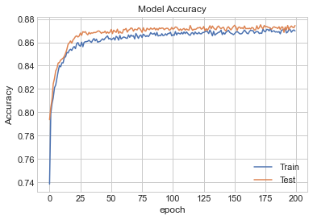
    


```python
# Model Losss
plt.plot(history.history['loss'])
plt.plot(history.history['val_loss'])
plt.title('Model Loss')
plt.ylabel('Loss')
plt.xlabel('epoch')
plt.legend(['Train', 'Test'])
plt.show()
```


    
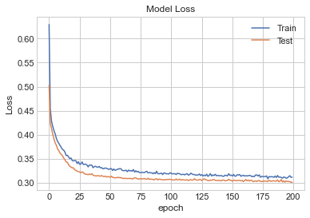
    


Confusion matrix:


```python
# Predicting the Test set results
y_pred = classifier.predict(val_X)
y_pred = (y_pred > 0.5)
# Making the Confusion Matrix
cm = confusion_matrix(val_y, y_pred)
#sns.heatmap(cm,annot=True)
print(cm)
print()
ac6=(cm[0][0] + cm[1][1])/sum(sum(cm))
print(f"The accuracy is {ac6}")
```

    [[1229  447]
     [ 150 2929]]
    
    The accuracy is 0.8744479495268139
    

It is too computational expensive to re-run this classificator to reevaluate and produce the formated confusion matrix, but it follows the same format of the other matrices:

|          |   Predicted F |   Predicted T |
|-----------|-------------|-------------|
| True F   |          1229 |           447 |
| True T   |           150 |          2929 |


#### ROC curve


```python
# tree
probs = classifier.predict(val_X)
preds = probs#this line changes respect to the one in the function. thats why I cant use the function to plot this
fprdtree, tprdtree, thresholddtree = roc_curve(val_y, preds)
roc_aucdtree = auc(fprdtree, tprdtree)

plt.plot(fprdtree, tprdtree, 'b', label = 'AUC = %0.2f' % roc_aucdtree)
plt.plot([0, 1], [0, 1],'r--')
plt.title('Receiver Operating Characteristic Neural Network ',fontsize=12)
plt.ylabel('True Positive Rate',fontsize=12)
plt.xlabel('False Positive Rate',fontsize=12)
plt.legend(loc = 'lower right', prop={'size': 12})
plt.show()
r6=roc_aucdtree
rx6=fprdtree
ry6=tprdtree
```


    

    


#### Cross validation


```python
#Scalling the data:
sc1 = StandardScaler()
X_s = sc1.fit_transform(X)
with HiddenPrints():
  score6 = cross_val_score(estimator=keras_clf, scoring="accuracy", X=X_s, y=y)
```

    WARNING:tensorflow:From C:\Users\Ariadna\Anaconda3\lib\site-packages\tensorflow\python\keras\wrappers\scikit_learn.py:241: Sequential.predict_classes (from tensorflow.python.keras.engine.sequential) is deprecated and will be removed after 2021-01-01.
    Instructions for updating:
    Please use instead:* `np.argmax(model.predict(x), axis=-1)`,   if your model does multi-class classification   (e.g. if it uses a `softmax` last-layer activation).* `(model.predict(x) > 0.5).astype("int32")`,   if your model does binary classification   (e.g. if it uses a `sigmoid` last-layer activation).
    


```python
print('Mean Accuracy Score ANN w no parameters: %2f' %(score6.mean()))
```

    Mean Accuracy Score ANN w no parameters: 0.830179
    

### Best parameters given by GridSearchCV package

Grid search is the process of performing hyper parameter tuning in order to determine the optimal values for a given model. Also the function preforms cross-validation


```python
def build_model(optimizer,kernel, units):
    model = Sequential()
    #First Hidden Layer
    model.add(Dense(units=units,  kernel_initializer= kernel, activation='relu', input_dim=10))
    model.add(Dropout(0.1))
    #Second  Hidden Layer
    model.add(Dense(units=units,  kernel_initializer=kernel, activation='relu'))
    model.add(Dropout(0.1))
    #Output Layer
    model.add(Dense(units=1,  kernel_initializer=kernel, activation='sigmoid'))

    #Compiling the neural network
    model.compile(optimizer=optimizer, loss='binary_crossentropy', metrics=['accuracy'])
    return model

keras_clf = KerasClassifier(build_model)#,epochs=200, batch_size=100)
```

Proving values for


```python
parameters ={'batch_size':[10,100,150],
            'epochs':[10,100,200],
            'optimizer':['adam','rmsprop','SGD'],
            'kernel':['uniform'],
            'units':[4,8,16]}
```

The *batch_size* is a hyperparameter that defines the number of samples to work through before updating the internal model parameters.

The number of *epochs* is a hyperparameter that defines the number times that the learning algorithm will work through the entire training dataset.

The *kernel* is a filter that is used to extract the features. The kernel is a matrix that moves over the input data, performs the dot product with the sub-region of input data, and gets the output as the matrix of dot products.

*Optimizers* are algorithms or methods used to change the attributes of the neural network such as weights and learning rate to reduce the losses.

The package realize cross validation in 5 groups with "accuracy" as the parameter of scoring


```python
ANN_GC = GridSearchCV(estimator=keras_clf,
                          param_grid=parameters,
                          cv=5, scoring='accuracy', verbose=0, n_jobs=-1)
```


```python
ANN_result = ANN_GC.fit(train_X,train_y);
ANN_params = ANN_result.best_params_
ANN_params
```

    Epoch 1/200
    96/96 [==============================] - 3s 27ms/step - loss: 0.6564 - accuracy: 0.7136
    Epoch 2/200
    96/96 [==============================] - 0s 2ms/step - loss: 0.4732 - accuracy: 0.7925
    Epoch 3/200
    96/96 [==============================] - 0s 2ms/step - loss: 0.4282 - accuracy: 0.8029
    Epoch 4/200
    96/96 [==============================] - 1s 6ms/step - loss: 0.4166 - accuracy: 0.8108
    Epoch 5/200
    96/96 [==============================] - 0s 2ms/step - loss: 0.4081 - accuracy: 0.8177
    Epoch 6/200
    96/96 [==============================] - 0s 2ms/step - loss: 0.4015 - accuracy: 0.8229
    Epoch 7/200
    96/96 [==============================] - 0s 2ms/step - loss: 0.3944 - accuracy: 0.8303
    Epoch 8/200
    96/96 [==============================] - 0s 2ms/step - loss: 0.3883 - accuracy: 0.8318
    Epoch 9/200
    96/96 [==============================] - 0s 2ms/step - loss: 0.3861 - accuracy: 0.8368
    Epoch 10/200
    96/96 [==============================] - 0s 2ms/step - loss: 0.3808 - accuracy: 0.8415
    Epoch 11/200
    96/96 [==============================] - 0s 2ms/step - loss: 0.3786 - accuracy: 0.8404
    Epoch 12/200
    96/96 [==============================] - 0s 2ms/step - loss: 0.3798 - accuracy: 0.8397
    Epoch 13/200
    96/96 [==============================] - 0s 2ms/step - loss: 0.3741 - accuracy: 0.8433
    Epoch 14/200
    96/96 [==============================] - 0s 2ms/step - loss: 0.3697 - accuracy: 0.8461
    Epoch 15/200
    96/96 [==============================] - 0s 3ms/step - loss: 0.3692 - accuracy: 0.8449
    Epoch 16/200
    96/96 [==============================] - 0s 2ms/step - loss: 0.3691 - accuracy: 0.8451
    Epoch 17/200
    96/96 [==============================] - 0s 3ms/step - loss: 0.3681 - accuracy: 0.8460
    Epoch 18/200
    96/96 [==============================] - 0s 2ms/step - loss: 0.3649 - accuracy: 0.8464
    Epoch 19/200
    96/96 [==============================] - 0s 2ms/step - loss: 0.3616 - accuracy: 0.8467
    Epoch 20/200
    96/96 [==============================] - 0s 2ms/step - loss: 0.3602 - accuracy: 0.8489
    Epoch 21/200
    96/96 [==============================] - 0s 3ms/step - loss: 0.3611 - accuracy: 0.8497
    Epoch 22/200
    96/96 [==============================] - 0s 2ms/step - loss: 0.3565 - accuracy: 0.8494
    Epoch 23/200
    96/96 [==============================] - 0s 1ms/step - loss: 0.3575 - accuracy: 0.8489
    Epoch 24/200
    96/96 [==============================] - 0s 2ms/step - loss: 0.3541 - accuracy: 0.8534
    Epoch 25/200
    96/96 [==============================] - 0s 2ms/step - loss: 0.3521 - accuracy: 0.8512
    Epoch 26/200
    96/96 [==============================] - 0s 2ms/step - loss: 0.3484 - accuracy: 0.8538
    Epoch 27/200
    96/96 [==============================] - 0s 2ms/step - loss: 0.3505 - accuracy: 0.8542
    Epoch 28/200
    96/96 [==============================] - 0s 2ms/step - loss: 0.3480 - accuracy: 0.8559
    Epoch 29/200
    96/96 [==============================] - 0s 2ms/step - loss: 0.3479 - accuracy: 0.8576
    Epoch 30/200
    96/96 [==============================] - 0s 2ms/step - loss: 0.3461 - accuracy: 0.8568
    Epoch 31/200
    96/96 [==============================] - 0s 1ms/step - loss: 0.3445 - accuracy: 0.8561
    Epoch 32/200
    96/96 [==============================] - ETA: 0s - loss: 0.3465 - accuracy: 0.85 - 0s 2ms/step - loss: 0.3422 - accuracy: 0.8573
    Epoch 33/200
    96/96 [==============================] - 0s 2ms/step - loss: 0.3418 - accuracy: 0.8585
    Epoch 34/200
    96/96 [==============================] - 0s 2ms/step - loss: 0.3411 - accuracy: 0.8580
    Epoch 35/200
    96/96 [==============================] - 0s 1ms/step - loss: 0.3398 - accuracy: 0.8601
    Epoch 36/200
    96/96 [==============================] - 0s 2ms/step - loss: 0.3381 - accuracy: 0.8608
    Epoch 37/200
    96/96 [==============================] - 0s 1ms/step - loss: 0.3362 - accuracy: 0.8574
    Epoch 38/200
    96/96 [==============================] - 0s 1ms/step - loss: 0.3380 - accuracy: 0.8610
    Epoch 39/200
    96/96 [==============================] - 0s 2ms/step - loss: 0.3356 - accuracy: 0.8585
    Epoch 40/200
    96/96 [==============================] - 0s 1ms/step - loss: 0.3346 - accuracy: 0.8607
    Epoch 41/200
    96/96 [==============================] - 0s 1ms/step - loss: 0.3346 - accuracy: 0.8606
    Epoch 42/200
    96/96 [==============================] - 0s 1ms/step - loss: 0.3351 - accuracy: 0.8593
    Epoch 43/200
    96/96 [==============================] - 0s 1ms/step - loss: 0.3327 - accuracy: 0.8624
    Epoch 44/200
    96/96 [==============================] - 0s 1ms/step - loss: 0.3332 - accuracy: 0.8610
    Epoch 45/200
    96/96 [==============================] - 0s 2ms/step - loss: 0.3339 - accuracy: 0.8618
    Epoch 46/200
    96/96 [==============================] - 0s 2ms/step - loss: 0.3328 - accuracy: 0.8619
    Epoch 47/200
    96/96 [==============================] - 0s 3ms/step - loss: 0.3313 - accuracy: 0.8619
    Epoch 48/200
    96/96 [==============================] - 0s 3ms/step - loss: 0.3321 - accuracy: 0.8620
    Epoch 49/200
    96/96 [==============================] - 0s 2ms/step - loss: 0.3275 - accuracy: 0.8644
    Epoch 50/200
    96/96 [==============================] - 0s 2ms/step - loss: 0.3307 - accuracy: 0.8646
    Epoch 51/200
    96/96 [==============================] - 0s 2ms/step - loss: 0.3311 - accuracy: 0.8617
    Epoch 52/200
    96/96 [==============================] - 0s 2ms/step - loss: 0.3273 - accuracy: 0.8630
    Epoch 53/200
    96/96 [==============================] - 0s 2ms/step - loss: 0.3300 - accuracy: 0.8655
    Epoch 54/200
    96/96 [==============================] - 0s 3ms/step - loss: 0.3287 - accuracy: 0.8633
    Epoch 55/200
    96/96 [==============================] - 0s 2ms/step - loss: 0.3299 - accuracy: 0.8630
    Epoch 56/200
    96/96 [==============================] - 0s 1ms/step - loss: 0.3267 - accuracy: 0.8660
    Epoch 57/200
    96/96 [==============================] - 0s 2ms/step - loss: 0.3263 - accuracy: 0.8614
    Epoch 58/200
    96/96 [==============================] - 0s 2ms/step - loss: 0.3256 - accuracy: 0.8655
    Epoch 59/200
    96/96 [==============================] - 0s 2ms/step - loss: 0.3265 - accuracy: 0.8637
    Epoch 60/200
    96/96 [==============================] - 0s 2ms/step - loss: 0.3259 - accuracy: 0.8635
    Epoch 61/200
    96/96 [==============================] - 0s 2ms/step - loss: 0.3258 - accuracy: 0.8658
    Epoch 62/200
    96/96 [==============================] - 0s 2ms/step - loss: 0.3277 - accuracy: 0.8631
    Epoch 63/200
    96/96 [==============================] - 0s 1ms/step - loss: 0.3282 - accuracy: 0.8658
    Epoch 64/200
    96/96 [==============================] - 0s 2ms/step - loss: 0.3275 - accuracy: 0.8634
    Epoch 65/200
    96/96 [==============================] - 0s 3ms/step - loss: 0.3261 - accuracy: 0.8634
    Epoch 66/200
    96/96 [==============================] - 0s 2ms/step - loss: 0.3226 - accuracy: 0.8662
    Epoch 67/200
    96/96 [==============================] - 0s 2ms/step - loss: 0.3259 - accuracy: 0.8631
    Epoch 68/200
    96/96 [==============================] - 0s 2ms/step - loss: 0.3250 - accuracy: 0.8630
    Epoch 69/200
    96/96 [==============================] - 0s 3ms/step - loss: 0.3245 - accuracy: 0.8643
    Epoch 70/200
    96/96 [==============================] - 0s 3ms/step - loss: 0.3228 - accuracy: 0.8649
    Epoch 71/200
    96/96 [==============================] - 0s 3ms/step - loss: 0.3237 - accuracy: 0.8657
    Epoch 72/200
    96/96 [==============================] - 0s 4ms/step - loss: 0.3244 - accuracy: 0.8639
    Epoch 73/200
    96/96 [==============================] - 0s 4ms/step - loss: 0.3260 - accuracy: 0.8643
    Epoch 74/200
    96/96 [==============================] - 0s 3ms/step - loss: 0.3244 - accuracy: 0.8639
    Epoch 75/200
    96/96 [==============================] - 0s 2ms/step - loss: 0.3217 - accuracy: 0.8670
    Epoch 76/200
    96/96 [==============================] - 0s 2ms/step - loss: 0.3208 - accuracy: 0.8669
    Epoch 77/200
    96/96 [==============================] - 0s 2ms/step - loss: 0.3233 - accuracy: 0.8650
    Epoch 78/200
    96/96 [==============================] - 0s 4ms/step - loss: 0.3217 - accuracy: 0.8666
    Epoch 79/200
    96/96 [==============================] - 0s 3ms/step - loss: 0.3209 - accuracy: 0.8667
    Epoch 80/200
    96/96 [==============================] - 0s 3ms/step - loss: 0.3219 - accuracy: 0.8672
    Epoch 81/200
    96/96 [==============================] - 0s 2ms/step - loss: 0.3224 - accuracy: 0.8662
    Epoch 82/200
    96/96 [==============================] - 0s 2ms/step - loss: 0.3209 - accuracy: 0.8657
    Epoch 83/200
    96/96 [==============================] - 0s 2ms/step - loss: 0.3226 - accuracy: 0.8641
    Epoch 84/200
    96/96 [==============================] - 0s 3ms/step - loss: 0.3242 - accuracy: 0.8641
    Epoch 85/200
    96/96 [==============================] - 0s 3ms/step - loss: 0.3213 - accuracy: 0.8662
    Epoch 86/200
    96/96 [==============================] - 0s 3ms/step - loss: 0.3218 - accuracy: 0.8655
    Epoch 87/200
    96/96 [==============================] - 0s 3ms/step - loss: 0.3207 - accuracy: 0.8673
    Epoch 88/200
    96/96 [==============================] - 0s 3ms/step - loss: 0.3172 - accuracy: 0.8675
    Epoch 89/200
    96/96 [==============================] - 0s 2ms/step - loss: 0.3182 - accuracy: 0.8686
    Epoch 90/200
    96/96 [==============================] - 0s 2ms/step - loss: 0.3208 - accuracy: 0.8669
    Epoch 91/200
    96/96 [==============================] - 0s 2ms/step - loss: 0.3194 - accuracy: 0.8675
    Epoch 92/200
    96/96 [==============================] - 0s 2ms/step - loss: 0.3211 - accuracy: 0.8654
    Epoch 93/200
    96/96 [==============================] - 0s 2ms/step - loss: 0.3206 - accuracy: 0.8659
    Epoch 94/200
    96/96 [==============================] - 0s 4ms/step - loss: 0.3178 - accuracy: 0.8674
    Epoch 95/200
    96/96 [==============================] - 0s 3ms/step - loss: 0.3216 - accuracy: 0.8661
    Epoch 96/200
    96/96 [==============================] - 0s 3ms/step - loss: 0.3190 - accuracy: 0.8655
    Epoch 97/200
    96/96 [==============================] - 0s 2ms/step - loss: 0.3170 - accuracy: 0.8680
    Epoch 98/200
    96/96 [==============================] - 0s 2ms/step - loss: 0.3208 - accuracy: 0.8659
    Epoch 99/200
    96/96 [==============================] - 0s 2ms/step - loss: 0.3128 - accuracy: 0.8679
    Epoch 100/200
    96/96 [==============================] - 0s 2ms/step - loss: 0.3202 - accuracy: 0.8668
    Epoch 101/200
    96/96 [==============================] - 0s 2ms/step - loss: 0.3186 - accuracy: 0.8689
    Epoch 102/200
    96/96 [==============================] - 0s 3ms/step - loss: 0.3174 - accuracy: 0.8661
    Epoch 103/200
    96/96 [==============================] - 0s 2ms/step - loss: 0.3187 - accuracy: 0.8690
    Epoch 104/200
    96/96 [==============================] - 0s 3ms/step - loss: 0.3179 - accuracy: 0.8641
    Epoch 105/200
    96/96 [==============================] - 0s 2ms/step - loss: 0.3190 - accuracy: 0.8685
    Epoch 106/200
    96/96 [==============================] - 0s 2ms/step - loss: 0.3178 - accuracy: 0.8685
    Epoch 107/200
    96/96 [==============================] - 0s 3ms/step - loss: 0.3174 - accuracy: 0.8658
    Epoch 108/200
    96/96 [==============================] - 0s 4ms/step - loss: 0.3152 - accuracy: 0.8667
    Epoch 109/200
    96/96 [==============================] - 0s 2ms/step - loss: 0.3175 - accuracy: 0.8674
    Epoch 110/200
    96/96 [==============================] - 0s 3ms/step - loss: 0.3167 - accuracy: 0.8685
    Epoch 111/200
    96/96 [==============================] - 0s 3ms/step - loss: 0.3174 - accuracy: 0.8687
    Epoch 112/200
    96/96 [==============================] - 0s 3ms/step - loss: 0.3188 - accuracy: 0.8651
    Epoch 113/200
    96/96 [==============================] - 0s 3ms/step - loss: 0.3172 - accuracy: 0.8653
    Epoch 114/200
    96/96 [==============================] - 0s 3ms/step - loss: 0.3183 - accuracy: 0.8652
    Epoch 115/200
    96/96 [==============================] - 0s 2ms/step - loss: 0.3173 - accuracy: 0.8698
    Epoch 116/200
    96/96 [==============================] - 0s 2ms/step - loss: 0.3159 - accuracy: 0.8695
    Epoch 117/200
    96/96 [==============================] - 0s 3ms/step - loss: 0.3169 - accuracy: 0.8695
    Epoch 118/200
    96/96 [==============================] - 0s 2ms/step - loss: 0.3168 - accuracy: 0.8691
    Epoch 119/200
    96/96 [==============================] - 0s 3ms/step - loss: 0.3165 - accuracy: 0.8669
    Epoch 120/200
    96/96 [==============================] - 0s 2ms/step - loss: 0.3169 - accuracy: 0.8662
    Epoch 121/200
    96/96 [==============================] - 0s 1ms/step - loss: 0.3176 - accuracy: 0.8692
    Epoch 122/200
    96/96 [==============================] - 0s 1ms/step - loss: 0.3171 - accuracy: 0.8700
    Epoch 123/200
    96/96 [==============================] - 0s 1ms/step - loss: 0.3171 - accuracy: 0.8686
    Epoch 124/200
    96/96 [==============================] - 0s 1ms/step - loss: 0.3150 - accuracy: 0.8674
    Epoch 125/200
    96/96 [==============================] - 0s 1ms/step - loss: 0.3163 - accuracy: 0.8690
    Epoch 126/200
    96/96 [==============================] - 0s 1ms/step - loss: 0.3137 - accuracy: 0.8688
    Epoch 127/200
    96/96 [==============================] - 0s 1ms/step - loss: 0.3184 - accuracy: 0.8679
    Epoch 128/200
    96/96 [==============================] - 0s 1ms/step - loss: 0.3181 - accuracy: 0.8681
    Epoch 129/200
    96/96 [==============================] - 0s 1ms/step - loss: 0.3167 - accuracy: 0.8670
    Epoch 130/200
    96/96 [==============================] - 0s 2ms/step - loss: 0.3142 - accuracy: 0.8700
    Epoch 131/200
    96/96 [==============================] - 0s 1ms/step - loss: 0.3143 - accuracy: 0.8698
    Epoch 132/200
    96/96 [==============================] - 0s 1ms/step - loss: 0.3156 - accuracy: 0.8709
    Epoch 133/200
    96/96 [==============================] - 0s 1ms/step - loss: 0.3157 - accuracy: 0.8703
    Epoch 134/200
    96/96 [==============================] - 0s 1ms/step - loss: 0.3152 - accuracy: 0.8688
    Epoch 135/200
    96/96 [==============================] - 0s 2ms/step - loss: 0.3160 - accuracy: 0.8681
    Epoch 136/200
    96/96 [==============================] - 0s 1ms/step - loss: 0.3133 - accuracy: 0.8706
    Epoch 137/200
    96/96 [==============================] - 0s 1ms/step - loss: 0.3136 - accuracy: 0.8693
    Epoch 138/200
    96/96 [==============================] - 0s 2ms/step - loss: 0.3141 - accuracy: 0.8702
    Epoch 139/200
    96/96 [==============================] - 0s 1ms/step - loss: 0.3125 - accuracy: 0.8684
    Epoch 140/200
    96/96 [==============================] - 0s 1ms/step - loss: 0.3127 - accuracy: 0.8708
    Epoch 141/200
    96/96 [==============================] - 0s 1ms/step - loss: 0.3167 - accuracy: 0.8709
    Epoch 142/200
    96/96 [==============================] - 0s 1ms/step - loss: 0.3169 - accuracy: 0.8687
    Epoch 143/200
    96/96 [==============================] - 0s 1ms/step - loss: 0.3137 - accuracy: 0.8676
    Epoch 144/200
    96/96 [==============================] - 0s 2ms/step - loss: 0.3160 - accuracy: 0.8674
    Epoch 145/200
    96/96 [==============================] - 0s 1ms/step - loss: 0.3109 - accuracy: 0.8714
    Epoch 146/200
    96/96 [==============================] - 0s 1ms/step - loss: 0.3103 - accuracy: 0.8704
    Epoch 147/200
    96/96 [==============================] - 0s 2ms/step - loss: 0.3130 - accuracy: 0.8712
    Epoch 148/200
    96/96 [==============================] - 0s 1ms/step - loss: 0.3130 - accuracy: 0.8690
    Epoch 149/200
    96/96 [==============================] - 0s 1ms/step - loss: 0.3136 - accuracy: 0.8692
    Epoch 150/200
    96/96 [==============================] - 0s 1ms/step - loss: 0.3155 - accuracy: 0.8686
    Epoch 151/200
    96/96 [==============================] - 0s 1ms/step - loss: 0.3178 - accuracy: 0.8663: 0s - loss: 0.3110 - accuracy: 0.86
    Epoch 152/200
    96/96 [==============================] - 0s 1ms/step - loss: 0.3161 - accuracy: 0.8672
    Epoch 153/200
    96/96 [==============================] - 0s 1ms/step - loss: 0.3153 - accuracy: 0.8692
    Epoch 154/200
    96/96 [==============================] - 0s 1ms/step - loss: 0.3168 - accuracy: 0.8685
    Epoch 155/200
    96/96 [==============================] - 0s 1ms/step - loss: 0.3134 - accuracy: 0.8692
    Epoch 156/200
    96/96 [==============================] - 0s 1ms/step - loss: 0.3163 - accuracy: 0.8676
    Epoch 157/200
    96/96 [==============================] - 0s 1ms/step - loss: 0.3118 - accuracy: 0.8706
    Epoch 158/200
    96/96 [==============================] - 0s 1ms/step - loss: 0.3146 - accuracy: 0.8677
    Epoch 159/200
    96/96 [==============================] - 0s 2ms/step - loss: 0.3122 - accuracy: 0.8709
    Epoch 160/200
    96/96 [==============================] - 0s 1ms/step - loss: 0.3149 - accuracy: 0.8706
    Epoch 161/200
    96/96 [==============================] - 0s 1ms/step - loss: 0.3146 - accuracy: 0.8698
    Epoch 162/200
    96/96 [==============================] - 0s 2ms/step - loss: 0.3147 - accuracy: 0.8707
    Epoch 163/200
    96/96 [==============================] - 0s 1ms/step - loss: 0.3125 - accuracy: 0.8695
    Epoch 164/200
    96/96 [==============================] - 0s 2ms/step - loss: 0.3120 - accuracy: 0.8676
    Epoch 165/200
    96/96 [==============================] - 0s 1ms/step - loss: 0.3136 - accuracy: 0.8707
    Epoch 166/200
    96/96 [==============================] - 0s 2ms/step - loss: 0.3154 - accuracy: 0.8686
    Epoch 167/200
    96/96 [==============================] - 0s 2ms/step - loss: 0.3100 - accuracy: 0.8721
    Epoch 168/200
    96/96 [==============================] - 0s 1ms/step - loss: 0.3121 - accuracy: 0.8714
    Epoch 169/200
    96/96 [==============================] - 0s 1ms/step - loss: 0.3108 - accuracy: 0.8711
    Epoch 170/200
    96/96 [==============================] - 0s 1ms/step - loss: 0.3113 - accuracy: 0.8676
    Epoch 171/200
    96/96 [==============================] - 0s 2ms/step - loss: 0.3122 - accuracy: 0.8695
    Epoch 172/200
    96/96 [==============================] - 0s 2ms/step - loss: 0.3158 - accuracy: 0.8693
    Epoch 173/200
    96/96 [==============================] - 0s 3ms/step - loss: 0.3126 - accuracy: 0.8688
    Epoch 174/200
    96/96 [==============================] - 0s 3ms/step - loss: 0.3136 - accuracy: 0.8675
    Epoch 175/200
    96/96 [==============================] - 0s 2ms/step - loss: 0.3127 - accuracy: 0.8686
    Epoch 176/200
    96/96 [==============================] - 0s 2ms/step - loss: 0.3127 - accuracy: 0.8707
    Epoch 177/200
    96/96 [==============================] - 0s 2ms/step - loss: 0.3151 - accuracy: 0.8674: 0s - loss: 0.3163 - accuracy: 0.
    Epoch 178/200
    96/96 [==============================] - 0s 2ms/step - loss: 0.3111 - accuracy: 0.8701
    Epoch 179/200
    96/96 [==============================] - 0s 1ms/step - loss: 0.3114 - accuracy: 0.8712
    Epoch 180/200
    96/96 [==============================] - 0s 2ms/step - loss: 0.3116 - accuracy: 0.8699
    Epoch 181/200
    96/96 [==============================] - 0s 2ms/step - loss: 0.3124 - accuracy: 0.8709
    Epoch 182/200
    96/96 [==============================] - 0s 2ms/step - loss: 0.3106 - accuracy: 0.8698
    Epoch 183/200
    96/96 [==============================] - 0s 1ms/step - loss: 0.3119 - accuracy: 0.8711
    Epoch 184/200
    96/96 [==============================] - 0s 2ms/step - loss: 0.3127 - accuracy: 0.8692
    Epoch 185/200
    96/96 [==============================] - 0s 1ms/step - loss: 0.3128 - accuracy: 0.8708
    Epoch 186/200
    96/96 [==============================] - 0s 2ms/step - loss: 0.3128 - accuracy: 0.8712
    Epoch 187/200
    96/96 [==============================] - 0s 2ms/step - loss: 0.3138 - accuracy: 0.8695
    Epoch 188/200
    96/96 [==============================] - 0s 2ms/step - loss: 0.3113 - accuracy: 0.8686
    Epoch 189/200
    96/96 [==============================] - 0s 2ms/step - loss: 0.3114 - accuracy: 0.8714
    Epoch 190/200
    96/96 [==============================] - 0s 1ms/step - loss: 0.3135 - accuracy: 0.8682
    Epoch 191/200
    96/96 [==============================] - 0s 1ms/step - loss: 0.3140 - accuracy: 0.8683
    Epoch 192/200
    96/96 [==============================] - 0s 2ms/step - loss: 0.3118 - accuracy: 0.8716
    Epoch 193/200
    96/96 [==============================] - 0s 2ms/step - loss: 0.3120 - accuracy: 0.8693
    Epoch 194/200
    96/96 [==============================] - 0s 2ms/step - loss: 0.3113 - accuracy: 0.8710
    Epoch 195/200
    96/96 [==============================] - 0s 1ms/step - loss: 0.3128 - accuracy: 0.8689
    Epoch 196/200
    96/96 [==============================] - 0s 2ms/step - loss: 0.3111 - accuracy: 0.8698
    Epoch 197/200
    96/96 [==============================] - 0s 3ms/step - loss: 0.3115 - accuracy: 0.8700
    Epoch 198/200
    96/96 [==============================] - 0s 2ms/step - loss: 0.3105 - accuracy: 0.8709
    Epoch 199/200
    96/96 [==============================] - 0s 3ms/step - loss: 0.3120 - accuracy: 0.8700
    Epoch 200/200
    96/96 [==============================] - 0s 2ms/step - loss: 0.3072 - accuracy: 0.8729
    


    {'batch_size': 150,
     'epochs': 200,
     'kernel': 'uniform',
     'optimizer': 'adam',
     'units': 16}


```python
classifier=build_model(ANN_params["optimizer"],ANN_params["kernel"],ANN_params["units"])
```


```python
history=classifier.fit(train_X, train_y, validation_data=(val_X, val_y),epochs=ANN_params["epochs"], batch_size=ANN_params["batch_size"])
```

    Epoch 1/200
    96/96 [==============================] - 6s 64ms/step - loss: 0.6470 - accuracy: 0.6977 - val_loss: 0.5391 - val_accuracy: 0.7647
    Epoch 2/200
    96/96 [==============================] - 1s 9ms/step - loss: 0.4634 - accuracy: 0.7942 - val_loss: 0.4225 - val_accuracy: 0.8053
    Epoch 3/200
    96/96 [==============================] - 0s 3ms/step - loss: 0.4184 - accuracy: 0.8107 - val_loss: 0.4052 - val_accuracy: 0.8196
    Epoch 4/200
    96/96 [==============================] - 1s 9ms/step - loss: 0.4072 - accuracy: 0.8172 - val_loss: 0.3960 - val_accuracy: 0.8254
    Epoch 5/200
    96/96 [==============================] - 0s 3ms/step - loss: 0.3970 - accuracy: 0.8255 - val_loss: 0.3861 - val_accuracy: 0.8309
    Epoch 6/200
    96/96 [==============================] - 0s 2ms/step - loss: 0.3873 - accuracy: 0.8320 - val_loss: 0.3793 - val_accuracy: 0.8387
    Epoch 7/200
    96/96 [==============================] - 0s 2ms/step - loss: 0.3834 - accuracy: 0.8355 - val_loss: 0.3739 - val_accuracy: 0.8402
    Epoch 8/200
    96/96 [==============================] - 0s 2ms/step - loss: 0.3805 - accuracy: 0.8384 - val_loss: 0.3708 - val_accuracy: 0.8416
    Epoch 9/200
    96/96 [==============================] - 0s 2ms/step - loss: 0.3747 - accuracy: 0.8416 - val_loss: 0.3651 - val_accuracy: 0.8467
    Epoch 10/200
    96/96 [==============================] - 0s 2ms/step - loss: 0.3734 - accuracy: 0.8428 - val_loss: 0.3618 - val_accuracy: 0.8494
    Epoch 11/200
    96/96 [==============================] - 0s 2ms/step - loss: 0.3691 - accuracy: 0.8447 - val_loss: 0.3592 - val_accuracy: 0.8509
    Epoch 12/200
    96/96 [==============================] - 0s 3ms/step - loss: 0.3652 - accuracy: 0.8494 - val_loss: 0.3570 - val_accuracy: 0.8505
    Epoch 13/200
    96/96 [==============================] - 0s 3ms/step - loss: 0.3640 - accuracy: 0.8475 - val_loss: 0.3540 - val_accuracy: 0.8524
    Epoch 14/200
    96/96 [==============================] - 0s 4ms/step - loss: 0.3632 - accuracy: 0.8490 - val_loss: 0.3522 - val_accuracy: 0.8498
    Epoch 15/200
    96/96 [==============================] - 0s 3ms/step - loss: 0.3583 - accuracy: 0.8498 - val_loss: 0.3490 - val_accuracy: 0.8540
    Epoch 16/200
    96/96 [==============================] - 0s 2ms/step - loss: 0.3585 - accuracy: 0.8522 - val_loss: 0.3481 - val_accuracy: 0.8549
    Epoch 17/200
    96/96 [==============================] - 0s 2ms/step - loss: 0.3576 - accuracy: 0.8522 - val_loss: 0.3462 - val_accuracy: 0.8572
    Epoch 18/200
    96/96 [==============================] - 0s 2ms/step - loss: 0.3563 - accuracy: 0.8520 - val_loss: 0.3447 - val_accuracy: 0.8555
    Epoch 19/200
    96/96 [==============================] - 0s 2ms/step - loss: 0.3514 - accuracy: 0.8563 - val_loss: 0.3437 - val_accuracy: 0.8585
    Epoch 20/200
    96/96 [==============================] - 0s 2ms/step - loss: 0.3518 - accuracy: 0.8522 - val_loss: 0.3418 - val_accuracy: 0.8574
    Epoch 21/200
    96/96 [==============================] - 0s 2ms/step - loss: 0.3524 - accuracy: 0.8526 - val_loss: 0.3416 - val_accuracy: 0.8589
    Epoch 22/200
    96/96 [==============================] - 0s 2ms/step - loss: 0.3485 - accuracy: 0.8543 - val_loss: 0.3396 - val_accuracy: 0.8583
    Epoch 23/200
    96/96 [==============================] - 0s 2ms/step - loss: 0.3453 - accuracy: 0.8571 - val_loss: 0.3371 - val_accuracy: 0.8566
    Epoch 24/200
    96/96 [==============================] - 0s 2ms/step - loss: 0.3453 - accuracy: 0.8559 - val_loss: 0.3352 - val_accuracy: 0.8604
    Epoch 25/200
    96/96 [==============================] - 0s 2ms/step - loss: 0.3465 - accuracy: 0.8551 - val_loss: 0.3345 - val_accuracy: 0.8604
    Epoch 26/200
    96/96 [==============================] - 0s 2ms/step - loss: 0.3439 - accuracy: 0.8592 - val_loss: 0.3330 - val_accuracy: 0.8597
    Epoch 27/200
    96/96 [==============================] - 0s 3ms/step - loss: 0.3394 - accuracy: 0.8590 - val_loss: 0.3308 - val_accuracy: 0.8639
    Epoch 28/200
    96/96 [==============================] - 0s 4ms/step - loss: 0.3405 - accuracy: 0.8598 - val_loss: 0.3296 - val_accuracy: 0.8633
    Epoch 29/200
    96/96 [==============================] - 0s 2ms/step - loss: 0.3393 - accuracy: 0.8592 - val_loss: 0.3290 - val_accuracy: 0.8648
    Epoch 30/200
    96/96 [==============================] - 0s 2ms/step - loss: 0.3396 - accuracy: 0.8580 - val_loss: 0.3278 - val_accuracy: 0.8675
    Epoch 31/200
    96/96 [==============================] - 0s 2ms/step - loss: 0.3375 - accuracy: 0.8601 - val_loss: 0.3267 - val_accuracy: 0.8644
    Epoch 32/200
    96/96 [==============================] - 0s 2ms/step - loss: 0.3377 - accuracy: 0.8595 - val_loss: 0.3251 - val_accuracy: 0.8629
    Epoch 33/200
    96/96 [==============================] - 0s 2ms/step - loss: 0.3376 - accuracy: 0.8620 - val_loss: 0.3273 - val_accuracy: 0.8646
    Epoch 34/200
    96/96 [==============================] - 0s 2ms/step - loss: 0.3369 - accuracy: 0.8594 - val_loss: 0.3256 - val_accuracy: 0.8686
    Epoch 35/200
    96/96 [==============================] - 0s 2ms/step - loss: 0.3350 - accuracy: 0.8613 - val_loss: 0.3231 - val_accuracy: 0.8669
    Epoch 36/200
    96/96 [==============================] - 0s 2ms/step - loss: 0.3364 - accuracy: 0.8601 - val_loss: 0.3227 - val_accuracy: 0.8686
    Epoch 37/200
    96/96 [==============================] - 0s 2ms/step - loss: 0.3338 - accuracy: 0.8625 - val_loss: 0.3226 - val_accuracy: 0.8692
    Epoch 38/200
    96/96 [==============================] - 0s 2ms/step - loss: 0.3346 - accuracy: 0.8623 - val_loss: 0.3220 - val_accuracy: 0.8705
    Epoch 39/200
    96/96 [==============================] - 0s 2ms/step - loss: 0.3346 - accuracy: 0.8612 - val_loss: 0.3214 - val_accuracy: 0.8711
    Epoch 40/200
    96/96 [==============================] - 0s 2ms/step - loss: 0.3326 - accuracy: 0.8623 - val_loss: 0.3205 - val_accuracy: 0.8702
    Epoch 41/200
    96/96 [==============================] - 0s 2ms/step - loss: 0.3338 - accuracy: 0.8632 - val_loss: 0.3202 - val_accuracy: 0.8686
    Epoch 42/200
    96/96 [==============================] - 0s 2ms/step - loss: 0.3308 - accuracy: 0.8632 - val_loss: 0.3190 - val_accuracy: 0.8711
    Epoch 43/200
    96/96 [==============================] - 0s 5ms/step - loss: 0.3297 - accuracy: 0.8648 - val_loss: 0.3189 - val_accuracy: 0.8705
    Epoch 44/200
    96/96 [==============================] - 0s 3ms/step - loss: 0.3300 - accuracy: 0.8637 - val_loss: 0.3187 - val_accuracy: 0.8717
    Epoch 45/200
    96/96 [==============================] - 0s 2ms/step - loss: 0.3305 - accuracy: 0.8662 - val_loss: 0.3166 - val_accuracy: 0.8715
    Epoch 46/200
    96/96 [==============================] - 0s 4ms/step - loss: 0.3337 - accuracy: 0.8614 - val_loss: 0.3175 - val_accuracy: 0.8711
    Epoch 47/200
    96/96 [==============================] - 0s 2ms/step - loss: 0.3327 - accuracy: 0.8641 - val_loss: 0.3168 - val_accuracy: 0.8709
    Epoch 48/200
    96/96 [==============================] - 0s 2ms/step - loss: 0.3287 - accuracy: 0.8649 - val_loss: 0.3187 - val_accuracy: 0.8711
    Epoch 49/200
    96/96 [==============================] - 0s 2ms/step - loss: 0.3302 - accuracy: 0.8640 - val_loss: 0.3168 - val_accuracy: 0.8696
    Epoch 50/200
    96/96 [==============================] - 0s 2ms/step - loss: 0.3298 - accuracy: 0.8646 - val_loss: 0.3162 - val_accuracy: 0.8713
    Epoch 51/200
    96/96 [==============================] - 0s 3ms/step - loss: 0.3313 - accuracy: 0.8646 - val_loss: 0.3181 - val_accuracy: 0.8702
    Epoch 52/200
    96/96 [==============================] - 0s 2ms/step - loss: 0.3287 - accuracy: 0.8656 - val_loss: 0.3154 - val_accuracy: 0.8713
    Epoch 53/200
    96/96 [==============================] - 0s 4ms/step - loss: 0.3303 - accuracy: 0.8641 - val_loss: 0.3158 - val_accuracy: 0.8717
    Epoch 54/200
    96/96 [==============================] - 0s 2ms/step - loss: 0.3260 - accuracy: 0.8665 - val_loss: 0.3160 - val_accuracy: 0.8709
    Epoch 55/200
    96/96 [==============================] - 0s 2ms/step - loss: 0.3290 - accuracy: 0.8636 - val_loss: 0.3150 - val_accuracy: 0.8711
    Epoch 56/200
    96/96 [==============================] - 0s 2ms/step - loss: 0.3289 - accuracy: 0.8633 - val_loss: 0.3150 - val_accuracy: 0.8711
    Epoch 57/200
    96/96 [==============================] - 0s 2ms/step - loss: 0.3290 - accuracy: 0.8631 - val_loss: 0.3145 - val_accuracy: 0.8702
    Epoch 58/200
    96/96 [==============================] - 0s 2ms/step - loss: 0.3266 - accuracy: 0.8651 - val_loss: 0.3157 - val_accuracy: 0.8715
    Epoch 59/200
    96/96 [==============================] - 0s 2ms/step - loss: 0.3296 - accuracy: 0.8647 - val_loss: 0.3145 - val_accuracy: 0.8711
    Epoch 60/200
    96/96 [==============================] - 0s 2ms/step - loss: 0.3273 - accuracy: 0.8639 - val_loss: 0.3156 - val_accuracy: 0.8719
    Epoch 61/200
    96/96 [==============================] - 0s 3ms/step - loss: 0.3262 - accuracy: 0.8637 - val_loss: 0.3143 - val_accuracy: 0.8707
    Epoch 62/200
    96/96 [==============================] - 0s 4ms/step - loss: 0.3258 - accuracy: 0.8665 - val_loss: 0.3137 - val_accuracy: 0.8705
    Epoch 63/200
    96/96 [==============================] - 0s 2ms/step - loss: 0.3270 - accuracy: 0.8663 - val_loss: 0.3133 - val_accuracy: 0.8707
    Epoch 64/200
    96/96 [==============================] - 0s 2ms/step - loss: 0.3262 - accuracy: 0.8646 - val_loss: 0.3142 - val_accuracy: 0.8707
    Epoch 65/200
    96/96 [==============================] - 0s 2ms/step - loss: 0.3242 - accuracy: 0.8676 - val_loss: 0.3139 - val_accuracy: 0.8709
    Epoch 66/200
    96/96 [==============================] - 0s 2ms/step - loss: 0.3260 - accuracy: 0.8659 - val_loss: 0.3134 - val_accuracy: 0.8707
    Epoch 67/200
    96/96 [==============================] - 0s 2ms/step - loss: 0.3229 - accuracy: 0.8657 - val_loss: 0.3137 - val_accuracy: 0.8709
    Epoch 68/200
    96/96 [==============================] - 0s 2ms/step - loss: 0.3248 - accuracy: 0.8646 - val_loss: 0.3133 - val_accuracy: 0.8709
    Epoch 69/200
    96/96 [==============================] - 0s 2ms/step - loss: 0.3255 - accuracy: 0.8655 - val_loss: 0.3137 - val_accuracy: 0.8717
    Epoch 70/200
    96/96 [==============================] - 0s 2ms/step - loss: 0.3246 - accuracy: 0.8680 - val_loss: 0.3134 - val_accuracy: 0.8700
    Epoch 71/200
    96/96 [==============================] - 0s 2ms/step - loss: 0.3267 - accuracy: 0.8669 - val_loss: 0.3126 - val_accuracy: 0.8713
    Epoch 72/200
    96/96 [==============================] - 0s 2ms/step - loss: 0.3254 - accuracy: 0.8656 - val_loss: 0.3122 - val_accuracy: 0.8717
    Epoch 73/200
    96/96 [==============================] - 0s 2ms/step - loss: 0.3243 - accuracy: 0.8665 - val_loss: 0.3116 - val_accuracy: 0.8711
    Epoch 74/200
    96/96 [==============================] - 0s 2ms/step - loss: 0.3235 - accuracy: 0.8651 - val_loss: 0.3112 - val_accuracy: 0.8711
    Epoch 75/200
    96/96 [==============================] - 0s 2ms/step - loss: 0.3257 - accuracy: 0.8657 - val_loss: 0.3125 - val_accuracy: 0.8705
    Epoch 76/200
    96/96 [==============================] - 0s 2ms/step - loss: 0.3238 - accuracy: 0.8660 - val_loss: 0.3123 - val_accuracy: 0.8723
    Epoch 77/200
    96/96 [==============================] - 0s 2ms/step - loss: 0.3261 - accuracy: 0.8652 - val_loss: 0.3116 - val_accuracy: 0.8713
    Epoch 78/200
    96/96 [==============================] - 0s 2ms/step - loss: 0.3232 - accuracy: 0.8669 - val_loss: 0.3119 - val_accuracy: 0.8713
    Epoch 79/200
    96/96 [==============================] - 0s 2ms/step - loss: 0.3237 - accuracy: 0.8647 - val_loss: 0.3126 - val_accuracy: 0.8723
    Epoch 80/200
    96/96 [==============================] - 0s 2ms/step - loss: 0.3251 - accuracy: 0.8667 - val_loss: 0.3105 - val_accuracy: 0.8705
    Epoch 81/200
    96/96 [==============================] - 0s 4ms/step - loss: 0.3244 - accuracy: 0.8653 - val_loss: 0.3117 - val_accuracy: 0.8711
    Epoch 82/200
    96/96 [==============================] - 0s 2ms/step - loss: 0.3245 - accuracy: 0.8673 - val_loss: 0.3112 - val_accuracy: 0.8715
    Epoch 83/200
    96/96 [==============================] - 0s 2ms/step - loss: 0.3232 - accuracy: 0.8668 - val_loss: 0.3107 - val_accuracy: 0.8707
    Epoch 84/200
    96/96 [==============================] - 0s 2ms/step - loss: 0.3242 - accuracy: 0.8633 - val_loss: 0.3106 - val_accuracy: 0.8728
    Epoch 85/200
    96/96 [==============================] - 0s 2ms/step - loss: 0.3231 - accuracy: 0.8669 - val_loss: 0.3124 - val_accuracy: 0.8702
    Epoch 86/200
    96/96 [==============================] - 0s 2ms/step - loss: 0.3227 - accuracy: 0.8658 - val_loss: 0.3119 - val_accuracy: 0.8726
    Epoch 87/200
    96/96 [==============================] - 0s 4ms/step - loss: 0.3229 - accuracy: 0.8646 - val_loss: 0.3114 - val_accuracy: 0.8698
    Epoch 88/200
    96/96 [==============================] - 0s 3ms/step - loss: 0.3198 - accuracy: 0.8697 - val_loss: 0.3093 - val_accuracy: 0.8717
    Epoch 89/200
    96/96 [==============================] - 0s 2ms/step - loss: 0.3212 - accuracy: 0.8667 - val_loss: 0.3101 - val_accuracy: 0.8717
    Epoch 90/200
    96/96 [==============================] - 0s 4ms/step - loss: 0.3200 - accuracy: 0.8689 - val_loss: 0.3098 - val_accuracy: 0.8721
    Epoch 91/200
    96/96 [==============================] - 0s 3ms/step - loss: 0.3236 - accuracy: 0.8658 - val_loss: 0.3111 - val_accuracy: 0.8732
    Epoch 92/200
    96/96 [==============================] - 0s 2ms/step - loss: 0.3207 - accuracy: 0.8679 - val_loss: 0.3092 - val_accuracy: 0.8721
    Epoch 93/200
    96/96 [==============================] - 0s 2ms/step - loss: 0.3215 - accuracy: 0.8668 - val_loss: 0.3094 - val_accuracy: 0.8721
    Epoch 94/200
    96/96 [==============================] - 0s 2ms/step - loss: 0.3229 - accuracy: 0.8675 - val_loss: 0.3101 - val_accuracy: 0.8728
    Epoch 95/200
    96/96 [==============================] - 0s 2ms/step - loss: 0.3200 - accuracy: 0.8672 - val_loss: 0.3101 - val_accuracy: 0.8715
    Epoch 96/200
    96/96 [==============================] - 0s 2ms/step - loss: 0.3189 - accuracy: 0.8676 - val_loss: 0.3108 - val_accuracy: 0.8713
    Epoch 97/200
    96/96 [==============================] - 0s 2ms/step - loss: 0.3213 - accuracy: 0.8647 - val_loss: 0.3109 - val_accuracy: 0.8728
    Epoch 98/200
    96/96 [==============================] - 0s 2ms/step - loss: 0.3225 - accuracy: 0.8657 - val_loss: 0.3098 - val_accuracy: 0.8726
    Epoch 99/200
    96/96 [==============================] - 0s 2ms/step - loss: 0.3214 - accuracy: 0.8681 - val_loss: 0.3099 - val_accuracy: 0.8713
    Epoch 100/200
    96/96 [==============================] - 0s 2ms/step - loss: 0.3203 - accuracy: 0.8667 - val_loss: 0.3094 - val_accuracy: 0.8713
    Epoch 101/200
    96/96 [==============================] - 0s 2ms/step - loss: 0.3193 - accuracy: 0.8681 - val_loss: 0.3091 - val_accuracy: 0.8717
    Epoch 102/200
    96/96 [==============================] - 0s 2ms/step - loss: 0.3188 - accuracy: 0.8690 - val_loss: 0.3090 - val_accuracy: 0.8732
    Epoch 103/200
    96/96 [==============================] - 0s 2ms/step - loss: 0.3190 - accuracy: 0.8681 - val_loss: 0.3089 - val_accuracy: 0.8736
    Epoch 104/200
    96/96 [==============================] - 0s 2ms/step - loss: 0.3205 - accuracy: 0.8674 - val_loss: 0.3084 - val_accuracy: 0.8726
    Epoch 105/200
    96/96 [==============================] - 0s 2ms/step - loss: 0.3184 - accuracy: 0.8691 - val_loss: 0.3101 - val_accuracy: 0.8711
    Epoch 106/200
    96/96 [==============================] - 0s 4ms/step - loss: 0.3195 - accuracy: 0.8677 - val_loss: 0.3100 - val_accuracy: 0.8711
    Epoch 107/200
    96/96 [==============================] - 0s 3ms/step - loss: 0.3212 - accuracy: 0.8680 - val_loss: 0.3096 - val_accuracy: 0.8705
    Epoch 108/200
    96/96 [==============================] - 0s 2ms/step - loss: 0.3186 - accuracy: 0.8681 - val_loss: 0.3084 - val_accuracy: 0.8717
    Epoch 109/200
    96/96 [==============================] - 0s 4ms/step - loss: 0.3185 - accuracy: 0.8695 - val_loss: 0.3093 - val_accuracy: 0.8713
    Epoch 110/200
    96/96 [==============================] - 0s 3ms/step - loss: 0.3179 - accuracy: 0.8661 - val_loss: 0.3083 - val_accuracy: 0.8721
    Epoch 111/200
    96/96 [==============================] - 0s 3ms/step - loss: 0.3188 - accuracy: 0.8695 - val_loss: 0.3085 - val_accuracy: 0.8732
    Epoch 112/200
    96/96 [==============================] - 0s 3ms/step - loss: 0.3195 - accuracy: 0.8688 - val_loss: 0.3079 - val_accuracy: 0.8713
    Epoch 113/200
    96/96 [==============================] - 0s 3ms/step - loss: 0.3202 - accuracy: 0.8687 - val_loss: 0.3083 - val_accuracy: 0.8732
    Epoch 114/200
    96/96 [==============================] - 0s 3ms/step - loss: 0.3209 - accuracy: 0.8683 - val_loss: 0.3087 - val_accuracy: 0.8715
    Epoch 115/200
    96/96 [==============================] - 0s 4ms/step - loss: 0.3156 - accuracy: 0.8722 - val_loss: 0.3087 - val_accuracy: 0.8715
    Epoch 116/200
    96/96 [==============================] - 0s 3ms/step - loss: 0.3178 - accuracy: 0.8677 - val_loss: 0.3094 - val_accuracy: 0.8709
    Epoch 117/200
    96/96 [==============================] - 0s 2ms/step - loss: 0.3197 - accuracy: 0.8677 - val_loss: 0.3074 - val_accuracy: 0.8709
    Epoch 118/200
    96/96 [==============================] - 0s 2ms/step - loss: 0.3183 - accuracy: 0.8667 - val_loss: 0.3081 - val_accuracy: 0.8723
    Epoch 119/200
    96/96 [==============================] - 0s 2ms/step - loss: 0.3198 - accuracy: 0.8688 - val_loss: 0.3082 - val_accuracy: 0.8715
    Epoch 120/200
    96/96 [==============================] - 0s 2ms/step - loss: 0.3170 - accuracy: 0.8698 - val_loss: 0.3073 - val_accuracy: 0.8732
    Epoch 121/200
    96/96 [==============================] - 0s 2ms/step - loss: 0.3183 - accuracy: 0.8677 - val_loss: 0.3089 - val_accuracy: 0.8711
    Epoch 122/200
    96/96 [==============================] - 0s 2ms/step - loss: 0.3177 - accuracy: 0.8697 - val_loss: 0.3075 - val_accuracy: 0.8717
    Epoch 123/200
    96/96 [==============================] - 0s 2ms/step - loss: 0.3162 - accuracy: 0.8675 - val_loss: 0.3078 - val_accuracy: 0.8702
    Epoch 124/200
    96/96 [==============================] - 0s 2ms/step - loss: 0.3180 - accuracy: 0.8692 - val_loss: 0.3095 - val_accuracy: 0.8730
    Epoch 125/200
    96/96 [==============================] - 0s 2ms/step - loss: 0.3161 - accuracy: 0.8691 - val_loss: 0.3075 - val_accuracy: 0.8726
    Epoch 126/200
    96/96 [==============================] - 0s 2ms/step - loss: 0.3142 - accuracy: 0.8691 - val_loss: 0.3076 - val_accuracy: 0.8723
    Epoch 127/200
    96/96 [==============================] - 0s 2ms/step - loss: 0.3159 - accuracy: 0.8698 - val_loss: 0.3075 - val_accuracy: 0.8726
    Epoch 128/200
    96/96 [==============================] - 0s 2ms/step - loss: 0.3158 - accuracy: 0.8684 - val_loss: 0.3082 - val_accuracy: 0.8711
    Epoch 129/200
    96/96 [==============================] - 0s 2ms/step - loss: 0.3185 - accuracy: 0.8669 - val_loss: 0.3088 - val_accuracy: 0.8707
    Epoch 130/200
    96/96 [==============================] - 0s 2ms/step - loss: 0.3126 - accuracy: 0.8716 - val_loss: 0.3080 - val_accuracy: 0.8713
    Epoch 131/200
    96/96 [==============================] - 0s 4ms/step - loss: 0.3162 - accuracy: 0.8700 - val_loss: 0.3074 - val_accuracy: 0.8728
    Epoch 132/200
    96/96 [==============================] - 0s 3ms/step - loss: 0.3157 - accuracy: 0.8699 - val_loss: 0.3070 - val_accuracy: 0.8723
    Epoch 133/200
    96/96 [==============================] - 0s 2ms/step - loss: 0.3165 - accuracy: 0.8680 - val_loss: 0.3069 - val_accuracy: 0.8719
    Epoch 134/200
    96/96 [==============================] - 0s 2ms/step - loss: 0.3133 - accuracy: 0.8688 - val_loss: 0.3065 - val_accuracy: 0.8715
    Epoch 135/200
    96/96 [==============================] - 0s 2ms/step - loss: 0.3145 - accuracy: 0.8708 - val_loss: 0.3091 - val_accuracy: 0.8713
    Epoch 136/200
    96/96 [==============================] - 0s 2ms/step - loss: 0.3198 - accuracy: 0.8676 - val_loss: 0.3065 - val_accuracy: 0.8709
    Epoch 137/200
    96/96 [==============================] - 0s 2ms/step - loss: 0.3132 - accuracy: 0.8700 - val_loss: 0.3079 - val_accuracy: 0.8711
    Epoch 138/200
    96/96 [==============================] - 0s 2ms/step - loss: 0.3129 - accuracy: 0.8695 - val_loss: 0.3074 - val_accuracy: 0.8692
    Epoch 139/200
    96/96 [==============================] - 0s 2ms/step - loss: 0.3148 - accuracy: 0.8686 - val_loss: 0.3074 - val_accuracy: 0.8713
    Epoch 140/200
    96/96 [==============================] - 0s 2ms/step - loss: 0.3155 - accuracy: 0.8674 - val_loss: 0.3101 - val_accuracy: 0.8723
    Epoch 141/200
    96/96 [==============================] - 0s 2ms/step - loss: 0.3164 - accuracy: 0.8679 - val_loss: 0.3082 - val_accuracy: 0.8730
    Epoch 142/200
    96/96 [==============================] - 0s 2ms/step - loss: 0.3155 - accuracy: 0.8707 - val_loss: 0.3097 - val_accuracy: 0.8723
    Epoch 143/200
    96/96 [==============================] - 0s 2ms/step - loss: 0.3153 - accuracy: 0.8699 - val_loss: 0.3100 - val_accuracy: 0.8717
    Epoch 144/200
    96/96 [==============================] - 0s 2ms/step - loss: 0.3131 - accuracy: 0.8702 - val_loss: 0.3090 - val_accuracy: 0.8713
    Epoch 145/200
    96/96 [==============================] - 0s 2ms/step - loss: 0.3160 - accuracy: 0.8700 - val_loss: 0.3082 - val_accuracy: 0.8711
    Epoch 146/200
    96/96 [==============================] - 0s 2ms/step - loss: 0.3148 - accuracy: 0.8699 - val_loss: 0.3085 - val_accuracy: 0.8740
    Epoch 147/200
    96/96 [==============================] - 0s 3ms/step - loss: 0.3163 - accuracy: 0.8691 - val_loss: 0.3082 - val_accuracy: 0.8728
    Epoch 148/200
    96/96 [==============================] - 0s 2ms/step - loss: 0.3143 - accuracy: 0.8688 - val_loss: 0.3075 - val_accuracy: 0.8744
    Epoch 149/200
    96/96 [==============================] - 0s 4ms/step - loss: 0.3181 - accuracy: 0.8684 - val_loss: 0.3067 - val_accuracy: 0.8726
    Epoch 150/200
    96/96 [==============================] - 0s 2ms/step - loss: 0.3152 - accuracy: 0.8726 - val_loss: 0.3074 - val_accuracy: 0.8721
    Epoch 151/200
    96/96 [==============================] - 0s 2ms/step - loss: 0.3116 - accuracy: 0.8719 - val_loss: 0.3080 - val_accuracy: 0.8715
    Epoch 152/200
    96/96 [==============================] - 0s 2ms/step - loss: 0.3146 - accuracy: 0.8693 - val_loss: 0.3089 - val_accuracy: 0.8717
    Epoch 153/200
    96/96 [==============================] - 0s 2ms/step - loss: 0.3144 - accuracy: 0.8721 - val_loss: 0.3065 - val_accuracy: 0.8709
    Epoch 154/200
    96/96 [==============================] - 0s 2ms/step - loss: 0.3160 - accuracy: 0.8695 - val_loss: 0.3069 - val_accuracy: 0.8736
    Epoch 155/200
    96/96 [==============================] - 0s 2ms/step - loss: 0.3122 - accuracy: 0.8712 - val_loss: 0.3058 - val_accuracy: 0.8744
    Epoch 156/200
    96/96 [==============================] - 0s 2ms/step - loss: 0.3144 - accuracy: 0.8702 - val_loss: 0.3065 - val_accuracy: 0.8719
    Epoch 157/200
    96/96 [==============================] - 0s 2ms/step - loss: 0.3126 - accuracy: 0.8714 - val_loss: 0.3065 - val_accuracy: 0.8728
    Epoch 158/200
    96/96 [==============================] - 0s 2ms/step - loss: 0.3126 - accuracy: 0.8700 - val_loss: 0.3062 - val_accuracy: 0.8721
    Epoch 159/200
    96/96 [==============================] - 0s 3ms/step - loss: 0.3165 - accuracy: 0.8692 - val_loss: 0.3088 - val_accuracy: 0.8738
    Epoch 160/200
    96/96 [==============================] - 0s 3ms/step - loss: 0.3161 - accuracy: 0.8674 - val_loss: 0.3067 - val_accuracy: 0.8732
    Epoch 161/200
    96/96 [==============================] - 0s 4ms/step - loss: 0.3120 - accuracy: 0.8700 - val_loss: 0.3068 - val_accuracy: 0.8734
    Epoch 162/200
    96/96 [==============================] - 0s 5ms/step - loss: 0.3131 - accuracy: 0.8709 - val_loss: 0.3075 - val_accuracy: 0.8736
    Epoch 163/200
    96/96 [==============================] - 1s 6ms/step - loss: 0.3139 - accuracy: 0.8699 - val_loss: 0.3066 - val_accuracy: 0.8742
    Epoch 164/200
    96/96 [==============================] - 1s 5ms/step - loss: 0.3144 - accuracy: 0.8688 - val_loss: 0.3053 - val_accuracy: 0.8738
    Epoch 165/200
    96/96 [==============================] - 0s 3ms/step - loss: 0.3129 - accuracy: 0.8709 - val_loss: 0.3070 - val_accuracy: 0.8730
    Epoch 166/200
    96/96 [==============================] - 0s 2ms/step - loss: 0.3152 - accuracy: 0.8700 - val_loss: 0.3063 - val_accuracy: 0.8742
    Epoch 167/200
    96/96 [==============================] - 0s 2ms/step - loss: 0.3137 - accuracy: 0.8686 - val_loss: 0.3066 - val_accuracy: 0.8740
    Epoch 168/200
    96/96 [==============================] - 0s 2ms/step - loss: 0.3144 - accuracy: 0.8698 - val_loss: 0.3066 - val_accuracy: 0.8719
    Epoch 169/200
    96/96 [==============================] - 0s 2ms/step - loss: 0.3139 - accuracy: 0.8696 - val_loss: 0.3066 - val_accuracy: 0.8742
    Epoch 170/200
    96/96 [==============================] - 0s 2ms/step - loss: 0.3114 - accuracy: 0.8705 - val_loss: 0.3080 - val_accuracy: 0.8730
    Epoch 171/200
    96/96 [==============================] - 0s 2ms/step - loss: 0.3164 - accuracy: 0.8686 - val_loss: 0.3062 - val_accuracy: 0.8747
    Epoch 172/200
    96/96 [==============================] - 0s 2ms/step - loss: 0.3146 - accuracy: 0.8695 - val_loss: 0.3063 - val_accuracy: 0.8736
    Epoch 173/200
    96/96 [==============================] - 0s 2ms/step - loss: 0.3122 - accuracy: 0.8703 - val_loss: 0.3057 - val_accuracy: 0.8740
    Epoch 174/200
    96/96 [==============================] - 0s 3ms/step - loss: 0.3139 - accuracy: 0.8690 - val_loss: 0.3079 - val_accuracy: 0.8742
    Epoch 175/200
    96/96 [==============================] - 0s 4ms/step - loss: 0.3150 - accuracy: 0.8704 - val_loss: 0.3069 - val_accuracy: 0.8723
    Epoch 176/200
    96/96 [==============================] - 0s 3ms/step - loss: 0.3120 - accuracy: 0.8693 - val_loss: 0.3069 - val_accuracy: 0.8742
    Epoch 177/200
    96/96 [==============================] - 0s 2ms/step - loss: 0.3111 - accuracy: 0.8696 - val_loss: 0.3052 - val_accuracy: 0.8755
    Epoch 178/200
    96/96 [==============================] - 0s 2ms/step - loss: 0.3128 - accuracy: 0.8719 - val_loss: 0.3064 - val_accuracy: 0.8751
    Epoch 179/200
    96/96 [==============================] - 0s 2ms/step - loss: 0.3131 - accuracy: 0.8706 - val_loss: 0.3060 - val_accuracy: 0.8747
    Epoch 180/200
    96/96 [==============================] - 0s 2ms/step - loss: 0.3139 - accuracy: 0.8691 - val_loss: 0.3063 - val_accuracy: 0.8744
    Epoch 181/200
    96/96 [==============================] - 0s 2ms/step - loss: 0.3117 - accuracy: 0.8698 - val_loss: 0.3056 - val_accuracy: 0.8753
    Epoch 182/200
    96/96 [==============================] - 0s 2ms/step - loss: 0.3112 - accuracy: 0.8728 - val_loss: 0.3053 - val_accuracy: 0.8723
    Epoch 183/200
    96/96 [==============================] - 0s 2ms/step - loss: 0.3112 - accuracy: 0.8699 - val_loss: 0.3088 - val_accuracy: 0.8742
    Epoch 184/200
    96/96 [==============================] - 0s 2ms/step - loss: 0.3158 - accuracy: 0.8680 - val_loss: 0.3062 - val_accuracy: 0.8732
    Epoch 185/200
    96/96 [==============================] - 0s 2ms/step - loss: 0.3127 - accuracy: 0.8702 - val_loss: 0.3067 - val_accuracy: 0.8715
    Epoch 186/200
    96/96 [==============================] - 0s 2ms/step - loss: 0.3112 - accuracy: 0.8706 - val_loss: 0.3069 - val_accuracy: 0.8747
    Epoch 187/200
    96/96 [==============================] - 0s 2ms/step - loss: 0.3141 - accuracy: 0.8688 - val_loss: 0.3070 - val_accuracy: 0.8742
    Epoch 188/200
    96/96 [==============================] - 0s 2ms/step - loss: 0.3143 - accuracy: 0.8698 - val_loss: 0.3062 - val_accuracy: 0.8732
    Epoch 189/200
    96/96 [==============================] - 0s 2ms/step - loss: 0.3124 - accuracy: 0.8699 - val_loss: 0.3051 - val_accuracy: 0.8730
    Epoch 190/200
    96/96 [==============================] - 0s 3ms/step - loss: 0.3111 - accuracy: 0.8714 - val_loss: 0.3051 - val_accuracy: 0.8732
    Epoch 191/200
    96/96 [==============================] - 0s 3ms/step - loss: 0.3140 - accuracy: 0.8711 - val_loss: 0.3054 - val_accuracy: 0.8742
    Epoch 192/200
    96/96 [==============================] - 0s 4ms/step - loss: 0.3137 - accuracy: 0.8713 - val_loss: 0.3049 - val_accuracy: 0.8742
    Epoch 193/200
    96/96 [==============================] - 0s 2ms/step - loss: 0.3107 - accuracy: 0.8735 - val_loss: 0.3056 - val_accuracy: 0.8732
    Epoch 194/200
    96/96 [==============================] - 0s 2ms/step - loss: 0.3124 - accuracy: 0.8691 - val_loss: 0.3054 - val_accuracy: 0.8723
    Epoch 195/200
    96/96 [==============================] - 0s 2ms/step - loss: 0.3130 - accuracy: 0.8691 - val_loss: 0.3062 - val_accuracy: 0.8738
    Epoch 196/200
    96/96 [==============================] - 0s 2ms/step - loss: 0.3141 - accuracy: 0.8682 - val_loss: 0.3061 - val_accuracy: 0.8753
    Epoch 197/200
    96/96 [==============================] - 0s 2ms/step - loss: 0.3105 - accuracy: 0.8719 - val_loss: 0.3055 - val_accuracy: 0.8744
    Epoch 198/200
    96/96 [==============================] - 0s 4ms/step - loss: 0.3121 - accuracy: 0.8698 - val_loss: 0.3060 - val_accuracy: 0.8734
    Epoch 199/200
    96/96 [==============================] - 0s 2ms/step - loss: 0.3158 - accuracy: 0.8698 - val_loss: 0.3059 - val_accuracy: 0.8747
    Epoch 200/200
    96/96 [==============================] - 0s 2ms/step - loss: 0.3118 - accuracy: 0.8714 - val_loss: 0.3053 - val_accuracy: 0.8749
    


```python
figsize=(30,20)
# Model accuracy
plt.plot(history.history['accuracy'])
plt.plot(history.history['val_accuracy'])
plt.title('Model Accuracy')
plt.ylabel('Accuracy')
plt.xlabel('epoch')
plt.legend(['Train', 'Test'])
plt.show()

```


    
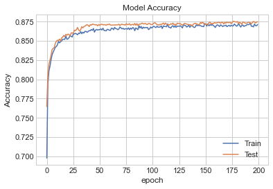
    


```python
# Model Losss
plt.plot(history.history['loss'])
plt.plot(history.history['val_loss'])
plt.title('Model Loss')
plt.ylabel('Loss')
plt.xlabel('epoch')
plt.legend(['Train', 'Test'])
plt.show()
```


    
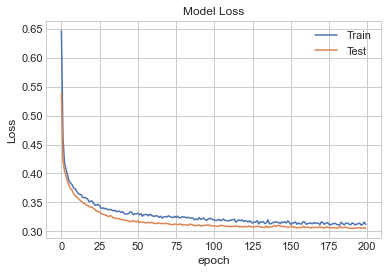
    


Confusion matrix:


```python
# Predicting the Test set results
y_pred = classifier.predict(val_X)
y_pred = (y_pred > 0.5)
# Making the Confusion Matrix
cm = confusion_matrix(val_y, y_pred)
#sns.heatmap(cm,annot=True)
print(cm)
print()
ac7=(cm[0][0] + cm[1][1])/sum(sum(cm))
print(f"The accuracy is {ac7}")
```

    [[1222  454]
     [ 141 2938]]
    
    The accuracy is 0.8748685594111462
    

It is too computational expensive to re-run this classificator to reevaluate and produce the formated confusion matrix, but it follows the same format of the other matrices:

|          |   Predicted F |   Predicted T |
|-----------|-------------|-------------|
| True F   |          1222 |           454 |
| True T   |           141 |          2938 |

#### ROC curve


```python
# tree
probs = classifier.predict(val_X)
preds = probs
fprd, tprd, threshold = roc_curve(val_y, preds)
roc_aucd = auc(fprd, tprd)

plt.plot(fprd, tprd, 'b', label = 'AUC = %0.2f' % roc_aucd)
plt.plot([0, 1], [0, 1],'r--')
plt.title('Receiver Operating Characteristic Neural Network ',fontsize=12)
plt.ylabel('True Positive Rate',fontsize=12)
plt.xlabel('False Positive Rate',fontsize=12)
plt.legend(loc = 'lower right', prop={'size': 12})
r7=roc_aucd
rx7=fprd
ry7=tprd
plt.show()
```


    
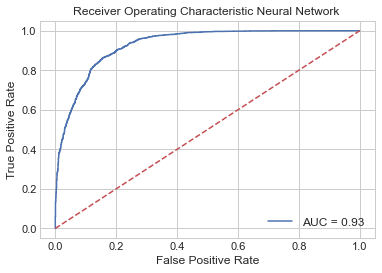
    


#### Cross validation


```python
def build_model_CV_best():
    optimizer=ANN_params["optimizer"]
    kernel=ANN_params["kernel"]
    units=ANN_params["units"]
    model = Sequential()
    #First Hidden Layer
    model.add(Dense(units=units,  kernel_initializer= kernel, activation='relu', input_dim=10))
    model.add(Dropout(0.1))
    #Second  Hidden Layer
    model.add(Dense(units=units,  kernel_initializer=kernel, activation='relu'))
    model.add(Dropout(0.1))
    #Output Layer
    model.add(Dense(units=1,  kernel_initializer=kernel, activation='sigmoid'))

    #Compiling the neural network
    model.compile(optimizer=optimizer, loss='binary_crossentropy', metrics=['accuracy'])
    return model

keras_clfCV_best = KerasClassifier(build_model_CV_best,epochs=ANN_params["epochs"], batch_size=ANN_params["batch_size"])
```


```python
with HiddenPrints():
  score7 = cross_val_score(estimator=keras_clfCV_best,  X=X_s, y=y,cv=5, scoring='accuracy')
```


```python
print('Mean Accuracy Score ANN w best parameters: %2f' %(score7.mean()))
```

    Mean Accuracy Score ANN w best parameters: 0.817876
    

### Best parameter by RandomSearchCV package

GridSearchCV is computationally-time expensive, especially when searching over a large hyperparameter space and dealing with multiple hyperparameters. A solution to this is to use RandomizedSearchCV, in which not all hyperparameter values are tried out. Instead, a fixed number of hyperparameter settings is sampled from specified probability distributions.


```python
def build_model(optimizer,kernel, units):
    model = Sequential()
    #First Hidden Layer
    model.add(Dense(units=units,  kernel_initializer= kernel, activation='relu', input_dim=10))
    model.add(Dropout(0.1))
    #Second  Hidden Layer
    model.add(Dense(units=units,  kernel_initializer=kernel, activation='relu'))
    model.add(Dropout(0.1))
    #Output Layer
    model.add(Dense(units=1,  kernel_initializer=kernel, activation='sigmoid'))

    #Compiling the neural network
    model.compile(optimizer=optimizer, loss='binary_crossentropy', metrics=['accuracy'])
    return model

keras_clf = KerasClassifier(build_model)#,epochs=200, batch_size=100)
```

Proving values for


```python
params_ann ={'batch_size':range(10,150),
            'epochs':range(10,200),
            'optimizer':['adam','rmsprop','SGD'],
            'kernel':['uniform'],
            'units':range(4,16)}
```

The *batch_size* is a hyperparameter that defines the number of samples to work through before updating the internal model parameters.

The number of *epochs* is a hyperparameter that defines the number times that the learning algorithm will work through the entire training dataset.

The *kernel* is a filter that is used to extract the features. The kernel is a matrix that moves over the input data, performs the dot product with the sub-region of input data, and gets the output as the matrix of dot products.

*Optimizers* are algorithms or methods used to change the attributes of the neural network such as weights and learning rate to reduce the losses.

The package realize cross-validation in 5 groups with "accuracy" as the parameter of scoring


```python
ann_RS = RandomizedSearchCV(estimator=keras_clf, param_distributions=params_ann, n_iter = 20, scoring='accuracy', cv =5, verbose=2, random_state=0, n_jobs=-1)
```


```python
ann_result = ann_RS.fit(train_X,train_y)
ann_params = ann_result.best_params_
ann_params
```

    Fitting 5 folds for each of 20 candidates, totalling 100 fits
    

    [Parallel(n_jobs=-1)]: Using backend LokyBackend with 4 concurrent workers.
    [Parallel(n_jobs=-1)]: Done  33 tasks      | elapsed:  9.0min
    [Parallel(n_jobs=-1)]: Done 100 out of 100 | elapsed: 24.5min finished
    

    Epoch 1/98
    265/265 [==============================] - 0s 1ms/step - loss: 0.5474 - accuracy: 0.7442
    Epoch 2/98
    265/265 [==============================] - 0s 1ms/step - loss: 0.4209 - accuracy: 0.8066
    Epoch 3/98
    265/265 [==============================] - 0s 1ms/step - loss: 0.4048 - accuracy: 0.8193
    Epoch 4/98
    265/265 [==============================] - 0s 1ms/step - loss: 0.3930 - accuracy: 0.8299
    Epoch 5/98
    265/265 [==============================] - 0s 1ms/step - loss: 0.3865 - accuracy: 0.8351: 0s - loss: 0.3876 - accuracy: 0.
    Epoch 6/98
    265/265 [==============================] - 0s 1ms/step - loss: 0.3849 - accuracy: 0.8393
    Epoch 7/98
    265/265 [==============================] - 0s 1ms/step - loss: 0.3773 - accuracy: 0.8399
    Epoch 8/98
    265/265 [==============================] - 0s 1ms/step - loss: 0.3759 - accuracy: 0.8451
    Epoch 9/98
    265/265 [==============================] - 0s 1ms/step - loss: 0.3701 - accuracy: 0.8461: 0s - loss: 0.3712 - accuracy: 0.84
    Epoch 10/98
    265/265 [==============================] - 0s 1ms/step - loss: 0.3680 - accuracy: 0.8463
    Epoch 11/98
    265/265 [==============================] - 0s 1ms/step - loss: 0.3638 - accuracy: 0.8487
    Epoch 12/98
    265/265 [==============================] - 0s 1ms/step - loss: 0.3641 - accuracy: 0.8482
    Epoch 13/98
    265/265 [==============================] - 0s 1ms/step - loss: 0.3597 - accuracy: 0.8498
    Epoch 14/98
    265/265 [==============================] - 0s 1ms/step - loss: 0.3599 - accuracy: 0.8498
    Epoch 15/98
    265/265 [==============================] - 0s 1ms/step - loss: 0.3564 - accuracy: 0.8529
    Epoch 16/98
    265/265 [==============================] - 0s 1ms/step - loss: 0.3528 - accuracy: 0.8527
    Epoch 17/98
    265/265 [==============================] - 0s 1ms/step - loss: 0.3512 - accuracy: 0.8529
    Epoch 18/98
    265/265 [==============================] - 0s 2ms/step - loss: 0.3496 - accuracy: 0.8566
    Epoch 19/98
    265/265 [==============================] - 0s 2ms/step - loss: 0.3478 - accuracy: 0.8552
    Epoch 20/98
    265/265 [==============================] - 1s 2ms/step - loss: 0.3468 - accuracy: 0.8572
    Epoch 21/98
    265/265 [==============================] - 0s 2ms/step - loss: 0.3442 - accuracy: 0.8569
    Epoch 22/98
    265/265 [==============================] - 0s 1ms/step - loss: 0.3440 - accuracy: 0.8545
    Epoch 23/98
    265/265 [==============================] - 0s 2ms/step - loss: 0.3416 - accuracy: 0.8571
    Epoch 24/98
    265/265 [==============================] - 0s 2ms/step - loss: 0.3433 - accuracy: 0.8583
    Epoch 25/98
    265/265 [==============================] - 0s 1ms/step - loss: 0.3390 - accuracy: 0.8609
    Epoch 26/98
    265/265 [==============================] - 0s 1ms/step - loss: 0.3398 - accuracy: 0.8580
    Epoch 27/98
    265/265 [==============================] - 0s 1ms/step - loss: 0.3401 - accuracy: 0.8590
    Epoch 28/98
    265/265 [==============================] - 0s 1ms/step - loss: 0.3374 - accuracy: 0.8579
    Epoch 29/98
    265/265 [==============================] - 0s 1ms/step - loss: 0.3357 - accuracy: 0.8612
    Epoch 30/98
    265/265 [==============================] - 0s 1ms/step - loss: 0.3359 - accuracy: 0.8589
    Epoch 31/98
    265/265 [==============================] - 1s 2ms/step - loss: 0.3367 - accuracy: 0.8602
    Epoch 32/98
    265/265 [==============================] - 0s 2ms/step - loss: 0.3361 - accuracy: 0.8611
    Epoch 33/98
    265/265 [==============================] - 0s 2ms/step - loss: 0.3322 - accuracy: 0.8620
    Epoch 34/98
    265/265 [==============================] - 0s 2ms/step - loss: 0.3332 - accuracy: 0.8641
    Epoch 35/98
    265/265 [==============================] - 0s 1ms/step - loss: 0.3323 - accuracy: 0.8601
    Epoch 36/98
    265/265 [==============================] - 0s 1ms/step - loss: 0.3329 - accuracy: 0.8598
    Epoch 37/98
    265/265 [==============================] - 0s 1ms/step - loss: 0.3335 - accuracy: 0.8632
    Epoch 38/98
    265/265 [==============================] - 0s 1ms/step - loss: 0.3321 - accuracy: 0.8628
    Epoch 39/98
    265/265 [==============================] - 0s 1ms/step - loss: 0.3316 - accuracy: 0.8629
    Epoch 40/98
    265/265 [==============================] - 0s 1ms/step - loss: 0.3312 - accuracy: 0.8617
    Epoch 41/98
    265/265 [==============================] - 0s 1ms/step - loss: 0.3308 - accuracy: 0.8651
    Epoch 42/98
    265/265 [==============================] - 0s 1ms/step - loss: 0.3302 - accuracy: 0.8621
    Epoch 43/98
    265/265 [==============================] - 0s 1ms/step - loss: 0.3307 - accuracy: 0.8625
    Epoch 44/98
    265/265 [==============================] - 0s 1ms/step - loss: 0.3305 - accuracy: 0.8623
    Epoch 45/98
    265/265 [==============================] - 0s 1ms/step - loss: 0.3265 - accuracy: 0.8654
    Epoch 46/98
    265/265 [==============================] - 0s 1ms/step - loss: 0.3294 - accuracy: 0.8618
    Epoch 47/98
    265/265 [==============================] - 0s 1ms/step - loss: 0.3283 - accuracy: 0.8639
    Epoch 48/98
    265/265 [==============================] - 0s 1ms/step - loss: 0.3279 - accuracy: 0.8639
    Epoch 49/98
    265/265 [==============================] - 0s 1ms/step - loss: 0.3302 - accuracy: 0.8623
    Epoch 50/98
    265/265 [==============================] - 0s 1ms/step - loss: 0.3268 - accuracy: 0.8642
    Epoch 51/98
    265/265 [==============================] - 0s 1ms/step - loss: 0.3268 - accuracy: 0.8639
    Epoch 52/98
    265/265 [==============================] - 0s 1ms/step - loss: 0.3285 - accuracy: 0.8650
    Epoch 53/98
    265/265 [==============================] - 0s 1ms/step - loss: 0.3268 - accuracy: 0.8627
    Epoch 54/98
    265/265 [==============================] - 0s 1ms/step - loss: 0.3287 - accuracy: 0.8634
    Epoch 55/98
    265/265 [==============================] - 0s 1ms/step - loss: 0.3271 - accuracy: 0.8644
    Epoch 56/98
    265/265 [==============================] - 0s 1ms/step - loss: 0.3285 - accuracy: 0.8642
    Epoch 57/98
    265/265 [==============================] - 0s 1ms/step - loss: 0.3295 - accuracy: 0.8636
    Epoch 58/98
    265/265 [==============================] - 0s 1ms/step - loss: 0.3292 - accuracy: 0.8633
    Epoch 59/98
    265/265 [==============================] - 0s 1ms/step - loss: 0.3252 - accuracy: 0.8676
    Epoch 60/98
    265/265 [==============================] - 0s 1ms/step - loss: 0.3264 - accuracy: 0.8643
    Epoch 61/98
    265/265 [==============================] - 0s 1ms/step - loss: 0.3249 - accuracy: 0.8643
    Epoch 62/98
    265/265 [==============================] - 0s 1ms/step - loss: 0.3287 - accuracy: 0.8619
    Epoch 63/98
    265/265 [==============================] - 0s 1ms/step - loss: 0.3251 - accuracy: 0.8654
    Epoch 64/98
    265/265 [==============================] - 0s 1ms/step - loss: 0.3250 - accuracy: 0.8651
    Epoch 65/98
    265/265 [==============================] - 0s 1ms/step - loss: 0.3280 - accuracy: 0.8642
    Epoch 66/98
    265/265 [==============================] - 0s 1ms/step - loss: 0.3253 - accuracy: 0.8646
    Epoch 67/98
    265/265 [==============================] - 0s 1ms/step - loss: 0.3266 - accuracy: 0.8644
    Epoch 68/98
    265/265 [==============================] - 0s 1ms/step - loss: 0.3255 - accuracy: 0.8640
    Epoch 69/98
    265/265 [==============================] - 0s 1ms/step - loss: 0.3265 - accuracy: 0.8626
    Epoch 70/98
    265/265 [==============================] - 0s 1ms/step - loss: 0.3256 - accuracy: 0.8653
    Epoch 71/98
    265/265 [==============================] - 0s 1ms/step - loss: 0.3257 - accuracy: 0.8627
    Epoch 72/98
    265/265 [==============================] - 0s 1ms/step - loss: 0.3272 - accuracy: 0.8641
    Epoch 73/98
    265/265 [==============================] - 0s 1ms/step - loss: 0.3273 - accuracy: 0.8641
    Epoch 74/98
    265/265 [==============================] - 0s 1ms/step - loss: 0.3271 - accuracy: 0.8648
    Epoch 75/98
    265/265 [==============================] - 0s 1ms/step - loss: 0.3269 - accuracy: 0.8632
    Epoch 76/98
    265/265 [==============================] - 0s 1ms/step - loss: 0.3277 - accuracy: 0.8639
    Epoch 77/98
    265/265 [==============================] - 0s 1ms/step - loss: 0.3256 - accuracy: 0.8630
    Epoch 78/98
    265/265 [==============================] - 0s 1ms/step - loss: 0.3278 - accuracy: 0.8657
    Epoch 79/98
    265/265 [==============================] - 0s 1ms/step - loss: 0.3231 - accuracy: 0.8648
    Epoch 80/98
    265/265 [==============================] - 0s 1ms/step - loss: 0.3243 - accuracy: 0.8657
    Epoch 81/98
    265/265 [==============================] - 0s 1ms/step - loss: 0.3231 - accuracy: 0.8679
    Epoch 82/98
    265/265 [==============================] - 0s 1ms/step - loss: 0.3262 - accuracy: 0.8662: 0s - loss: 0.3284 - accuracy: 
    Epoch 83/98
    265/265 [==============================] - 0s 1ms/step - loss: 0.3251 - accuracy: 0.8650
    Epoch 84/98
    265/265 [==============================] - 0s 2ms/step - loss: 0.3232 - accuracy: 0.8667
    Epoch 85/98
    265/265 [==============================] - 0s 2ms/step - loss: 0.3246 - accuracy: 0.8658
    Epoch 86/98
    265/265 [==============================] - 1s 2ms/step - loss: 0.3257 - accuracy: 0.8644
    Epoch 87/98
    265/265 [==============================] - 0s 1ms/step - loss: 0.3241 - accuracy: 0.8654
    Epoch 88/98
    265/265 [==============================] - 0s 1ms/step - loss: 0.3214 - accuracy: 0.8668
    Epoch 89/98
    265/265 [==============================] - 0s 1ms/step - loss: 0.3252 - accuracy: 0.8672
    Epoch 90/98
    265/265 [==============================] - 0s 1ms/step - loss: 0.3253 - accuracy: 0.8654
    Epoch 91/98
    265/265 [==============================] - 0s 1ms/step - loss: 0.3250 - accuracy: 0.8667
    Epoch 92/98
    265/265 [==============================] - 0s 1ms/step - loss: 0.3209 - accuracy: 0.8670
    Epoch 93/98
    265/265 [==============================] - 0s 1ms/step - loss: 0.3238 - accuracy: 0.8669
    Epoch 94/98
    265/265 [==============================] - 0s 1ms/step - loss: 0.3231 - accuracy: 0.8638
    Epoch 95/98
    265/265 [==============================] - 0s 1ms/step - loss: 0.3250 - accuracy: 0.8643
    Epoch 96/98
    265/265 [==============================] - 0s 1ms/step - loss: 0.3250 - accuracy: 0.8664
    Epoch 97/98
    265/265 [==============================] - 0s 1ms/step - loss: 0.3243 - accuracy: 0.8676
    Epoch 98/98
    265/265 [==============================] - 0s 1ms/step - loss: 0.3228 - accuracy: 0.8676
    


    {'units': 13,
     'optimizer': 'adam',
     'kernel': 'uniform',
     'epochs': 98,
     'batch_size': 54}


```python
classifier=build_model(ann_params["optimizer"],ann_params["kernel"],ann_params["units"])
```


```python
history=classifier.fit(train_X, train_y, validation_data=(val_X, val_y),
                       epochs=ann_params["epochs"], batch_size=ann_params["batch_size"])
```

    Epoch 1/98
    265/265 [==============================] - 1s 2ms/step - loss: 0.5570 - accuracy: 0.7675 - val_loss: 0.4281 - val_accuracy: 0.7996
    Epoch 2/98
    265/265 [==============================] - 0s 1ms/step - loss: 0.4270 - accuracy: 0.8060 - val_loss: 0.4090 - val_accuracy: 0.8164
    Epoch 3/98
    265/265 [==============================] - 0s 2ms/step - loss: 0.4118 - accuracy: 0.8154 - val_loss: 0.3958 - val_accuracy: 0.8284
    Epoch 4/98
    265/265 [==============================] - 0s 1ms/step - loss: 0.4012 - accuracy: 0.8243 - val_loss: 0.3857 - val_accuracy: 0.8330
    Epoch 5/98
    265/265 [==============================] - 0s 1ms/step - loss: 0.3928 - accuracy: 0.8328 - val_loss: 0.3760 - val_accuracy: 0.8391
    Epoch 6/98
    265/265 [==============================] - 0s 2ms/step - loss: 0.3899 - accuracy: 0.8315 - val_loss: 0.3714 - val_accuracy: 0.8431
    Epoch 7/98
    265/265 [==============================] - 0s 1ms/step - loss: 0.3824 - accuracy: 0.8372 - val_loss: 0.3697 - val_accuracy: 0.8446
    Epoch 8/98
    265/265 [==============================] - 0s 1ms/step - loss: 0.3801 - accuracy: 0.8384 - val_loss: 0.3649 - val_accuracy: 0.8461
    Epoch 9/98
    265/265 [==============================] - 0s 2ms/step - loss: 0.3754 - accuracy: 0.8415 - val_loss: 0.3601 - val_accuracy: 0.8475
    Epoch 10/98
    265/265 [==============================] - 0s 1ms/step - loss: 0.3709 - accuracy: 0.8438 - val_loss: 0.3560 - val_accuracy: 0.8492
    Epoch 11/98
    265/265 [==============================] - 0s 1ms/step - loss: 0.3690 - accuracy: 0.8442 - val_loss: 0.3519 - val_accuracy: 0.8528
    Epoch 12/98
    265/265 [==============================] - 0s 1ms/step - loss: 0.3659 - accuracy: 0.8473 - val_loss: 0.3481 - val_accuracy: 0.8517
    Epoch 13/98
    265/265 [==============================] - 0s 1ms/step - loss: 0.3618 - accuracy: 0.8473 - val_loss: 0.3446 - val_accuracy: 0.8549
    Epoch 14/98
    265/265 [==============================] - 0s 2ms/step - loss: 0.3605 - accuracy: 0.8484 - val_loss: 0.3423 - val_accuracy: 0.8553
    Epoch 15/98
    265/265 [==============================] - 0s 1ms/step - loss: 0.3564 - accuracy: 0.8497 - val_loss: 0.3388 - val_accuracy: 0.8568
    Epoch 16/98
    265/265 [==============================] - 0s 2ms/step - loss: 0.3560 - accuracy: 0.8517 - val_loss: 0.3364 - val_accuracy: 0.8589
    Epoch 17/98
    265/265 [==============================] - 0s 1ms/step - loss: 0.3520 - accuracy: 0.8540 - val_loss: 0.3343 - val_accuracy: 0.8604
    Epoch 18/98
    265/265 [==============================] - 0s 1ms/step - loss: 0.3511 - accuracy: 0.8536 - val_loss: 0.3331 - val_accuracy: 0.8595
    Epoch 19/98
    265/265 [==============================] - 0s 1ms/step - loss: 0.3488 - accuracy: 0.8547 - val_loss: 0.3307 - val_accuracy: 0.8606
    Epoch 20/98
    265/265 [==============================] - 0s 2ms/step - loss: 0.3459 - accuracy: 0.8535 - val_loss: 0.3323 - val_accuracy: 0.8625
    Epoch 21/98
    265/265 [==============================] - 0s 1ms/step - loss: 0.3458 - accuracy: 0.8560 - val_loss: 0.3292 - val_accuracy: 0.8620
    Epoch 22/98
    265/265 [==============================] - 0s 1ms/step - loss: 0.3447 - accuracy: 0.8560 - val_loss: 0.3258 - val_accuracy: 0.8646
    Epoch 23/98
    265/265 [==============================] - 0s 2ms/step - loss: 0.3453 - accuracy: 0.8570 - val_loss: 0.3261 - val_accuracy: 0.8637
    Epoch 24/98
    265/265 [==============================] - 0s 1ms/step - loss: 0.3424 - accuracy: 0.8576 - val_loss: 0.3266 - val_accuracy: 0.8662
    Epoch 25/98
    265/265 [==============================] - 0s 2ms/step - loss: 0.3435 - accuracy: 0.8573 - val_loss: 0.3229 - val_accuracy: 0.8650
    Epoch 26/98
    265/265 [==============================] - 0s 1ms/step - loss: 0.3403 - accuracy: 0.8569 - val_loss: 0.3223 - val_accuracy: 0.8652
    Epoch 27/98
    265/265 [==============================] - 0s 2ms/step - loss: 0.3392 - accuracy: 0.8596 - val_loss: 0.3226 - val_accuracy: 0.8650
    Epoch 28/98
    265/265 [==============================] - 0s 2ms/step - loss: 0.3403 - accuracy: 0.8585 - val_loss: 0.3217 - val_accuracy: 0.8662
    Epoch 29/98
    265/265 [==============================] - 0s 1ms/step - loss: 0.3392 - accuracy: 0.8585 - val_loss: 0.3217 - val_accuracy: 0.8667
    Epoch 30/98
    265/265 [==============================] - 0s 2ms/step - loss: 0.3353 - accuracy: 0.8599 - val_loss: 0.3203 - val_accuracy: 0.8673
    Epoch 31/98
    265/265 [==============================] - 0s 1ms/step - loss: 0.3337 - accuracy: 0.8594 - val_loss: 0.3199 - val_accuracy: 0.8696
    Epoch 32/98
    265/265 [==============================] - 0s 2ms/step - loss: 0.3342 - accuracy: 0.8612 - val_loss: 0.3195 - val_accuracy: 0.8654
    Epoch 33/98
    265/265 [==============================] - 0s 2ms/step - loss: 0.3378 - accuracy: 0.8588 - val_loss: 0.3214 - val_accuracy: 0.8675
    Epoch 34/98
    265/265 [==============================] - 0s 2ms/step - loss: 0.3367 - accuracy: 0.8595 - val_loss: 0.3195 - val_accuracy: 0.8681
    Epoch 35/98
    265/265 [==============================] - 1s 3ms/step - loss: 0.3334 - accuracy: 0.8597 - val_loss: 0.3181 - val_accuracy: 0.8681
    Epoch 36/98
    265/265 [==============================] - 1s 2ms/step - loss: 0.3348 - accuracy: 0.8585 - val_loss: 0.3180 - val_accuracy: 0.8690
    Epoch 37/98
    265/265 [==============================] - 0s 2ms/step - loss: 0.3341 - accuracy: 0.8594 - val_loss: 0.3193 - val_accuracy: 0.8658
    Epoch 38/98
    265/265 [==============================] - 0s 1ms/step - loss: 0.3351 - accuracy: 0.8587 - val_loss: 0.3213 - val_accuracy: 0.8652
    Epoch 39/98
    265/265 [==============================] - 0s 2ms/step - loss: 0.3334 - accuracy: 0.8618 - val_loss: 0.3177 - val_accuracy: 0.8688
    Epoch 40/98
    265/265 [==============================] - 0s 1ms/step - loss: 0.3349 - accuracy: 0.8594 - val_loss: 0.3171 - val_accuracy: 0.8677
    Epoch 41/98
    265/265 [==============================] - 0s 1ms/step - loss: 0.3340 - accuracy: 0.8610 - val_loss: 0.3181 - val_accuracy: 0.8667
    Epoch 42/98
    265/265 [==============================] - 0s 2ms/step - loss: 0.3330 - accuracy: 0.8615 - val_loss: 0.3181 - val_accuracy: 0.8681
    Epoch 43/98
    265/265 [==============================] - 1s 2ms/step - loss: 0.3333 - accuracy: 0.8604 - val_loss: 0.3167 - val_accuracy: 0.8673
    Epoch 44/98
    265/265 [==============================] - 1s 2ms/step - loss: 0.3326 - accuracy: 0.8621 - val_loss: 0.3176 - val_accuracy: 0.8669
    Epoch 45/98
    265/265 [==============================] - 0s 2ms/step - loss: 0.3325 - accuracy: 0.8621 - val_loss: 0.3174 - val_accuracy: 0.8644
    Epoch 46/98
    265/265 [==============================] - 0s 2ms/step - loss: 0.3300 - accuracy: 0.8615 - val_loss: 0.3147 - val_accuracy: 0.8686
    Epoch 47/98
    265/265 [==============================] - 0s 2ms/step - loss: 0.3325 - accuracy: 0.8619 - val_loss: 0.3173 - val_accuracy: 0.8665
    Epoch 48/98
    265/265 [==============================] - 1s 2ms/step - loss: 0.3322 - accuracy: 0.8611 - val_loss: 0.3161 - val_accuracy: 0.8707
    Epoch 49/98
    265/265 [==============================] - 1s 2ms/step - loss: 0.3325 - accuracy: 0.8622 - val_loss: 0.3163 - val_accuracy: 0.8686
    Epoch 50/98
    265/265 [==============================] - 1s 3ms/step - loss: 0.3291 - accuracy: 0.8618 - val_loss: 0.3157 - val_accuracy: 0.8686
    Epoch 51/98
    265/265 [==============================] - 1s 2ms/step - loss: 0.3303 - accuracy: 0.8620 - val_loss: 0.3155 - val_accuracy: 0.8658
    Epoch 52/98
    265/265 [==============================] - 1s 2ms/step - loss: 0.3310 - accuracy: 0.8607 - val_loss: 0.3161 - val_accuracy: 0.8688
    Epoch 53/98
    265/265 [==============================] - 1s 2ms/step - loss: 0.3310 - accuracy: 0.8625 - val_loss: 0.3143 - val_accuracy: 0.8696
    Epoch 54/98
    265/265 [==============================] - 1s 2ms/step - loss: 0.3296 - accuracy: 0.8607 - val_loss: 0.3154 - val_accuracy: 0.8669
    Epoch 55/98
    265/265 [==============================] - 1s 3ms/step - loss: 0.3307 - accuracy: 0.8611 - val_loss: 0.3173 - val_accuracy: 0.8677
    Epoch 56/98
    265/265 [==============================] - 1s 3ms/step - loss: 0.3298 - accuracy: 0.8606 - val_loss: 0.3159 - val_accuracy: 0.8683
    Epoch 57/98
    265/265 [==============================] - 1s 3ms/step - loss: 0.3272 - accuracy: 0.8632 - val_loss: 0.3144 - val_accuracy: 0.8700
    Epoch 58/98
    265/265 [==============================] - 1s 3ms/step - loss: 0.3286 - accuracy: 0.8638 - val_loss: 0.3170 - val_accuracy: 0.8662
    Epoch 59/98
    265/265 [==============================] - 1s 2ms/step - loss: 0.3294 - accuracy: 0.8626 - val_loss: 0.3156 - val_accuracy: 0.8690
    Epoch 60/98
    265/265 [==============================] - 1s 2ms/step - loss: 0.3276 - accuracy: 0.8638 - val_loss: 0.3134 - val_accuracy: 0.8702
    Epoch 61/98
    265/265 [==============================] - 1s 3ms/step - loss: 0.3277 - accuracy: 0.8637 - val_loss: 0.3143 - val_accuracy: 0.8675
    Epoch 62/98
    265/265 [==============================] - 0s 2ms/step - loss: 0.3266 - accuracy: 0.8629 - val_loss: 0.3134 - val_accuracy: 0.8705
    Epoch 63/98
    265/265 [==============================] - 0s 2ms/step - loss: 0.3267 - accuracy: 0.8629 - val_loss: 0.3131 - val_accuracy: 0.8681
    Epoch 64/98
    265/265 [==============================] - 0s 2ms/step - loss: 0.3286 - accuracy: 0.8618 - val_loss: 0.3148 - val_accuracy: 0.8683
    Epoch 65/98
    265/265 [==============================] - 0s 2ms/step - loss: 0.3276 - accuracy: 0.8634 - val_loss: 0.3140 - val_accuracy: 0.8705
    Epoch 66/98
    265/265 [==============================] - 0s 2ms/step - loss: 0.3274 - accuracy: 0.8653 - val_loss: 0.3157 - val_accuracy: 0.8705
    Epoch 67/98
    265/265 [==============================] - 0s 2ms/step - loss: 0.3277 - accuracy: 0.8634 - val_loss: 0.3125 - val_accuracy: 0.8713
    Epoch 68/98
    265/265 [==============================] - 0s 2ms/step - loss: 0.3283 - accuracy: 0.8627 - val_loss: 0.3123 - val_accuracy: 0.8696
    Epoch 69/98
    265/265 [==============================] - 0s 2ms/step - loss: 0.3249 - accuracy: 0.8658 - val_loss: 0.3116 - val_accuracy: 0.8692
    Epoch 70/98
    265/265 [==============================] - 0s 2ms/step - loss: 0.3252 - accuracy: 0.8619 - val_loss: 0.3120 - val_accuracy: 0.8675
    Epoch 71/98
    265/265 [==============================] - 0s 1ms/step - loss: 0.3250 - accuracy: 0.8642 - val_loss: 0.3122 - val_accuracy: 0.8696
    Epoch 72/98
    265/265 [==============================] - 0s 2ms/step - loss: 0.3284 - accuracy: 0.8641 - val_loss: 0.3110 - val_accuracy: 0.8675
    Epoch 73/98
    265/265 [==============================] - 0s 2ms/step - loss: 0.3262 - accuracy: 0.8620 - val_loss: 0.3108 - val_accuracy: 0.8711
    Epoch 74/98
    265/265 [==============================] - 0s 2ms/step - loss: 0.3241 - accuracy: 0.8644 - val_loss: 0.3103 - val_accuracy: 0.8723
    Epoch 75/98
    265/265 [==============================] - 0s 2ms/step - loss: 0.3252 - accuracy: 0.8620 - val_loss: 0.3111 - val_accuracy: 0.8698
    Epoch 76/98
    265/265 [==============================] - 0s 2ms/step - loss: 0.3259 - accuracy: 0.8643 - val_loss: 0.3110 - val_accuracy: 0.8713
    Epoch 77/98
    265/265 [==============================] - 0s 1ms/step - loss: 0.3235 - accuracy: 0.8631 - val_loss: 0.3110 - val_accuracy: 0.8715
    Epoch 78/98
    265/265 [==============================] - 0s 2ms/step - loss: 0.3263 - accuracy: 0.8644 - val_loss: 0.3110 - val_accuracy: 0.8713
    Epoch 79/98
    265/265 [==============================] - 0s 2ms/step - loss: 0.3251 - accuracy: 0.8630 - val_loss: 0.3110 - val_accuracy: 0.8702
    Epoch 80/98
    265/265 [==============================] - 0s 2ms/step - loss: 0.3242 - accuracy: 0.8634 - val_loss: 0.3123 - val_accuracy: 0.8702
    Epoch 81/98
    265/265 [==============================] - 0s 2ms/step - loss: 0.3216 - accuracy: 0.8646 - val_loss: 0.3102 - val_accuracy: 0.8717
    Epoch 82/98
    265/265 [==============================] - 0s 1ms/step - loss: 0.3223 - accuracy: 0.8639 - val_loss: 0.3118 - val_accuracy: 0.8702
    Epoch 83/98
    265/265 [==============================] - 0s 1ms/step - loss: 0.3223 - accuracy: 0.8658 - val_loss: 0.3103 - val_accuracy: 0.8681
    Epoch 84/98
    265/265 [==============================] - 0s 2ms/step - loss: 0.3247 - accuracy: 0.8673 - val_loss: 0.3095 - val_accuracy: 0.8719
    Epoch 85/98
    265/265 [==============================] - 0s 2ms/step - loss: 0.3247 - accuracy: 0.8627 - val_loss: 0.3107 - val_accuracy: 0.8707
    Epoch 86/98
    265/265 [==============================] - 1s 2ms/step - loss: 0.3224 - accuracy: 0.8663 - val_loss: 0.3107 - val_accuracy: 0.8726
    Epoch 87/98
    265/265 [==============================] - 1s 3ms/step - loss: 0.3243 - accuracy: 0.8629 - val_loss: 0.3112 - val_accuracy: 0.8700
    Epoch 88/98
    265/265 [==============================] - 1s 2ms/step - loss: 0.3244 - accuracy: 0.8636 - val_loss: 0.3108 - val_accuracy: 0.8683
    Epoch 89/98
    265/265 [==============================] - 1s 2ms/step - loss: 0.3250 - accuracy: 0.8633 - val_loss: 0.3100 - val_accuracy: 0.8705
    Epoch 90/98
    265/265 [==============================] - 1s 2ms/step - loss: 0.3226 - accuracy: 0.8641 - val_loss: 0.3094 - val_accuracy: 0.8686
    Epoch 91/98
    265/265 [==============================] - 0s 2ms/step - loss: 0.3207 - accuracy: 0.8650 - val_loss: 0.3091 - val_accuracy: 0.8719
    Epoch 92/98
    265/265 [==============================] - 0s 2ms/step - loss: 0.3242 - accuracy: 0.8637 - val_loss: 0.3100 - val_accuracy: 0.8662
    Epoch 93/98
    265/265 [==============================] - 0s 2ms/step - loss: 0.3230 - accuracy: 0.8644 - val_loss: 0.3089 - val_accuracy: 0.8711
    Epoch 94/98
    265/265 [==============================] - 0s 2ms/step - loss: 0.3218 - accuracy: 0.8620 - val_loss: 0.3091 - val_accuracy: 0.8700
    Epoch 95/98
    265/265 [==============================] - 0s 2ms/step - loss: 0.3243 - accuracy: 0.8635 - val_loss: 0.3108 - val_accuracy: 0.8715
    Epoch 96/98
    265/265 [==============================] - 1s 2ms/step - loss: 0.3216 - accuracy: 0.8635 - val_loss: 0.3089 - val_accuracy: 0.8698
    Epoch 97/98
    265/265 [==============================] - 0s 2ms/step - loss: 0.3258 - accuracy: 0.8648 - val_loss: 0.3090 - val_accuracy: 0.8702
    Epoch 98/98
    265/265 [==============================] - 0s 2ms/step - loss: 0.3212 - accuracy: 0.8658 - val_loss: 0.3119 - val_accuracy: 0.8715
    


```python
figsize=(30,20)
# Model accuracy
plt.plot(history.history['accuracy'])
plt.plot(history.history['val_accuracy'])
plt.title('Model Accuracy')
plt.ylabel('Accuracy')
plt.xlabel('epoch')
plt.legend(['Train', 'Test'])
plt.show()

```


    
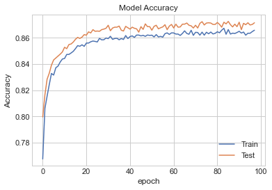
    


```python
# Model Losss
plt.plot(history.history['loss'])
plt.plot(history.history['val_loss'])
plt.title('Model Loss')
plt.ylabel('Loss')
plt.xlabel('epoch')
plt.legend(['Train', 'Test'])
plt.show()
```


    
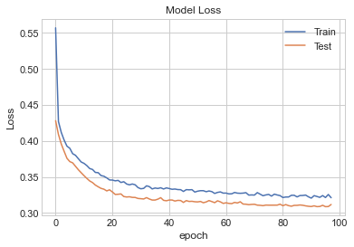
    


Confusion matrix:


```python
# Predicting the Test set results
y_pred = classifier.predict(val_X)
y_pred = (y_pred > 0.5)
# Making the Confusion Matrix
cm = confusion_matrix(val_y, y_pred)
#sns.heatmap(cm,annot=True)
print(cm)
print()
ac7b=(cm[0][0] + cm[1][1])/sum(sum(cm))
print(f"The accuracy is {ac7b}")
```

    [[1213  463]
     [ 148 2931]]
    
    The accuracy is 0.871503680336488
    

It is too computational expensive to re-run this classificator to reevaluate and produce the formated confusion matrix, but it follows the same format of the other matrices:

|          |   Predicted F |   Predicted T |
|-----------|-------------|-------------|
| True F   |          1213 |           463 |
| True T   |           148 |          2931 |

#### ROC curve


```python

probs = classifier.predict(val_X)
preds = probs
fprd, tprd, thresholdd = roc_curve(val_y, preds)
roc_aucd = auc(fprd, tprd)

plt.plot(fprd, tprd, 'b', label = 'AUC = %0.2f' % roc_aucd)
plt.plot([0, 1], [0, 1],'r--')
plt.title('Receiver Operating Characteristic Neural Network ',fontsize=12)
plt.ylabel('True Positive Rate',fontsize=12)
plt.xlabel('False Positive Rate',fontsize=12)
plt.legend(loc = 'lower right', prop={'size': 12})
r7b=roc_aucd
rx7b=fprd
ry7b=tprd
plt.show()
```


    
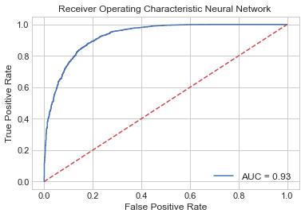
    


#### Cross validation


```python
def build_model_CV_best():
    optimizer=ann_params["optimizer"]
    kernel=ann_params["kernel"]
    units=ann_params["units"]
    model = Sequential()
    #First Hidden Layer
    model.add(Dense(units=units,  kernel_initializer= kernel, activation='relu', input_dim=10))
    model.add(Dropout(0.1))
    #Second  Hidden Layer
    model.add(Dense(units=units,  kernel_initializer=kernel, activation='relu'))
    model.add(Dropout(0.1))
    #Output Layer
    model.add(Dense(units=1,  kernel_initializer=kernel, activation='sigmoid'))

    #Compiling the neural network
    model.compile(optimizer=optimizer, loss='binary_crossentropy', metrics=['accuracy'])
    return model

keras_clfCV_best = KerasClassifier(build_model_CV_best,epochs=ann_params["epochs"], batch_size=ann_params["batch_size"])
```


```python
with HiddenPrints():
  score7b = cross_val_score(estimator=keras_clfCV_best,  X=X_s, y=y,cv=5, scoring='accuracy')
```


```python
print('Mean Accuracy Score ANN w best parameters: %2f' %(score7b.mean()))
```

    Mean Accuracy Score ANN w best parameters: 0.826183
    

## Gradient Boost Classifier

### No boosted parameters


```python
gbc = GradientBoostingClassifier()
gbc.fit(train_X, train_y)

# Make validation predictions and calculate precition
print_score(gbc, train_X, train_y, val_X, val_y, train=False)
```

    Test Result:
    ===========================================
    accuracy score: 0.8719242902208202
    
    Classification Report: 
     	Precision: 0.8662514827995255
    	Recall Score: 0.9486846378694381
    	F1 score: 0.9055960316230042
    
    Confusion Matrix: 
    
    +----------+---------------+---------------+
    |          |   Predicted F |   Predicted T |
    |----------+---------------+---------------|
    | True F   |          1225 |           451 |
    | True T   |           158 |          2921 |
    +----------+---------------+---------------+
    
    Relative Confusion Matrix: 
    
    +----------+---------------+---------------+
    |          |   Predicted F |   Predicted T |
    |----------+---------------+---------------|
    | True F   |        0.731  |         0.269 |
    | True T   |        0.0513 |         0.949 |
    +----------+---------------+---------------+
    


```python
#saving the result for later
#pudo ir antes en la función de display de resultados pero me iba a costar tiempo reevaluar
ac8 =accuracy_score(val_y, gbc.predict(val_X)) 
```

#### ROC curve


```python
(r8,rx8,ry8)=ROC_plot(gbc,'Gradient Boosting Classifier')
```


    
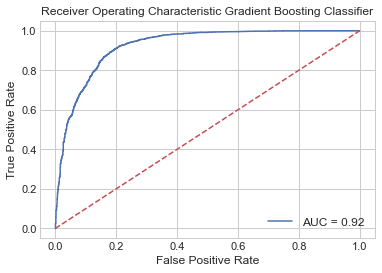
    


#### Cross validation


```python
score8  =cross_val_score(gbc, X, y, cv=5, scoring='accuracy')# in 5 groups
print('Mean Accuracy Score GBC w no parameters: %2f' %(score8.mean()))
```

    Mean Accuracy Score GBC w no parameters: 0.870978
    

### Best parameters given by GridSearchCV package

Grid search is the process of performing hyper parameter tuning in order to determine the optimal values for a given model. Also the function preforms cross-validation


```python
GBC = GradientBoostingClassifier(random_state = 0)
```

Proving values for

*n_estimators*: (default=100)
The number of boosting stages to perform. Gradient boosting is fairly robust to over-fitting so a large number usually results in better performance.

*learning_rate*: (default=0.1)
learning rate shrinks the contribution of each tree by learning_rate. There is a trade-off between learning_rate and n_estimators.

*max_depth*: (default=3)
maximum depth of the individual regression estimators. The maximum depth limits the number of nodes in the tree. Tune this parameter for best performance; the best value depends on the interaction of the input variables.


```python
params_GBC={'n_estimators':range(50,200,50), 
            'learning_rate':[0.05, 0.5, 1], 
            'max_depth':[2,3,4]}
```

The package realize cross-validation in 5 groups with "accuracy" as the parameter of scoring


```python
GBC_GS = GridSearchCV(
        estimator=GBC,
        param_grid=params_GBC,
        cv=5, scoring='accuracy', verbose=0, n_jobs=-1)
```


```python
GBC_result = GBC_GS.fit(train_X,train_y)
GBC_params = GBC_result.best_params_
GBC_params
```


    {'learning_rate': 0.5, 'max_depth': 3, 'n_estimators': 50}


```python
best_GBC=GradientBoostingClassifier(random_state = 0,
                                    n_estimators=GBC_params["n_estimators"],learning_rate=GBC_params["learning_rate"],
                                    max_depth=GBC_params['max_depth'])
best_GBC.fit(train_X,train_y);
print_score(best_GBC, train_X, train_y, val_X, val_y, train=False)
```

    Test Result:
    ===========================================
    accuracy score: 0.8797055730809674
    
    Classification Report: 
     	Precision: 0.8804248861911987
    	Recall Score: 0.9421890224098733
    	F1 score: 0.9102604330090994
    
    Confusion Matrix: 
    
    +----------+---------------+---------------+
    |          |   Predicted F |   Predicted T |
    |----------+---------------+---------------|
    | True F   |          1282 |           394 |
    | True T   |           178 |          2901 |
    +----------+---------------+---------------+
    
    Relative Confusion Matrix: 
    
    +----------+---------------+---------------+
    |          |   Predicted F |   Predicted T |
    |----------+---------------+---------------|
    | True F   |        0.765  |         0.235 |
    | True T   |        0.0578 |         0.942 |
    +----------+---------------+---------------+
    


```python
#saving the result for later
#pudo ir antes en la función de display de resultados pero me iba a costar tiempo reevaluar
ac9 =accuracy_score(val_y, best_GBC.predict(val_X)) 
```

#### ROC curve


```python
(r9,rx9,ry9)=ROC_plot(best_GBC,"Gradient Boost Model")
```


    
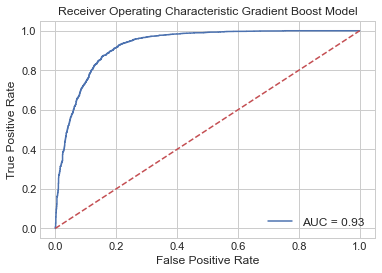
    


#### Cross validation


```python
score9  =cross_val_score(best_GBC, X, y, cv=5, scoring='accuracy')
print('Mean Accuracy Score GBC w best parameters: %2f' %(score9.mean()))
```

    Mean Accuracy Score GBC w best parameters: 0.871609
    

### Best parameter by RandomSearchCV package

GridSearchCV is computationally-time expensive, especially when searching over a large hyperparameter space and dealing with multiple hyperparameters. A solution to this is to use RandomizedSearchCV, in which not all hyperparameter values are tried out. Instead, a fixed number of hyperparameter settings is sampled from specified probability distributions.


```python
gbc = GradientBoostingClassifier(random_state = 0)
```

Proving values for

*n_estimators*: (default=100)
The number of boosting stages to perform. Gradient boosting is fairly robust to over-fitting so a large number usually results in better performance.

*learning_rate*: (default=0.1)
learning rate shrinks the contribution of each tree by learning_rate. There is a trade-off between learning_rate and n_estimators.

*max_depth*: (default=3)
maximum depth of the individual regression estimators. The maximum depth limits the number of nodes in the tree. Tune this parameter for best performance; the best value depends on the interaction of the input variables.


```python
params_gbc={'n_estimators':range(50,200), 
            'learning_rate':[i/100. for i in range(5,101)], 
            'max_depth':range(2,4)}
```

Proving values for


The package realize cross-validation in 5 groups with "accuracy" as the parameter of scoring


```python
gbc_RS = RandomizedSearchCV(estimator=gbc, param_distributions=params_gbc,
                            n_iter = 20, scoring='accuracy', cv =5, verbose=2, random_state=0, n_jobs=-1)
```


```python
gbc_result = gbc_RS.fit(train_X,train_y)
gbc_params = gbc_result.best_params_
gbc_params
```

    Fitting 5 folds for each of 20 candidates, totalling 100 fits
    

    [Parallel(n_jobs=-1)]: Using backend LokyBackend with 4 concurrent workers.
    [Parallel(n_jobs=-1)]: Done  33 tasks      | elapsed:  1.5min
    [Parallel(n_jobs=-1)]: Done 100 out of 100 | elapsed:  4.1min finished
    


    {'n_estimators': 180, 'max_depth': 2, 'learning_rate': 0.56}


```python
best_gbc=GradientBoostingClassifier(random_state = 0,
                                    n_estimators=gbc_params["n_estimators"],learning_rate=gbc_params["learning_rate"],
                                    max_depth=gbc_params['max_depth'])
best_gbc.fit(train_X,train_y);
print_score(best_gbc, train_X, train_y, val_X, val_y, train=False)
```

    Test Result:
    ===========================================
    accuracy score: 0.8792849631966351
    
    Classification Report: 
     	Precision: 0.8829104249464995
    	Recall Score: 0.9379668723611562
    	F1 score: 0.9096062992125984
    
    Confusion Matrix: 
    
    +----------+---------------+---------------+
    |          |   Predicted F |   Predicted T |
    |----------+---------------+---------------|
    | True F   |          1293 |           383 |
    | True T   |           191 |          2888 |
    +----------+---------------+---------------+
    
    Relative Confusion Matrix: 
    
    +----------+---------------+---------------+
    |          |   Predicted F |   Predicted T |
    |----------+---------------+---------------|
    | True F   |         0.771 |         0.229 |
    | True T   |         0.062 |         0.938 |
    +----------+---------------+---------------+
    


```python
#saving the result for later
#pudo ir antes en la función de display de resultados pero me iba a costar tiempo reevaluar
ac9b =accuracy_score(val_y, best_gbc.predict(val_X)) 
```

#### ROC curve


```python
(r9b,rx9b,ry9b)=ROC_plot(best_gbc,"Gradient Boost Model")
```


    
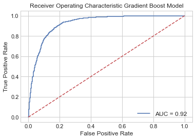
    


#### Cross validation


```python
score9b  =cross_val_score(best_gbc, X, y, cv=5, scoring='accuracy')
print('Mean Accuracy Score GBC w best parameters: %2f' %(score9b.mean()))
```

    Mean Accuracy Score GBC w best parameters: 0.875815
    

## K-Near Neighbors

### No boosted parameters


```python
KNC = KNeighborsClassifier()
KNC.fit(train_X, train_y)

# Make validation predictions and calculate precition
print_score(KNC, train_X, train_y, val_X, val_y, train=False)
```

    Test Result:
    ===========================================
    accuracy score: 0.8317560462670873
    
    Classification Report: 
     	Precision: 0.8251069900142654
    	Recall Score: 0.9392659954530692
    	F1 score: 0.8784933171324423
    
    Confusion Matrix: 
    
    +----------+---------------+---------------+
    |          |   Predicted F |   Predicted T |
    |----------+---------------+---------------|
    | True F   |          1063 |           613 |
    | True T   |           187 |          2892 |
    +----------+---------------+---------------+
    
    Relative Confusion Matrix: 
    
    +----------+---------------+---------------+
    |          |   Predicted F |   Predicted T |
    |----------+---------------+---------------|
    | True F   |        0.634  |         0.366 |
    | True T   |        0.0607 |         0.939 |
    +----------+---------------+---------------+
    


```python
#saving the result for later
#pudo ir antes en la función de display de resultados pero me iba a costar tiempo reevaluar
ac10 =accuracy_score(val_y, KNC.predict(val_X)) 
```

#### ROC curve


```python
(r10,rx10,ry10)=ROC_plot(KNC,'K-Near Neighbors')
```


    
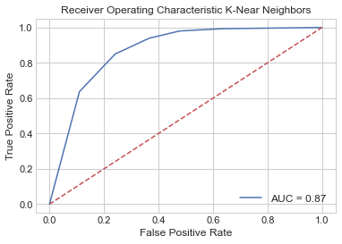
    


#### Cross validation


```python
score10  =cross_val_score(KNC, X, y, cv=5, scoring='accuracy')# in 5 groups
print('Mean Accuracy Score KNN w no parameters: %2f' %(score10.mean()))
```

    Mean Accuracy Score KNN w no parameters: 0.838223
    

### Best parameters given by GridSearchCV package

Grid search is the process of performing hyper parameter tuning in order to determine the optimal values for a given model. Also the function preforms cross-validation


```python
KNN = KNeighborsClassifier()
```

Proving values for
 *n_neighbors*:  k near elements


```python
params_KNN = {'n_neighbors':range(2,51)}#he tratado hasta 500 pero sigue saliendo 14
```

The package realize cross-validation in 5 groups with "accuracy" as the parameter of scoring


```python
KNN_GS = GridSearchCV(
        estimator=KNN,
        param_grid=params_KNN,
        cv=5, scoring='accuracy', verbose=0, n_jobs=-1)
```


```python
KNN_result = KNN_GS.fit(train_X,train_y)
KNN_params = KNN_result.best_params_
KNN_params
```


    {'n_neighbors': 12}


```python
best_KNN= KNeighborsClassifier(
                                    n_neighbors=KNN_params["n_neighbors"])
best_KNN.fit(train_X,train_y);
print_score(best_KNN, train_X, train_y, val_X, val_y, train=False)
```

    Test Result:
    ===========================================
    accuracy score: 0.8401682439537329
    
    Classification Report: 
     	Precision: 0.8330939385234128
    	Recall Score: 0.9418642416368951
    	F1 score: 0.8841463414634148
    
    Confusion Matrix: 
    
    +----------+---------------+---------------+
    |          |   Predicted F |   Predicted T |
    |----------+---------------+---------------|
    | True F   |          1095 |           581 |
    | True T   |           179 |          2900 |
    +----------+---------------+---------------+
    
    Relative Confusion Matrix: 
    
    +----------+---------------+---------------+
    |          |   Predicted F |   Predicted T |
    |----------+---------------+---------------|
    | True F   |        0.653  |         0.347 |
    | True T   |        0.0581 |         0.942 |
    +----------+---------------+---------------+
    


```python
#saving the result for later
#pudo ir antes en la función de display de resultados pero me iba a costar tiempo reevaluar
ac11 =accuracy_score(val_y, best_KNN.predict(val_X)) 
```

#### ROC curve


```python
(r11,rx11,ry11)=ROC_plot(best_KNN,"K Neighbors Model")
```


    
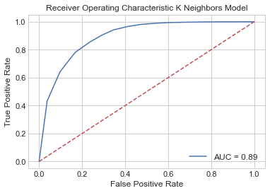
    


#### Cross validation


```python
score11  =cross_val_score(best_KNN, X, y, cv=5, scoring='accuracy')
print('Mean Accuracy Score KNN w best parameters: %2f' %(score11.mean()))
```

    Mean Accuracy Score KNN w best parameters: 0.842482
    

### Best parameter by RandomSearchCV package

GridSearchCV is computationally-time expensive, especially when searching over a large hyperparameter space and dealing with multiple hyperparameters. A solution to this is to use RandomizedSearchCV, in which not all hyperparameter values are tried out. Instead, a fixed number of hyperparameter settings is sampled from specified probability distributions.


```python
knn = KNeighborsClassifier()
```

Proving values for
 *n_neighbors*:  k near elements


```python
params_knn = {'n_neighbors':range(2,500)}
```

The package realize cross-validation in 5 groups with "accuracy" as the parameter of scoring


```python
knn_RS = RandomizedSearchCV(estimator=knn, param_distributions=params_knn,
                            n_iter = 20, scoring='accuracy', cv =5, verbose=2, random_state=0, n_jobs=-1)
```


```python
knn_result = knn_RS.fit(train_X,train_y)
knn_params = knn_result.best_params_
knn_params
```

    Fitting 5 folds for each of 20 candidates, totalling 100 fits
    

    [Parallel(n_jobs=-1)]: Using backend LokyBackend with 4 concurrent workers.
    [Parallel(n_jobs=-1)]: Done  33 tasks      | elapsed:   20.0s
    [Parallel(n_jobs=-1)]: Done 100 out of 100 | elapsed:  1.1min finished
    


    {'n_neighbors': 17}


```python
best_knn= KNeighborsClassifier(
                                    n_neighbors=knn_params["n_neighbors"])
best_knn.fit(train_X,train_y);
print_score(best_knn, train_X, train_y, val_X, val_y, train=False)
```

    Test Result:
    ===========================================
    accuracy score: 0.8372239747634069
    
    Classification Report: 
     	Precision: 0.8191636665743561
    	Recall Score: 0.960701526469633
    	F1 score: 0.884304932735426
    
    Confusion Matrix: 
    
    +----------+---------------+---------------+
    |          |   Predicted F |   Predicted T |
    |----------+---------------+---------------|
    | True F   |          1023 |           653 |
    | True T   |           121 |          2958 |
    +----------+---------------+---------------+
    
    Relative Confusion Matrix: 
    
    +----------+---------------+---------------+
    |          |   Predicted F |   Predicted T |
    |----------+---------------+---------------|
    | True F   |        0.61   |         0.39  |
    | True T   |        0.0393 |         0.961 |
    +----------+---------------+---------------+
    


```python
#saving the result for later
#pudo ir antes en la función de display de resultados pero me iba a costar tiempo reevaluar
ac11b =accuracy_score(val_y, best_knn.predict(val_X)) 
```

#### ROC curve


```python
(r11b,rx11b,ry11b)=ROC_plot(best_knn,"Gradient Boost Model")
```


    

    


#### Cross validation


```python
score11b  =cross_val_score(best_knn, X, y, cv=5, scoring='accuracy')
print('Mean Accuracy Score GBC w best parameters: %2f' %(score11b.mean()))
```

    Mean Accuracy Score GBC w best parameters: 0.838486
    

#  Comparing all models

## Comparison of  accuracy of the split test data-validation data


```python
#Organizando todos los scores que habia obtenido antes
scores=[]
classific=["Logistic Regression","Decisition tree","Random Forest","Artifitial Neural Network","Gradient Boost Classifier","K-Near Neighbors"]
for i in range(0,12,2):
  scores.append([classific[int(i/2)],eval('ac'+str(i)),eval('ac'+str(i+1)),eval('ac'+str(i+1)+'b')])
title=["Classificator","Accuracy w/n parameters","Accuracy w parameters GSV","Accuracy w parameters RSV"]

print(tabulate(scores, headers=title,numalign="left",floatfmt="1.3e",tablefmt="github"))
```

    | Classificator             | Accuracy w/n parameters   | Accuracy w parameters GSV   | Accuracy w parameters RSV   |
    |---------------------------|---------------------------|-----------------------------|-----------------------------|
    | Logistic Regression       | 7.912e-01                 | 7.912e-01                   | 7.912e-01                   |
    | Decisition tree           | 8.143e-01                 | 8.515e-01                   | 8.511e-01                   |
    | Random Forest             | 8.858e-01                 | 8.858e-01                   | 8.843e-01                   |
    | Artifitial Neural Network | 8.744e-01                 | 8.749e-01                   | 8.715e-01                   |
    | Gradient Boost Classifier | 8.719e-01                 | 8.797e-01                   | 8.793e-01                   |
    | K-Near Neighbors          | 8.318e-01                 | 8.402e-01                   | 8.372e-01                   |
    

| Classificator             | Accuracy w/n parameters   | Accuracy w parameters GSV   | Accuracy w parameters RSV   |
|---------------------------|---------------------------|-----------------------------|-----------------------------|
| Logistic Regression       | 7.912e-01                 | 7.912e-01                   | 7.912e-01                   |
| Decisition tree           | 8.143e-01                 | 8.515e-01                   | 8.511e-01                   |
| Random Forest             | 8.858e-01                 | 8.858e-01                   | 8.843e-01                   |
| Artifitial Neural Network | 8.744e-01                 | 8.749e-01                   | 8.715e-01                   |
| Gradient Boost Classifier | 8.719e-01                 | 8.797e-01                   | 8.793e-01                   |
| K-Near Neighbors          | 8.318e-01                 | 8.402e-01                   | 8.372e-01                   |

The best Classifier, in terms of accuracy, for this division of test-validation is the Random Forest. There is not noticeable improvement when tunned parameters are used.

## Comparison of AUC done with the split test data-validation data


```python
#Organizando todos los scores que habia obtenido antes
scores=[]

for i in range(0,12,2):
  scores.append([classific[int(i/2)],eval('r'+str(i)),eval('r'+str(i+1)),eval('r'+str(i+1)+'b')])
title=["Classificator","AUC w/n parameters","AUC w parameters GSV","AUC w parameters RSV"]

print(tabulate(scores, headers=title,numalign="left",floatfmt="1.3e",tablefmt="github"))
```

    | Classificator             | AUC w/n parameters   | AUC w parameters GSV   | AUC w parameters RSV   |
    |---------------------------|----------------------|------------------------|------------------------|
    | Logistic Regression       | 8.412e-01            | 8.412e-01              | 8.412e-01              |
    | Decisition tree           | 8.269e-01            | 9.012e-01              | 9.003e-01              |
    | Random Forest             | 8.323e-01            | 9.363e-01              | 9.360e-01              |
    | Artifitial Neural Network | 9.312e-01            | 9.294e-01              | 9.273e-01              |
    | Gradient Boost Classifier | 9.239e-01            | 9.260e-01              | 9.243e-01              |
    | K-Near Neighbors          | 8.705e-01            | 8.923e-01              | 8.974e-01              |
    

| Classificator             | AUC w/n parameters   | AUC w parameters GSV   | AUC w parameters RSV   |
|---------------------------|----------------------|------------------------|------------------------|
| Logistic Regression       | 8.412e-01            | 8.412e-01              | 8.412e-01              |
| Decisition tree           | 8.269e-01            | 9.012e-01              | 9.003e-01              |
| Random Forest             | 8.323e-01            | 9.363e-01              | 9.360e-01              |
| Artifitial Neural Network | 9.312e-01            | 9.294e-01              | 9.273e-01              |
| Gradient Boost Classifier | 9.239e-01            | 9.260e-01              | 9.243e-01              |
| K-Near Neighbors          | 8.705e-01            | 8.923e-01              | 8.974e-01              |

The best Classifier, in terms of AUC, for this division of test-validation is the Random Forest. There is a noticeable improvement when tunned parameters are used, specially whith GridSearchCV.

## Comparison of mean accuracy with Cross Validation (5 sets)


```python
#Organizando todos los scores que habia obtenido antes
scores=[]

for i in range(0,12,2):
  scores.append([classific[int(i/2)],np.mean(eval('score'+str(i))),np.mean(eval('score'+str(i+1))),np.mean(eval('score'+str(i+1)+'b'))])
title=["Classificator","Accuracy w/n parameters","Accuracy w parameters GSV","Accuracy w parameters RSV"]

print(tabulate(scores, headers=title,numalign="left",floatfmt="1.3e",tablefmt="github"))
```

    | Classificator             | Accuracy w/n parameters   | Accuracy w parameters GSV   | Accuracy w parameters RSV   |
    |---------------------------|---------------------------|-----------------------------|-----------------------------|
    | Logistic Regression       | 7.908e-01                 | 7.906e-01                   | 7.906e-01                   |
    | Decisition tree           | 8.181e-01                 | 8.501e-01                   | 8.498e-01                   |
    | Random Forest             | 8.810e-01                 | 8.811e-01                   | 8.807e-01                   |
    | Artifitial Neural Network | 8.302e-01                 | 8.179e-01                   | 8.262e-01                   |
    | Gradient Boost Classifier | 8.710e-01                 | 8.716e-01                   | 8.758e-01                   |
    | K-Near Neighbors          | 8.382e-01                 | 8.425e-01                   | 8.385e-01                   |
    

| Classificator             | Accuracy w/n parameters   | Accuracy w parameters GSV   | Accuracy w parameters RSV   |
|---------------------------|---------------------------|-----------------------------|-----------------------------|
| Logistic Regression       | 7.908e-01                 | 7.906e-01                   | 7.906e-01                   |
| Decisition tree           | 8.181e-01                 | 8.501e-01                   | 8.498e-01                   |
| Random Forest             | 8.810e-01                 | 8.811e-01                   | 8.807e-01                   |
| Artifitial Neural Network | 8.302e-01                 | 8.179e-01                   | 8.262e-01                   |
| Gradient Boost Classifier | 8.710e-01                 | 8.716e-01                   | 8.758e-01                   |
| K-Near Neighbors          | 8.382e-01                 | 8.425e-01                   | 8.385e-01                   |

The best classificator is the Random Forest. The accuracy is better when the hyperparameters are tunned, but between methods of tunning there is not difference.

## ROC curves

### ROC w/o Tunning Hyperparameters


```python
# multiple plot
palette = plt.get_cmap('Set1')#color library

figure(num=None, figsize=(8, 6), dpi=80, facecolor='w', edgecolor='k')

for i in range(0,12,2):
    plt.plot(eval('rx'+str(i)), eval('ry'+str(i)), marker='', color=palette(int(i/2)), 
             linewidth=1, alpha=0.9, label='AUC '+classific[int(i/2)]+' = %0.2f' %eval('r'+str(i)))
        
# Add titles
plt.plot([0, 1], [0, 1],'r--')
plt.title('Receiver Operating Characteristic '+'without Tunning Hyperparameters',fontsize=12)
plt.ylabel('True Positive Rate',fontsize=12)
plt.xlabel('False Positive Rate',fontsize=12)

# Add legend
plt.legend(loc = 'lower right', prop={'size': 12})
plt.show()
```


    
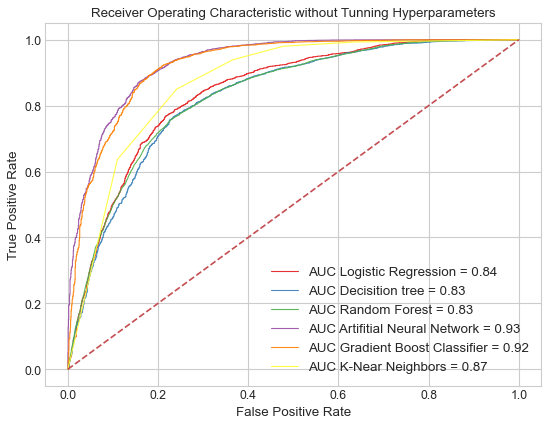
    


### ROC w Tunned Hyperparameters GSCV


```python
# multiple plot
figure(num=None, figsize=(8, 6), dpi=80, facecolor='w', edgecolor='k')

for i in range(0,12,2):
    plt.plot(eval('rx'+str(i+1)), eval('ry'+str(i+1)), marker='', color=palette(int(i/2)), 
             linewidth=1, alpha=0.9, label='AUC '+classific[int(i/2)]+' = %0.2f' %eval('r'+str(i+1)))
        
# Add titles
plt.plot([0, 1], [0, 1],'r--')
plt.title('Receiver Operating Characteristic '+'withTunned Hyperparameters GSCV',fontsize=12)
plt.ylabel('True Positive Rate',fontsize=12)
plt.xlabel('False Positive Rate',fontsize=12)

# Add legend
plt.legend(loc = 'lower right', prop={'size': 12})
plt.show()
```


    
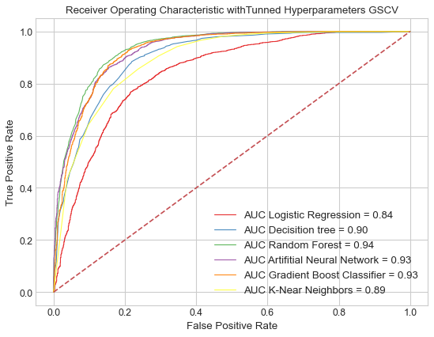
    


### ROC w Tunned Hyperparameters RSCV


```python
# multiple plot
figure(num=None, figsize=(8, 6), dpi=80, facecolor='w', edgecolor='k')

for i in range(0,12,2):
    plt.plot(eval('rx'+str(i+1)+'b'), eval('ry'+str(i+1)+'b'), marker='', color=palette(int(i/2)), 
             linewidth=1, alpha=0.9, label='AUC '+classific[int(i/2)]+' = %0.2f' %eval('r'+str(i+1)+'b'))
        
# Add titles
plt.plot([0, 1], [0, 1],'r--')
plt.title('Receiver Operating Characteristic '+'withTunned Hyperparameters RSCV',fontsize=12)
plt.ylabel('True Positive Rate',fontsize=12)
plt.xlabel('False Positive Rate',fontsize=12)

# Add legend
plt.legend(loc = 'lower right', prop={'size': 12})
plt.show()
```


    

    


# Cutting: signal and background 

---


Later, the significance function is again defined. It is defined here to obtain the significance of the data after passing the slicing by minimization function -[2(n signal)-(n background)]


```python
datasets = {}
by_class = df.groupby('class')
#dividing the datased by background and signal
for groups, data in by_class:
    datasets[groups] = data.drop(columns=['class'])
signn=len(datasets['g'])#number of events that are signal
backn=len(datasets['h'])#number of events which are background
```


```python
def significance(x,i):
    #señal
    j = datasets['g'].iloc[:,i].values
    gg=len([1 for o in j if x[0] < o < x[1] ])#number of signal events between cuts
    if gg==0:
      gg=2.220446049250313e-16# this is the minimum number support by 32 bits. its to avoid 0's in the denominator
    #fondo
    j = datasets['h'].iloc[:,i].values
    hh=len([1 for o in j if x[0] < o < x[1]]) #number of background events between cuts
    return gg/(hh**0.5)
```

## Signal and background - parameter distributions (without cuts):


```python
fig, ax = plt.subplots(2,5, figsize=(18, 8))
ax = ax.flatten()
for i in range(10):
    sns.distplot(datasets['g'].iloc[:,i].values, ax=ax[i],color='r', label='Signal',norm_hist=True)
    sns.distplot(datasets['h'].iloc[:,i].values, ax=ax[i],color='b', label='BG',norm_hist=True)
    ax[i].set_title(datasets['g'].columns[i])
    ax[i].legend(loc="best")
fig.tight_layout(pad=2.0)   
```


    
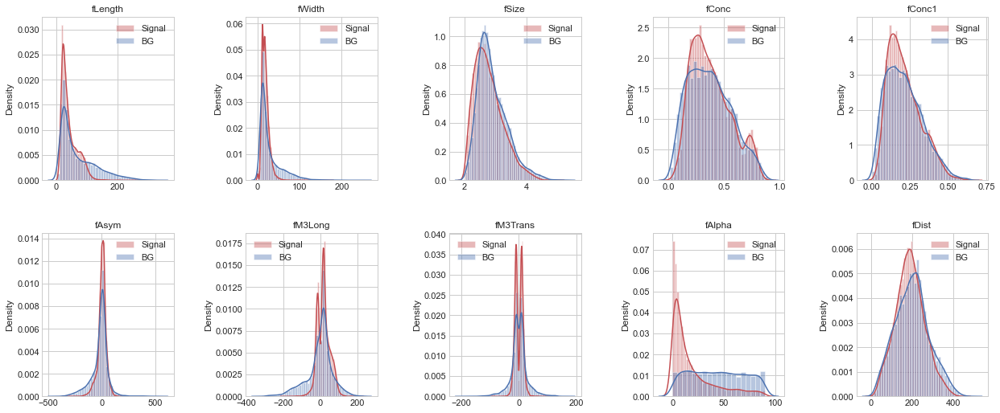
    


## Minimization function: -[2*(#signal)-(#background)]

Obtaining the cuts from the minimization (optimization) of the function -[2*(#signal)-(#background)]

---


```python
#mnimization function
def cut0(x,i):
    j = datasets['g'].iloc[:,i].values#signal data
    gg=len([1 for o in j if x[0] < o < x[1] ])#number of signal events
    j = datasets['h'].iloc[:,i].values#background data
    hh=len([1 for o in j if x[0] < o < x[1]]) #number of background events
    return -1*(gg*2-hh)#minimization function
```

### CG method of minimization


```python
cortes0=[]#to save the cut values
significan0=[]#to save the significance final value
for i in range(10):
    x0 = np.array([min(datasets['g'].iloc[:,i].values), max(datasets['g'].iloc[:,i].values)])#the initial limits are the extremal values of the signal data
    print(str(df.columns[i]))
    res0 = minimize(cut0, x0,args=(i), method='CG',#'type of solver',
                  options={'disp': True})#'xatol': 1e-8,...,bounds=(min(datasets['g'].iloc[:,i].values), max(datasets['h'].iloc[:,i].values)))
    limits=res0.x#the limits returned by the minimizer are save in this variable
    significan0.append(significance(limits,i))#we evluate the cut values to obtain the significance
    print(limits)
    cortes0.append(limits)
    print()
```

    fLength
    Optimization terminated successfully.
             Current function value: -18057.000000
             Iterations: 1
             Function evaluations: 33
             Gradient evaluations: 11
    [ 12.1929     272.06305126]
    
    fWidth
    Optimization terminated successfully.
             Current function value: -17850.000000
             Iterations: 1
             Function evaluations: 33
             Gradient evaluations: 11
    [  0.         176.33505126]
    
    fSize
    Optimization terminated successfully.
             Current function value: -17981.000000
             Iterations: 1
             Function evaluations: 33
             Gradient evaluations: 11
    [1.9978     5.01005127]
    
    fConc
    Optimization terminated successfully.
             Current function value: -17980.000000
             Iterations: 1
             Function evaluations: 33
             Gradient evaluations: 11
    [0.0139     0.88895126]
    
    fConc1
    Optimization terminated successfully.
             Current function value: -17982.000000
             Iterations: 1
             Function evaluations: 33
             Gradient evaluations: 11
    [0.0073     0.67525126]
    
    fAsym
    Optimization terminated successfully.
             Current function value: -18028.000000
             Iterations: 1
             Function evaluations: 33
             Gradient evaluations: 11
    [-349.757       219.89605126]
    
    fM3Long
    Optimization terminated successfully.
             Current function value: -18071.000000
             Iterations: 1
             Function evaluations: 33
             Gradient evaluations: 11
    [-198.867       215.89405126]
    
    fM3Trans
    Optimization terminated successfully.
             Current function value: -18086.000000
             Iterations: 1
             Function evaluations: 33
             Gradient evaluations: 11
    [-91.3485     101.39305127]
    
    fAlpha
    Optimization terminated successfully.
             Current function value: -17966.000000
             Iterations: 1
             Function evaluations: 33
             Gradient evaluations: 11
    [ 0.         90.00005126]
    
    fDist
    Optimization terminated successfully.
             Current function value: -17981.000000
             Iterations: 1
             Function evaluations: 33
             Gradient evaluations: 11
    [  5.7456     450.40205126]
    
    

#### Combination of all cuts

Cutting the dataset:


```python
dfcutall0=df
sizw=[len(dfcutall0)]#para ver como disminuye el tamaño de la data
for i in range(10):
  Xcut=cortes0[i]#asignas lista [corte izq,corte der]
  name=dfcutall0.columns[i]#nombre del parametro
  dfcutall0=dfcutall0[(dfcutall0[name] >Xcut[0]) & (dfcutall0[name] <Xcut[1])].dropna()#aqui se hace el corte
  sizw.append(len(dfcutall0))#guardas el tamaño del dataset tras el corte
```

Once the data is cutted, lets split the data in signal v background:


```python
datasetcutall = {}
by_class = dfcutall0.groupby('class')

for groups, data in by_class:
    datasetcutall[groups] = data.drop(columns=['class'])

#number of events that are signal:
signcutall0=len(datasetcutall['g'])
# number of events that are background:
backcutall0=len(datasetcutall['h'])
```

Dividing the data in X and y:


```python
# Create target object and call it y
ycutall0 = dfcutall0['class'].replace('g',1).replace('h',0)

# Create X
features = list(dfcutall0)[:-1]
Xcutall0 = dfcutall0[features]
```

Plots of distributions


```python
fig, ax = plt.subplots(2,5, figsize=(18, 8))
ax = ax.flatten()
for i in range(10):
    sns.distplot(datasets['g'].iloc[:,i].values, ax=ax[i],color='r', label='Signal')
    sns.distplot(datasets['h'].iloc[:,i].values, ax=ax[i],color='b', label='BG')
    cor=cortes0[i]
    ax[i].axvline( x=cor[0], ymin=0, ymax=1)
    ax[i].axvline( x=cor[1], ymin=0, ymax=1)
    ax[i].set_title(datasets['g'].columns[i])
    ax[i].legend(loc="best")
fig.tight_layout(pad=2.0)   
```


    
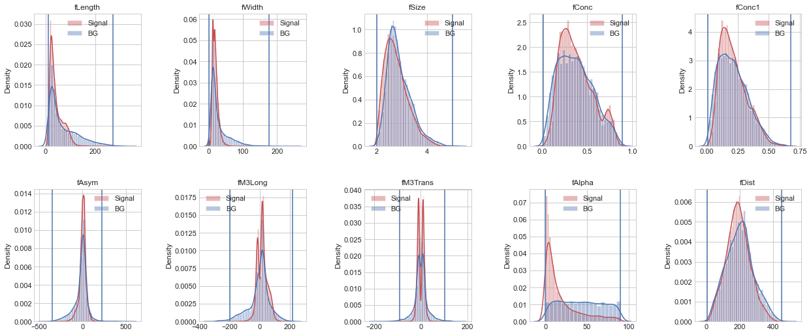
    


Cross validation with the best classifier


```python
#random Forest with the best parameters obtained with GSCV
rf_model_c0  = RandomForestClassifier(criterion='entropy',random_state = 0,
                                bootstrap=RFC_params["bootstrap"],
                                max_depth=RFC_params["max_depth"],
                                max_features=RFC_params["max_features"],
                                n_estimators=RFC_params["n_estimators"],
                                );
scores0=[]#to save the cross validations score
porcsignal0=[]#to save the fraction of signal events after the cut in comparison of the initial signal events
porbackground0=[]#to save the fraction of background events after the cut in comparison of the initial background events
portot0=[]#to save the fraction of all events after the cut in comparison of all initial events
#Score of the Random Forest Classifier model :
for i in range(10):#for each parameter of the data
    datasetc0 = {}
    Xcut0=cortes0[i]
    name=df.columns[i]
    dfcut0=df[(df[name] >Xcut0[0]) & (df[name] <Xcut0[1])].dropna()#cutting the data
    #splitting the data between background and signal
    by_classc0 = dfcut0.groupby('class')

    for groups, data in by_classc0:
          datasetc0[groups] = data.drop(columns=['class'])

    #saving the fractions 
    porcsignal0.append(len(datasetc0['g'])/signn)
    porbackground0.append(len(datasetc0['h'])/backn)
    portot0.append(len(dfcut0)/len(df))

    # Create target object and call it y
    ycut0 = dfcut0['class'].replace('g',1).replace('h',0)

    # Create X
    features0 = list(dfcut0)[:-1]
    Xcut0 = dfcut0[features0]
    score0=cross_val_score(rf_model_c0, Xcut0, ycut0, scoring='accuracy')
    scores0.append(score0)
    #print(name+' cut')
    #print(score2)
    #print()
```

Cross validation


```python
cutall0= cross_val_score(rf_model_c0, Xcutall0, ycutall0, scoring='accuracy')
```

Summary


```python
cut_0=[]
for i in range(10):
  cut_0.append([df.columns[i],porcsignal0[i],porbackground0[i],portot0[i],scores0[i].mean(),significan0[i],significan0[i]/(signn/backn**0.5)])

cut_0.append(["All",signcutall0/signn,backcutall0/backn,(backcutall0+signcutall0)/len(df),cutall0.mean(),(-1*backcutall0+2*signcutall0),(-1*backcutall0+2*signcutall0)/(2*signn-backn)])
title=["Parameter","Signal","Background","Total","Mean Accuracy RFC w GSCV estimators","Significance","Relative significance"]

print(tabulate(cut_0, headers=title,numalign="right",floatfmt="1.3e",tablefmt="github"))
```

    | Parameter   |    Signal |   Background |     Total |   Mean Accuracy RFC w GSCV estimators |   Significance |   Relative significance |
    |-------------|-----------|--------------|-----------|---------------------------------------|----------------|-------------------------|
    | fLength     | 9.999e-01 |    9.876e-01 | 9.956e-01 |                             8.807e-01 |      1.517e+02 |               1.006e+00 |
    | fWidth      | 9.937e-01 |    9.955e-01 | 9.943e-01 |                             8.823e-01 |      1.502e+02 |               9.959e-01 |
    | fSize       | 9.999e-01 |    9.990e-01 | 9.996e-01 |                             8.811e-01 |      1.509e+02 |               1.000e+00 |
    | fConc       | 9.999e-01 |    9.991e-01 | 9.996e-01 |                             8.812e-01 |      1.508e+02 |               1.000e+00 |
    | fConc1      | 9.999e-01 |    9.988e-01 | 9.995e-01 |                             8.810e-01 |      1.509e+02 |               1.001e+00 |
    | fAsym       | 9.999e-01 |    9.919e-01 | 9.971e-01 |                             8.818e-01 |      1.514e+02 |               1.004e+00 |
    | fM3Long     | 9.999e-01 |    9.855e-01 | 9.948e-01 |                             8.807e-01 |      1.519e+02 |               1.007e+00 |
    | fM3Trans    | 9.999e-01 |    9.833e-01 | 9.941e-01 |                             8.811e-01 |      1.521e+02 |               1.008e+00 |
    | fAlpha      | 9.996e-01 |    1.000e+00 | 9.997e-01 |                             8.824e-01 |      1.507e+02 |               9.996e-01 |
    | fDist       | 9.999e-01 |    9.990e-01 | 9.996e-01 |                             8.805e-01 |      1.509e+02 |               1.000e+00 |
    | All         | 9.929e-01 |    9.499e-01 | 9.778e-01 |                             8.799e-01 |      1.814e+04 |               1.009e+00 |
    

| Parameter   |    Signal |   Background |     Total |   Mean Accuracy RFC w GSCV estimators |   Significance |   Relative significance |
|-------------|-----------|--------------|-----------|---------------------------------------|----------------|-------------------------|
| fLength     | 9.999e-01 |    9.876e-01 | 9.956e-01 |                             8.807e-01 |      1.517e+02 |               1.006e+00 |
| fWidth      | 9.937e-01 |    9.955e-01 | 9.943e-01 |                             8.823e-01 |      1.502e+02 |               9.959e-01 |
| fSize       | 9.999e-01 |    9.990e-01 | 9.996e-01 |                             8.811e-01 |      1.509e+02 |               1.000e+00 |
| fConc       | 9.999e-01 |    9.991e-01 | 9.996e-01 |                             8.812e-01 |      1.508e+02 |               1.000e+00 |
| fConc1      | 9.999e-01 |    9.988e-01 | 9.995e-01 |                             8.810e-01 |      1.509e+02 |               1.001e+00 |
| fAsym       | 9.999e-01 |    9.919e-01 | 9.971e-01 |                             8.818e-01 |      1.514e+02 |               1.004e+00 |
| fM3Long     | 9.999e-01 |    9.855e-01 | 9.948e-01 |                             8.807e-01 |      1.519e+02 |               1.007e+00 |
| fM3Trans    | 9.999e-01 |    9.833e-01 | 9.941e-01 |                             8.811e-01 |      1.521e+02 |               1.008e+00 |
| fAlpha      | 9.996e-01 |    1.000e+00 | 9.997e-01 |                             8.824e-01 |      1.507e+02 |               9.996e-01 |
| fDist       | 9.999e-01 |    9.990e-01 | 9.996e-01 |                             8.805e-01 |      1.509e+02 |               1.000e+00 |
| All         | 9.929e-01 |    9.499e-01 | 9.778e-01 |                             8.799e-01 |      1.814e+04 |               1.009e+00 |

The significance is measured with the function (# signal)/(#background^0.5). This election of function and method is the worst. 


---


---


### Nelder-mead method


```python
cortes1=[]#para guardar los cortes
significan1=[]
for i in range(10):
  x0 = np.array([min(datasets['g'].iloc[:,i].values), max(datasets['g'].iloc[:,i].values)]) #valores iniciales: extremos
  print(str(df.columns[i]))
  res1 = minimize(cut0, x0,args=(i), method='nelder-mead',
                 options={'xatol': 1e-8, 'disp': True})#,bounds=(min(datasets['g'].iloc[:,i].values), max(datasets['g'].iloc[:,i].values)))
  limits=res1.x
  significan1.append(significance(limits,i))
  print(limits)
  cortes1.append(limits)
  print()
```

    fLength
    Optimization terminated successfully.
             Current function value: -19214.000000
             Iterations: 61
             Function evaluations: 162
    [ 12.28535477 114.72620385]
    
    fWidth
    Optimization terminated successfully.
             Current function value: -17986.000000
             Iterations: 38
             Function evaluations: 133
    [-1.17187500e-04  1.77023809e+02]
    
    fSize
    Optimization terminated successfully.
             Current function value: -17981.000000
             Iterations: 28
             Function evaluations: 103
    [1.96034125 5.02565625]
    
    fConc
    Optimization terminated successfully.
             Current function value: -17994.000000
             Iterations: 29
             Function evaluations: 91
    [0.01385656 0.85001062]
    
    fConc1
    Optimization terminated successfully.
             Current function value: -17987.000000
             Iterations: 29
             Function evaluations: 101
    [0.00860031 0.71529   ]
    
    fAsym
    Optimization terminated successfully.
             Current function value: -18096.000000
             Iterations: 46
             Function evaluations: 151
    [-390.56803178  117.50424072]
    
    fM3Long
    Optimization terminated successfully.
             Current function value: -18881.000000
             Iterations: 50
             Function evaluations: 152
    [-55.91590589 254.54725058]
    
    fM3Trans
    Optimization terminated successfully.
             Current function value: -18920.000000
             Iterations: 62
             Function evaluations: 168
    [-27.97728133  34.22108609]
    
    fAlpha
    Optimization terminated successfully.
             Current function value: -17976.000000
             Iterations: 33
             Function evaluations: 124
    [-2.50e-04  9.45e+01]
    
    fDist
    Optimization terminated successfully.
             Current function value: -18008.000000
             Iterations: 38
             Function evaluations: 133
    [  6.1316325  406.76930625]
    
    

#### Combination of all cuts

Cutting the dataset:


```python
dfcutall1=df
sizw1=[len(dfcutall1)]#para ver como disminuye el tamaño de la data
for i in range(10):
  Xcut=cortes1[i]#asignas lista [corte izq,corte der]
  name=dfcutall1.columns[i]#nombre del parametro
  dfcutall1=dfcutall1[(dfcutall1[name] >Xcut[0]) & (dfcutall1[name] <Xcut[1])].dropna()#aqui se hace el corte
  sizw1.append(len(dfcutall1))#guardas el tamaño del dataset tras el corte
```

Once the data is cutted, lets split the data in signal v background:


```python
datasetcutall1 = {}
by_class = dfcutall1.groupby('class')

for groups, data in by_class:
    datasetcutall1[groups] = data.drop(columns=['class'])

#number of events that are signal:
signcutall1=len(datasetcutall1['g'])
# number of events that are background:
backcutall1=len(datasetcutall1['h'])
```

Dividing the data in X and y:


```python
# Create target object and call it y
ycutall1 = dfcutall1['class'].replace('g',1).replace('h',0)

# Create X
features = list(dfcutall1)[:-1]
Xcutall1 = dfcutall1[features]
```

Plots of distributions


```python
fig, ax = plt.subplots(2,5, figsize=(18, 8))
ax = ax.flatten()
for i in range(10):
    sns.distplot(datasets['g'].iloc[:,i].values, ax=ax[i],color='r', label='Signal')
    sns.distplot(datasets['h'].iloc[:,i].values, ax=ax[i],color='b', label='BG')
    cor=cortes1[i]
    ax[i].axvline( x=cor[0], ymin=0, ymax=1,c='tab:purple')
    ax[i].axvline( x=cor[1], ymin=0, ymax=1,c='tab:purple')
    ax[i].set_title(datasets['g'].columns[i])
    ax[i].legend(loc="best")
fig.tight_layout(pad=2.0)   
```


    
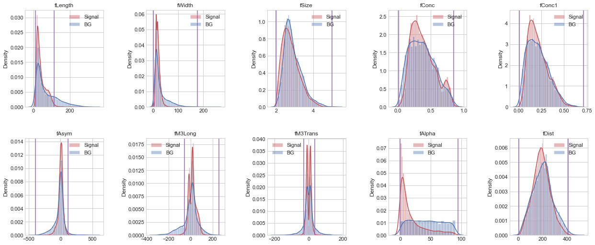
    


```python
rf_model_c1  = RandomForestClassifier(criterion='entropy',random_state = 0,
                                bootstrap=RFC_params["bootstrap"],
                                max_depth=RFC_params["max_depth"],
                                max_features=RFC_params["max_features"],
                                n_estimators=RFC_params["n_estimators"],
                                );
scores1=[]
porcsignal1=[]
porbackground1=[]
portot1=[]
#Score of the Random Forest Classifier model :
for i in range(10):
    datasetc1 = {}
    Xcut1=cortes1[i]
    name=df.columns[i]
    dfcut1=df[(df[name] >Xcut1[0]) & (df[name] <Xcut1[1])].dropna()
    by_classc = dfcut1.groupby('class')

    for groups, data in by_classc:
          datasetc1[groups] = data.drop(columns=['class'])
    porcsignal1.append(len(datasetc1['g'])/signn)
    porbackground1.append(len(datasetc1['h'])/backn)
    portot1.append(len(dfcut1)/len(df))

    # Create target object and call it y
    ycut1 = dfcut1['class'].replace('g',1).replace('h',0)

    # Create X
    features1 = list(dfcut1)[:-1]
    Xcut1 = dfcut1[features1]
    score=cross_val_score(rf_model_c1, Xcut1, ycut1, scoring='accuracy')
    scores1.append(score)
    #print(name+' cut')
    #print(score)
    #print()
```


```python
cutall1= cross_val_score(rf_model_c1, Xcutall1, ycutall1, scoring='accuracy')
```


```python
cut_1=[]
for i in range(10):
  cut_1.append([df.columns[i],porcsignal1[i],porbackground1[i],portot1[i],scores1[i].mean(),significan1[i],significan1[i]/(signn/backn**0.5)])

cut_1.append(["All",signcutall1/signn,backcutall1/backn,(backcutall1+signcutall1)/len(df),cutall1.mean(),(-1*backcutall1+2*signcutall1),(-1*backcutall1+2*signcutall1)/(2*signn-backn)])

print(tabulate(cut_1, headers=title,numalign="right",floatfmt="1.3e",tablefmt="github"))
```

    | Parameter   |    Signal |   Background |     Total |   Mean Accuracy RFC w GSCV estimators |   Significance |   Relative significance |
    |-------------|-----------|--------------|-----------|---------------------------------------|----------------|-------------------------|
    | fLength     | 9.895e-01 |    7.760e-01 | 9.144e-01 |                             8.755e-01 |      1.694e+02 |               1.123e+00 |
    | fWidth      | 1.000e+00 |    9.985e-01 | 9.995e-01 |                             8.817e-01 |      1.509e+02 |               1.001e+00 |
    | fSize       | 1.000e+00 |    9.993e-01 | 9.997e-01 |                             8.805e-01 |      1.509e+02 |               1.000e+00 |
    | fConc       | 9.996e-01 |    9.958e-01 | 9.983e-01 |                             8.818e-01 |      1.510e+02 |               1.002e+00 |
    | fConc1      | 9.999e-01 |    9.981e-01 | 9.993e-01 |                             8.816e-01 |      1.509e+02 |               1.001e+00 |
    | fAsym       | 9.981e-01 |    9.752e-01 | 9.901e-01 |                             8.814e-01 |      1.524e+02 |               1.011e+00 |
    | fM3Long     | 9.886e-01 |    8.225e-01 | 9.302e-01 |                             8.772e-01 |      1.644e+02 |               1.090e+00 |
    | fM3Trans    | 9.849e-01 |    8.032e-01 | 9.210e-01 |                             8.774e-01 |      1.657e+02 |               1.099e+00 |
    | fAlpha      | 1.000e+00 |    1.000e+00 | 1.000e+00 |                             8.811e-01 |      1.508e+02 |               1.000e+00 |
    | fDist       | 9.993e-01 |    9.925e-01 | 9.969e-01 |                             8.798e-01 |      1.513e+02 |               1.003e+00 |
    | All         | 9.662e-01 |    6.743e-01 | 8.636e-01 |                             8.746e-01 |      1.932e+04 |               1.075e+00 |
    

| Parameter   |    Signal |   Background |     Total |   Mean Accuracy RFC w GSCV estimators |   Significance |   Relative significance |
|-------------|-----------|--------------|-----------|---------------------------------------|----------------|-------------------------|
| fLength     | 9.895e-01 |    7.760e-01 | 9.144e-01 |                             8.755e-01 |      1.694e+02 |               1.123e+00 |
| fWidth      | 1.000e+00 |    9.985e-01 | 9.995e-01 |                             8.817e-01 |      1.509e+02 |               1.001e+00 |
| fSize       | 1.000e+00 |    9.993e-01 | 9.997e-01 |                             8.805e-01 |      1.509e+02 |               1.000e+00 |
| fConc       | 9.996e-01 |    9.958e-01 | 9.983e-01 |                             8.818e-01 |      1.510e+02 |               1.002e+00 |
| fConc1      | 9.999e-01 |    9.981e-01 | 9.993e-01 |                             8.816e-01 |      1.509e+02 |               1.001e+00 |
| fAsym       | 9.981e-01 |    9.752e-01 | 9.901e-01 |                             8.814e-01 |      1.524e+02 |               1.011e+00 |
| fM3Long     | 9.886e-01 |    8.225e-01 | 9.302e-01 |                             8.772e-01 |      1.644e+02 |               1.090e+00 |
| fM3Trans    | 9.849e-01 |    8.032e-01 | 9.210e-01 |                             8.774e-01 |      1.657e+02 |               1.099e+00 |
| fAlpha      | 1.000e+00 |    1.000e+00 | 1.000e+00 |                             8.811e-01 |      1.508e+02 |               1.000e+00 |
| fDist       | 9.993e-01 |    9.925e-01 | 9.969e-01 |                             8.798e-01 |      1.513e+02 |               1.003e+00 |
| All         | 9.662e-01 |    6.743e-01 | 8.636e-01 |                             8.746e-01 |      1.932e+04 |               1.075e+00 |

## Minimization function: Significance

Obteniendo los cortes a partir de reducción (optimización) de la función [(#signal)/(#background)^0.5]^-1

---


```python
def cut2(x,i):
    #señal
    j = datasets['g'].iloc[:,i].values
    gg=len([1 for o in j if x[0] < o < x[1] ])
    if gg==0:
      gg=2.220446049250313e-16
    #fondo
    j = datasets['h'].iloc[:,i].values
    hh=len([1 for o in j if x[0] < o < x[1]]) 
    return (hh**0.5)/gg
```

### CG method


```python
cortes2=[]
significan2=[]
for i in range(10):
  x0 = np.array([min(datasets['g'].iloc[:,i].values), max(datasets['g'].iloc[:,i].values)])
  print(str(df.columns[i]))
  res2 = minimize(cut2, x0,args=(i), method='CG',#'nelder-mead',
                  options={ 'disp': True})#'xatol': 1e-8,...,bounds=(min(datasets['g'].iloc[:,i].values), max(datasets['h'].iloc[:,i].values)))
  limits=res2.x
  significan2.append(cut2(limits,i))
  print(limits)
  cortes2.append(limits)
  print()
```

    fLength
    Optimization terminated successfully.
             Current function value: 0.006591
             Iterations: 1
             Function evaluations: 33
             Gradient evaluations: 11
    [ 12.1929     272.06305126]
    
    fWidth
    Optimization terminated successfully.
             Current function value: 0.006659
             Iterations: 1
             Function evaluations: 33
             Gradient evaluations: 11
    [  0.         176.33505126]
    
    fSize
    Optimization terminated successfully.
             Current function value: 0.006629
             Iterations: 1
             Function evaluations: 33
             Gradient evaluations: 11
    [1.9978     5.01005127]
    
    fConc
    Optimization terminated successfully.
             Current function value: 0.006629
             Iterations: 1
             Function evaluations: 33
             Gradient evaluations: 11
    [0.0139    0.8889513]
    
    fConc1
    Optimization terminated successfully.
             Current function value: 0.006628
             Iterations: 1
             Function evaluations: 33
             Gradient evaluations: 11
    [0.0073     0.67525126]
    
    fAsym
    Optimization terminated successfully.
             Current function value: 0.006605
             Iterations: 1
             Function evaluations: 33
             Gradient evaluations: 11
    [-349.757       219.89605127]
    
    fM3Long
    Optimization terminated successfully.
             Current function value: 0.006584
             Iterations: 1
             Function evaluations: 33
             Gradient evaluations: 11
    [-198.867       215.89405126]
    
    fM3Trans
    Optimization terminated successfully.
             Current function value: 0.006576
             Iterations: 1
             Function evaluations: 33
             Gradient evaluations: 11
    [-91.3485     101.39305127]
    
    fAlpha
    Optimization terminated successfully.
             Current function value: 0.006634
             Iterations: 1
             Function evaluations: 33
             Gradient evaluations: 11
    [ 0.         90.00005126]
    
    fDist
    Optimization terminated successfully.
             Current function value: 0.006629
             Iterations: 1
             Function evaluations: 33
             Gradient evaluations: 11
    [  5.7456     450.40205126]
    
    

#### Combination of all cuts

Cutting the dataset:


```python
dfcutall2=df
sizw=[len(dfcutall2)]
for i in range(10):
  Xcut=cortes2[i]
  name=dfcutall2.columns[i]
  dfcutall2=dfcutall2[(dfcutall2[name] >Xcut[0]) & (dfcutall2[name] <Xcut[1])].dropna()
  sizw.append(len(dfcutall2))
#sizw
```

Once the data is cutted, lets split the data in signal v background:


```python
datasetcutall2 = {}
by_class = dfcutall2.groupby('class')

for groups, data in by_class:
    datasetcutall2[groups] = data.drop(columns=['class'])

#number of events that are signal:
signcutall2=len(datasetcutall2['g'])
# number of events that are background:
backcutall2=len(datasetcutall2['h'])
```

Dividing the data in X and y:


```python
# Create target object and call it y
ycutall2 = dfcutall2['class'].replace('g',1).replace('h',0)

# Create X
features = list(dfcutall2)[:-1]
Xcutall2 = dfcutall2[features]
```

Plots of distributions


```python
fig, ax = plt.subplots(2,5, figsize=(18, 8))
ax = ax.flatten()
for i in range(10):
    sns.distplot(datasets['g'].iloc[:,i].values, ax=ax[i],color='r', label='Signal')
    sns.distplot(datasets['h'].iloc[:,i].values, ax=ax[i],color='b', label='BG')
    cor2=cortes2[i]
    ax[i].axvline( x=cor2[0], ymin=0, ymax=1)
    ax[i].axvline( x=cor2[1], ymin=0, ymax=1)
    ax[i].set_title(datasets['g'].columns[i])
    ax[i].legend(loc="best")
fig.tight_layout(pad=2.0)   
```


    

    


```python
rf_model_c2  = RandomForestClassifier(criterion = 'entropy', random_state = 0)
scores2=[]
porcsignal2=[]
porbackground2=[]
portot2=[]
#Score of the Random Forest Classifier model :
for i in range(10):
    datasetc2 = {}
    Xcut2=cortes2[i]
    name=df.columns[i]
    dfcut2=df[(df[name] >Xcut2[0]) & (df[name] <Xcut2[1])].dropna()
    by_classc2 = dfcut2.groupby('class')

    for groups, data in by_classc2:
          datasetc2[groups] = data.drop(columns=['class'])

    porcsignal2.append(len(datasetc2['g'])/signn)
    porbackground2.append(len(datasetc2['h'])/backn)
    portot2.append(len(dfcut2)/len(df))

    # Create target object and call it y
    ycut2 = dfcut2['class'].replace('g',1).replace('h',0)

    # Create X
    features2 = list(dfcut2)[:-1]
    Xcut2 = dfcut2[features2]
    score2=cross_val_score(rf_model_c2, Xcut2, ycut2, scoring='accuracy')
    scores2.append(score2)
#    print(name+' cut')
#    print(score2)
#    print()
```


```python
cutall2= cross_val_score(rf_model_c2, Xcutall2, ycutall2, scoring='accuracy')
```


```python
cut_2=[]
for i in range(10):
  cut_2.append([df.columns[i],porcsignal2[i],porbackground2[i],portot2[i],scores2[i].mean(),significan2[i]**-1,(significan2[i]**-1)/(signn/backn**0.5)])

cut_2.append(["All",signcutall2/signn,backcutall2/backn,(backcutall2+signcutall2)/len(df),cutall2.mean(),(signcutall2/backcutall2**0.5),(signcutall2/backcutall2**0.5)/(signn/backn**0.5)])

print(tabulate(cut_2, headers=title,numalign="right",floatfmt="1.3e",tablefmt="github"))
```

    | Parameter   |    Signal |   Background |     Total |   Mean Accuracy RFC w GSCV estimators |   Significance |   Relative significance |
    |-------------|-----------|--------------|-----------|---------------------------------------|----------------|-------------------------|
    | fLength     | 9.999e-01 |    9.876e-01 | 9.956e-01 |                             8.796e-01 |      1.517e+02 |               1.006e+00 |
    | fWidth      | 9.937e-01 |    9.955e-01 | 9.943e-01 |                             8.820e-01 |      1.502e+02 |               9.959e-01 |
    | fSize       | 9.999e-01 |    9.990e-01 | 9.996e-01 |                             8.809e-01 |      1.509e+02 |               1.000e+00 |
    | fConc       | 9.999e-01 |    9.991e-01 | 9.996e-01 |                             8.805e-01 |      1.508e+02 |               1.000e+00 |
    | fConc1      | 9.999e-01 |    9.988e-01 | 9.995e-01 |                             8.803e-01 |      1.509e+02 |               1.001e+00 |
    | fAsym       | 9.999e-01 |    9.919e-01 | 9.971e-01 |                             8.810e-01 |      1.514e+02 |               1.004e+00 |
    | fM3Long     | 9.999e-01 |    9.855e-01 | 9.948e-01 |                             8.798e-01 |      1.519e+02 |               1.007e+00 |
    | fM3Trans    | 9.999e-01 |    9.833e-01 | 9.941e-01 |                             8.795e-01 |      1.521e+02 |               1.008e+00 |
    | fAlpha      | 9.996e-01 |    1.000e+00 | 9.997e-01 |                             8.805e-01 |      1.507e+02 |               9.996e-01 |
    | fDist       | 9.999e-01 |    9.990e-01 | 9.996e-01 |                             8.811e-01 |      1.509e+02 |               1.000e+00 |
    | All         | 9.929e-01 |    9.499e-01 | 9.778e-01 |                             8.800e-01 |      1.536e+02 |               1.019e+00 |
    

| Parameter   |    Signal |   Background |     Total |   Mean Accuracy RFC w GSCV estimators |   Significance |   Relative significance |
|-------------|-----------|--------------|-----------|---------------------------------------|----------------|-------------------------|
| fLength     | 9.999e-01 |    9.876e-01 | 9.956e-01 |                             8.796e-01 |      1.517e+02 |               1.006e+00 |
| fWidth      | 9.937e-01 |    9.955e-01 | 9.943e-01 |                             8.820e-01 |      1.502e+02 |               9.959e-01 |
| fSize       | 9.999e-01 |    9.990e-01 | 9.996e-01 |                             8.809e-01 |      1.509e+02 |               1.000e+00 |
| fConc       | 9.999e-01 |    9.991e-01 | 9.996e-01 |                             8.805e-01 |      1.508e+02 |               1.000e+00 |
| fConc1      | 9.999e-01 |    9.988e-01 | 9.995e-01 |                             8.803e-01 |      1.509e+02 |               1.001e+00 |
| fAsym       | 9.999e-01 |    9.919e-01 | 9.971e-01 |                             8.810e-01 |      1.514e+02 |               1.004e+00 |
| fM3Long     | 9.999e-01 |    9.855e-01 | 9.948e-01 |                             8.798e-01 |      1.519e+02 |               1.007e+00 |
| fM3Trans    | 9.999e-01 |    9.833e-01 | 9.941e-01 |                             8.795e-01 |      1.521e+02 |               1.008e+00 |
| fAlpha      | 9.996e-01 |    1.000e+00 | 9.997e-01 |                             8.805e-01 |      1.507e+02 |               9.996e-01 |
| fDist       | 9.999e-01 |    9.990e-01 | 9.996e-01 |                             8.811e-01 |      1.509e+02 |               1.000e+00 |
| All         | 9.929e-01 |    9.499e-01 | 9.778e-01 |                             8.800e-01 |      1.536e+02 |               1.019e+00 |


---


---


### Nelder-mead method


```python
cortes3=[]
signifan3=[]
for i in range(10):
  x0 = np.array([min(datasets['g'].iloc[:,i].values), max(datasets['g'].iloc[:,i].values)])
  print(str(df.columns[i]))
  res3 = minimize(cut2, x0,args=(i), method='nelder-mead',
                  options={ 'xatol': 1e-8,'disp': True})#'xatol': 1e-8,...,bounds=(min(datasets['g'].iloc[:,i].values), max(datasets['h'].iloc[:,i].values)))
  limits3=res3.x
  signifan3.append(cut2(limits3,i))
  print(limits3)
  cortes3.append(limits3)
  print()
cortes3=np.array(cortes3)
```

    fLength
    Optimization terminated successfully.
             Current function value: 0.000000
             Iterations: 45
             Function evaluations: 154
    [12.55487672  5.31373047]
    
    fWidth
    Optimization terminated successfully.
             Current function value: 0.005960
             Iterations: 50
             Function evaluations: 144
    [-1.13352966e-03  3.96769894e+01]
    
    fSize
    Optimization terminated successfully.
             Current function value: 0.006609
             Iterations: 44
             Function evaluations: 123
    [1.99350814 4.31813057]
    
    fConc
    Optimization terminated successfully.
             Current function value: 0.006621
             Iterations: 30
             Function evaluations: 93
    [0.01443754 0.83126039]
    
    fConc1
    Optimization terminated successfully.
             Current function value: 0.006527
             Iterations: 48
             Function evaluations: 129
    [0.06326423 0.96240727]
    
    fAsym
    Optimization terminated successfully.
             Current function value: 0.006559
             Iterations: 45
             Function evaluations: 151
    [-380.63398516  104.1070125 ]
    
    fM3Long
    Optimization terminated successfully.
             Current function value: 0.006032
             Iterations: 52
             Function evaluations: 157
    [-37.80068183 251.42692563]
    
    fM3Trans
    Optimization terminated successfully.
             Current function value: 0.005997
             Iterations: 63
             Function evaluations: 168
    [-27.37154417  26.42620607]
    
    fAlpha
    Optimization terminated successfully.
             Current function value: 0.006632
             Iterations: 33
             Function evaluations: 124
    [-2.50e-04  9.45e+01]
    
    fDist
    Optimization terminated successfully.
             Current function value: 0.006589
             Iterations: 40
             Function evaluations: 133
    [  6.59060719 360.14566172]
    
    

#### Combination of all cuts


```python
dfcutall3=df
sizw=[len(dfcutall3)]
for i in range(1,10):
  Xcut3=cortes3[i]
  name=dfcutall3.columns[i]
  dfcutall3=dfcutall3[(dfcutall3[name] >Xcut3[0]) & (dfcutall3[name] <Xcut3[1])].dropna()
  sizw.append(len(dfcutall3))
#sizw
```


```python
datasetcutall3 = {}
by_class = dfcutall3.groupby('class')

for groups, data in by_class:
    datasetcutall3[groups] = data.drop(columns=['class'])
    
signcutall3=len(datasetcutall3['g'])
backcutall3=len(datasetcutall3['h'])
significancetotal3=signcutall3/backcutall3**0.5
```


```python
# Create target object and call it y
ycutall3 = dfcutall3['class'].replace('g',1).replace('h',0)

# Create X
features = list(dfcutall3)[:-1]
Xcutall3 = dfcutall3[features]
```


```python
fig, ax = plt.subplots(2,5, figsize=(18, 8))
ax = ax.flatten()
for i in range(10):
    sns.distplot(datasets['g'].iloc[:,i].values, ax=ax[i],color='r', label='Signal')
    sns.distplot(datasets['h'].iloc[:,i].values, ax=ax[i],color='b', label='BG')
    cor3=cortes3[i]
    ax[i].axvline( x=cor3[0], ymin=0, ymax=1)
    ax[i].axvline( x=cor3[1], ymin=0, ymax=1)
    ax[i].set_title(datasets['g'].columns[i])
    ax[i].legend(loc="best")
fig.tight_layout(pad=2.0)   
```


    
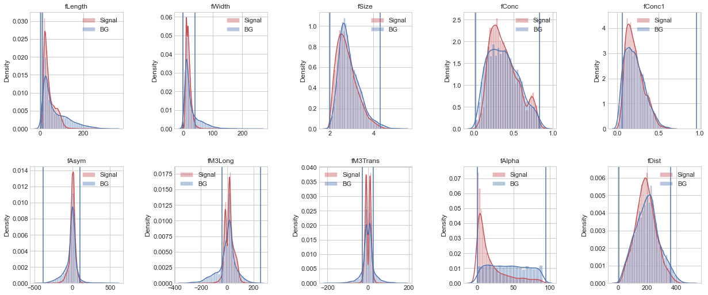
    


```python
rf_model_c3  = RandomForestClassifier(criterion = 'entropy', random_state = 0)
scores3=[]
porcsignal3=[]
porbackground3=[]
portot3=[]
#Score of the Random Forest Classifier model :
for i in range(1,10):
    datasetc3 = {}
    Xcut3=cortes3[i]
    name=df.columns[i]
    dfcut3=df[(df[name] >Xcut3[0]) & (df[name] <Xcut3[1])].dropna()
    by_classc3 = dfcut3.groupby('class')

    for groups, data in by_classc3:
          datasetc3[groups] = data.drop(columns=['class'])

    porcsignal3.append(len(datasetc3['g'])/signn)
    porbackground3.append(len(datasetc3['h'])/backn)
    portot3.append(len(dfcut3)/len(df))

    # Create target object and call it y
    ycut3 = dfcut3['class'].replace('g',1).replace('h',0)

    # Create X
    features3 = list(dfcut3)[:-1]
    Xcut3 = dfcut3[features3]
    score3=cross_val_score(rf_model_c3, Xcut3, ycut3, scoring='accuracy')
    scores3.append(score3)
    #print(name+' cut')
    #print(score3)
    #print()
```


```python
cutall3= cross_val_score(rf_model_c3, Xcutall3, ycutall3, scoring='accuracy')
```


```python
cut_3=[]
for i in range(1,10):
  cut_3.append([df.columns[i],porcsignal3[i-1],porbackground3[i-1],portot3[i-1],scores3[i-1].mean(),signifan3[i]**-1,(signifan3[i]**-1)/(signn/backn**0.5)])

cut_3.append(["All",signcutall3/signn,backcutall3/backn,(backcutall3+signcutall3)/len(df),cutall3.mean(),significancetotal3,significancetotal3/(signn/backn**0.5)])

print(tabulate(cut_3, headers=title,numalign="right",floatfmt="1.3e",tablefmt="github"))
```

    | Parameter   |    Signal |   Background |     Total |   Mean Accuracy RFC w GSCV estimators |   Significance |   Relative significance |
    |-------------|-----------|--------------|-----------|---------------------------------------|----------------|-------------------------|
    | fWidth      | 9.766e-01 |    7.703e-01 | 9.040e-01 |                             8.742e-01 |      1.678e+02 |               1.113e+00 |
    | fSize       | 9.972e-01 |    9.874e-01 | 9.937e-01 |                             8.802e-01 |      1.513e+02 |               1.003e+00 |
    | fConc       | 9.981e-01 |    9.930e-01 | 9.963e-01 |                             8.807e-01 |      1.510e+02 |               1.002e+00 |
    | fConc1      | 9.755e-01 |    9.218e-01 | 9.566e-01 |                             8.771e-01 |      1.532e+02 |               1.016e+00 |
    | fAsym       | 9.959e-01 |    9.704e-01 | 9.870e-01 |                             8.812e-01 |      1.525e+02 |               1.011e+00 |
    | fM3Long     | 9.720e-01 |    7.817e-01 | 9.051e-01 |                             8.759e-01 |      1.658e+02 |               1.099e+00 |
    | fM3Trans    | 9.721e-01 |    7.727e-01 | 9.020e-01 |                             8.756e-01 |      1.668e+02 |               1.106e+00 |
    | fAlpha      | 1.000e+00 |    1.000e+00 | 1.000e+00 |                             8.809e-01 |      1.508e+02 |               1.000e+00 |
    | fDist       | 9.891e-01 |    9.656e-01 | 9.808e-01 |                             8.793e-01 |      1.518e+02 |               1.007e+00 |
    | All         | 9.202e-01 |    6.471e-01 | 8.242e-01 |                             8.747e-01 |      1.725e+02 |               1.144e+00 |
    

| Parameter   |    Signal |   Background |     Total |   Mean Accuracy RFC w GSCV estimators |   Significance |   Relative significance |
|-------------|-----------|--------------|-----------|---------------------------------------|----------------|-------------------------|
| fWidth      | 9.766e-01 |    7.703e-01 | 9.040e-01 |                             8.742e-01 |      1.678e+02 |               1.113e+00 |
| fSize       | 9.972e-01 |    9.874e-01 | 9.937e-01 |                             8.802e-01 |      1.513e+02 |               1.003e+00 |
| fConc       | 9.981e-01 |    9.930e-01 | 9.963e-01 |                             8.807e-01 |      1.510e+02 |               1.002e+00 |
| fConc1      | 9.755e-01 |    9.218e-01 | 9.566e-01 |                             8.771e-01 |      1.532e+02 |               1.016e+00 |
| fAsym       | 9.959e-01 |    9.704e-01 | 9.870e-01 |                             8.812e-01 |      1.525e+02 |               1.011e+00 |
| fM3Long     | 9.720e-01 |    7.817e-01 | 9.051e-01 |                             8.759e-01 |      1.658e+02 |               1.099e+00 |
| fM3Trans    | 9.721e-01 |    7.727e-01 | 9.020e-01 |                             8.756e-01 |      1.668e+02 |               1.106e+00 |
| fAlpha      | 1.000e+00 |    1.000e+00 | 1.000e+00 |                             8.809e-01 |      1.508e+02 |               1.000e+00 |
| fDist       | 9.891e-01 |    9.656e-01 | 9.808e-01 |                             8.793e-01 |      1.518e+02 |               1.007e+00 |
| All         | 9.202e-01 |    6.471e-01 | 8.242e-01 |                             8.747e-01 |      1.725e+02 |               1.144e+00 |

# Removing highly correlated parameters

Deleting the parameter 'fConc1' because it is verry correlated (p=0.98) with 'fConc1' and it can be redundant


```python
dfwofconc1 = df
del dfwofconc1['fConc1']
dfwofconc1.info()
```

    <class 'pandas.core.frame.DataFrame'>
    RangeIndex: 19020 entries, 0 to 19019
    Data columns (total 10 columns):
     #   Column    Non-Null Count  Dtype  
    ---  ------    --------------  -----  
     0   fLength   19020 non-null  float64
     1   fWidth    19020 non-null  float64
     2   fSize     19020 non-null  float64
     3   fConc     19020 non-null  float64
     4   fAsym     19020 non-null  float64
     5   fM3Long   19020 non-null  float64
     6   fM3Trans  19020 non-null  float64
     7   fAlpha    19020 non-null  float64
     8   fDist     19020 non-null  float64
     9   class     19020 non-null  object 
    dtypes: float64(9), object(1)
    memory usage: 1.5+ MB
    

Splitting X and y


```python
# Create target object and call it y
ywc = dfwofconc1['class'].replace('g',1).replace('h',0)

# Create X
features = list(dfwofconc1)[:-1]
Xwc = dfwofconc1[features]
```

Using a Random Forest Classifier with defined parameters gscv


```python
# Define the model. Set random_state to 0
rf_model_wc  =RandomForestClassifier(criterion='entropy',random_state = 0,
                                bootstrap=RFC_params["bootstrap"],
                                max_depth=RFC_params["max_depth"],
                                max_features=RFC_params["max_features"],
                                n_estimators=RFC_params["n_estimators"],
                                );
```

Cross Validation


```python
scorewc  =cross_val_score(rf_model_wc, Xwc, ywc, cv=5, scoring='accuracy')# in 5 groups
print('Mean Accuracy Score RFC w parameters: %2f' %(scorewc.mean()))
```

    Mean Accuracy Score RFC w parameters: 0.881861
    

Spliting data in test and validation:


```python
# Split into validation and training data
train_X_wc, val_X_wc, train_y_wc, val_y_wc = train_test_split(Xwc, ywc, test_size = 0.25, random_state = 0)
```

Score


```python
# fit your model
rf_model_wc.fit(train_X_wc, train_y_wc)

print_score(rf_model_wc,train_X_wc, train_y_wc, val_X_wc, val_y_wc, train=False)

```

    Test Result:
    ===========================================
    accuracy score: 0.8841219768664563
    
    Classification Report: 
     	Precision: 0.8816425120772947
    	Recall Score: 0.9483598570964599
    	F1 score: 0.9137850101705524
    
    Confusion Matrix: 
    
    +----------+---------------+---------------+
    |          |   Predicted F |   Predicted T |
    |----------+---------------+---------------|
    | True F   |          1284 |           392 |
    | True T   |           159 |          2920 |
    +----------+---------------+---------------+
    
    Relative Confusion Matrix: 
    
    +----------+---------------+---------------+
    |          |   Predicted F |   Predicted T |
    |----------+---------------+---------------|
    | True F   |        0.766  |         0.234 |
    | True T   |        0.0516 |         0.948 |
    +----------+---------------+---------------+
    


---


---


---


